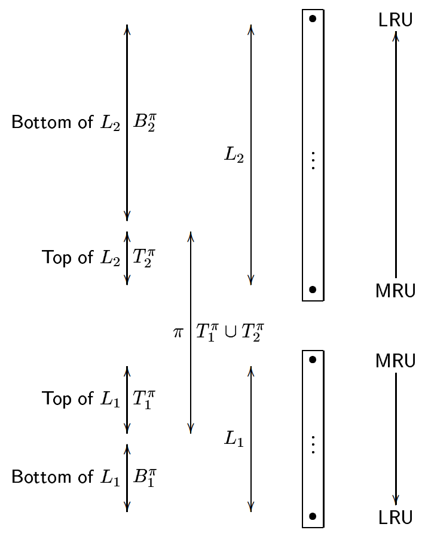

# [ARC: A Self-Tuning, Low Overhead Replacement Cache](https://dl.acm.org/citation.cfm?id=1090708) 论文阅读笔记

2层 LRU，并且有 C 个 page entry。L1为命中1次的，L2为命中2次的。

缓存中的 k 只有部分有 v，即 T1 和 T2（|T1|+|T2|=C）

对于一个访问 x：

- 如果 x 在 T1 或 T2，则移动到 T2 的 MRU
- （未命中）如果 x 在 B1，增大 T1，移动到 T2 MRU
- （未命中）如果 x 在 B2，增大 T2，移动到 T2 MRU
- （未命中）如果 x 完全未命中
  - Case A：如果 |L1| = C
      - 如果 |T1| < C，删除 B1 LRU
      - 否则 B1 为空，删除 T1 LRU
  - Case B：如果 |L1| < C，删除 B2 LRU
  - 移动到 T1 MRU

> 感觉细节前后有出入

## Reference

- [论文笔记 FAST'03 ARC: A Self-Tuning, Low Overhead...](https://zhuanlan.zhihu.com/p/60916764)