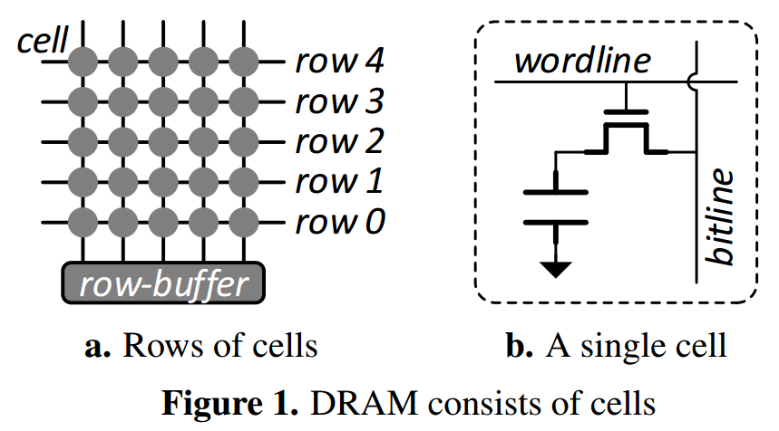
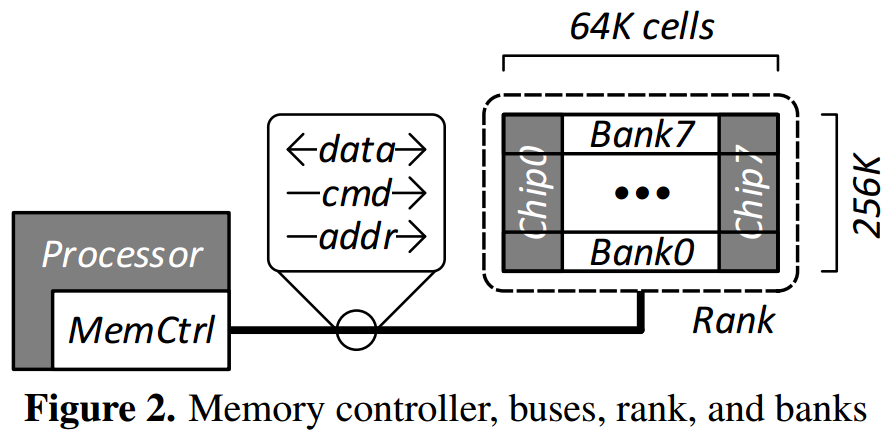
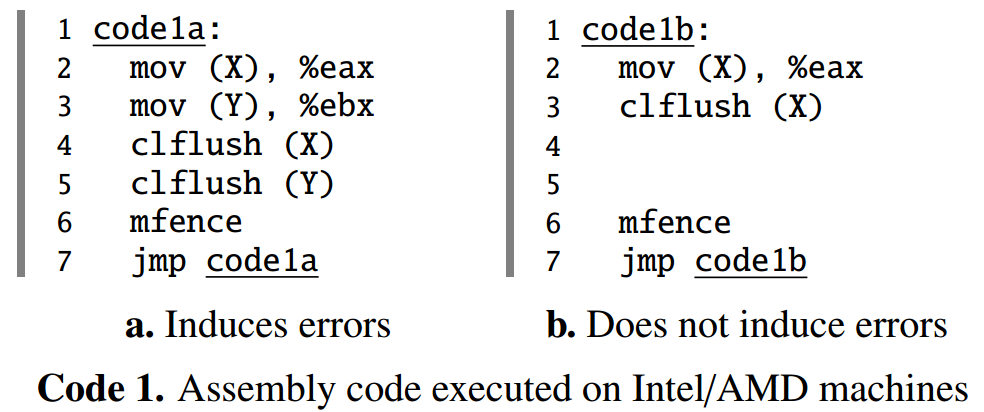
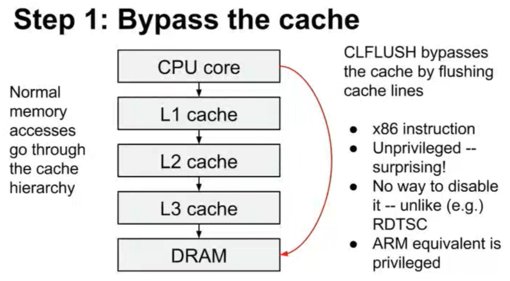
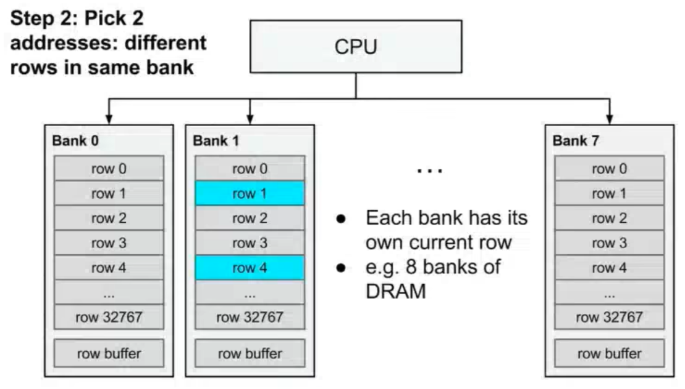
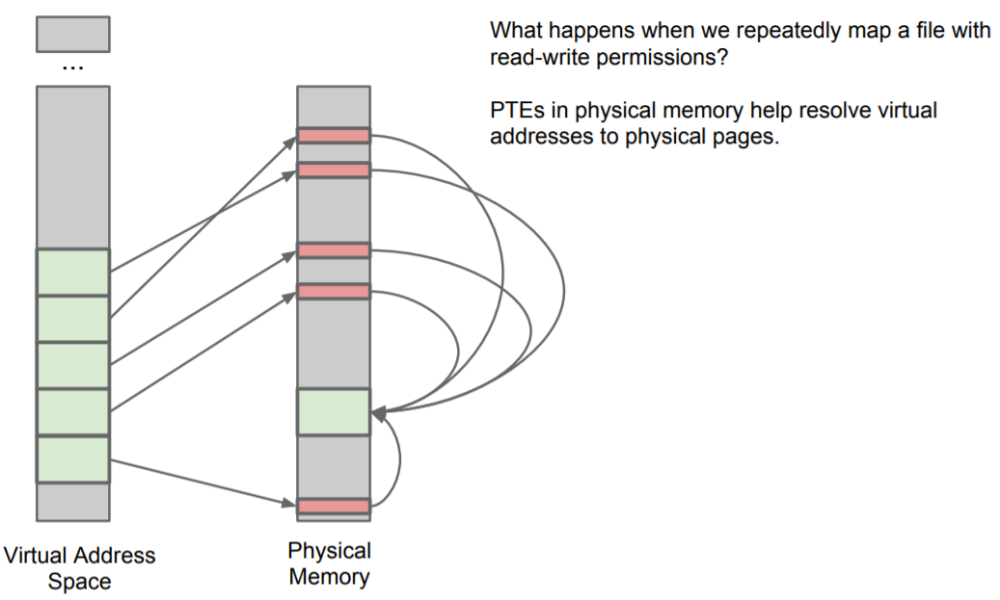
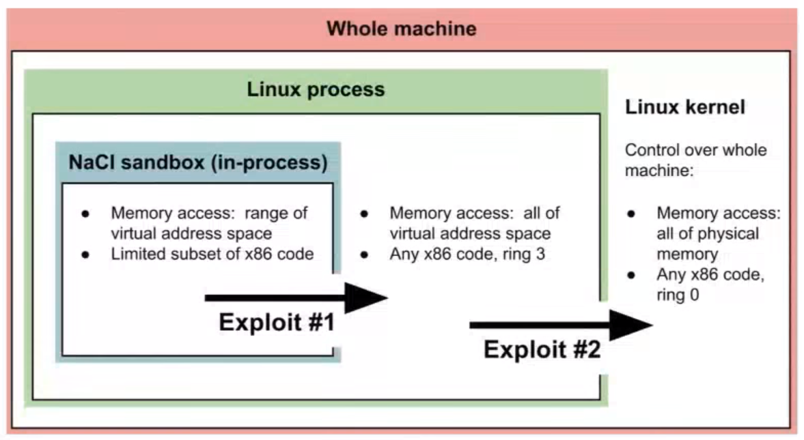

# [Flipping bits in memory without accessing them: an experimental study of DRAM disturbance errors](https://dl.acm.org/citation.cfm?id=2665726) 论文阅读笔记

**activating the same row in DRAM corrupts data in nearby rows during a refresh interval**

## DRAM

### Low-Level Organization

- activate row 时提高 wordline 电压，然后通过 bitline 读 capacitor
- 不访问时 wordline 低电压
- 所有 access 都是在 row buffer 中进行的

- 一组 cells 称作 bank，每个 bank 有独立的 row buffer
- 一组 banks 称作 rank

### Accessing DRAM

对一个 rank 的访问分为三步：

- activate 指定 bank 中的 指定 row
  - 高电压，数据传输到 row buffer
- 访问 row buffer 中的指定 column
  - read / write
- 关闭 row
  - 低电压（precharge）

### Refreshing DRAM

refresh row <=> activate row + precharge

## Mechanics of Disturbance Errors

*When a wordline’s voltage is toggled repeatedly, some cells in nearby rows leak charge at a much faster rate.*

## Real System Demonstration

使用 CLFLUSH 指令（无特权）可以使得 cache line 失效，然后不断访问，即不断地 activate-precharge，造成 bit flipping。1a 可以造成 bit flipping，但是 1b 不行，因为需要不断地 open 和 close，1b 中 controller 把访问优化为全部在 row buffer 中。

在 Ref[3] 中讲了如何去利用这个 bug 来获得内核权限。

- 首先要绕过 cache，使用 CLFLUSH

- 然后找到2个 addr，必须位于同一个 bank，一般随机就可以

- 选择攻击的 data structure，一般选择 page table
- `mmap()` 创建大量的 page table entry
- 引发 bit flipping
- 可以访问错误的 physical addr

## Fix and Mitigation

- ECC (Error Correcting Code)
- TRR (Target Row Refresh)
  - 记录访问次数，refresh 附近的 row
- refresh frequently

### PARA (probabilistic adjacent row activation)

- 每次 access 有一定概率 refresh 附近的 row
- 这个方法是 stateless
- 极大地降低了 disturbance rate

## Reference

- [Row hammer - Wiki](https://en.wikipedia.org/wiki/Row_hammer)
- [DRAM-Related Faults (rowhammer, SPOILER, RAMBleed) - Red Hat](https://access.redhat.com/articles/1377393)
- [Exploiting the DRAM Rowhammer Bug to Gain Kernel Privileges - YouTube](https://www.youtube.com/watch?v=0U7511Fb4to)
- [Exploiting the DRAM Rowhammer Bug to Gain Kernel Privileges.pdf](https://syssec.kaist.ac.kr/~yongdaek/courses/ee515/2017/Slides/Row_hammer.pdf)
- [Exploiting the DRAM row hammer bug to gain kernel privileges.pdf](https://www.blackhat.com/docs/us-15/materials/us-15-Seaborn-Exploiting-The-DRAM-Rowhammer-Bug-To-Gain-Kernel-Privileges.pdf)
- [Exploiting the DRAM rowhammer bug to gain kernel privileges - LWN.net - article 636508](https://lwn.net/Articles/636508/)
- [Exploiting the DRAM rowhammer bug to gain kernel privileges - LWN.net - article 636136](https://lwn.net/Articles/636136/)
- [Mitigations Available for the DRAM Row Hammer Vulnerability](https://blogs.cisco.com/security/mitigations-available-for-the-dram-row-hammer-vulnerability)
- [Vendor responses to the rowhammer bug](https://github.com/google/rowhammer-test/blob/master/docs/vendor_responses.md)