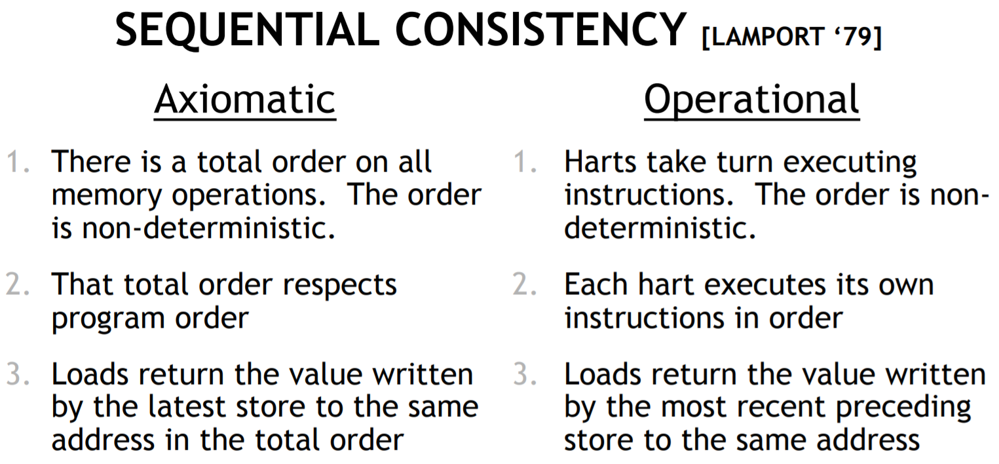
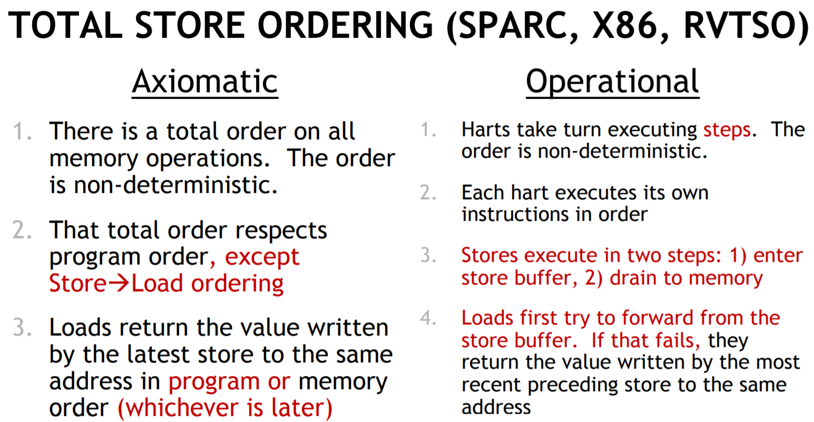
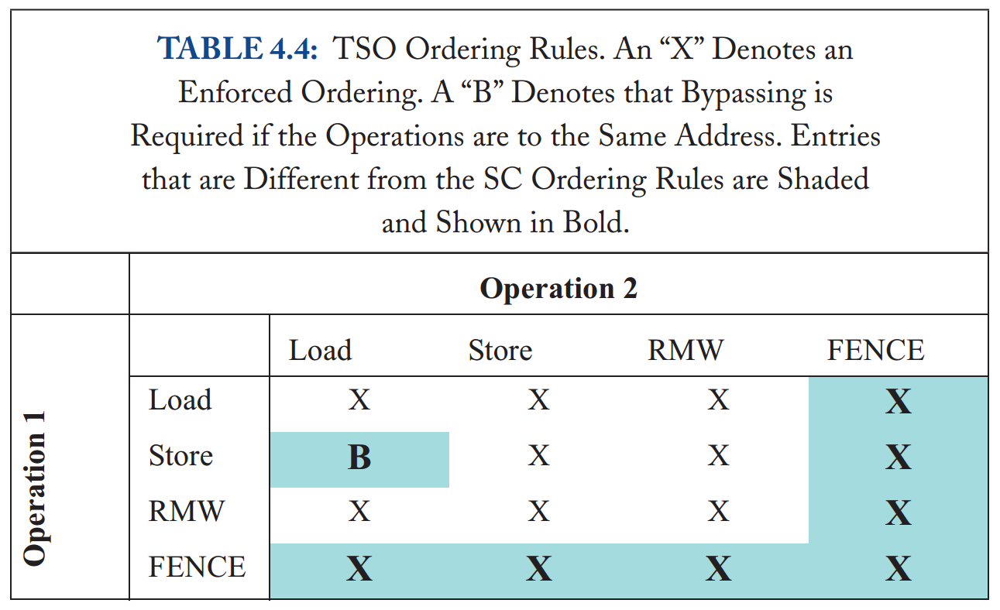
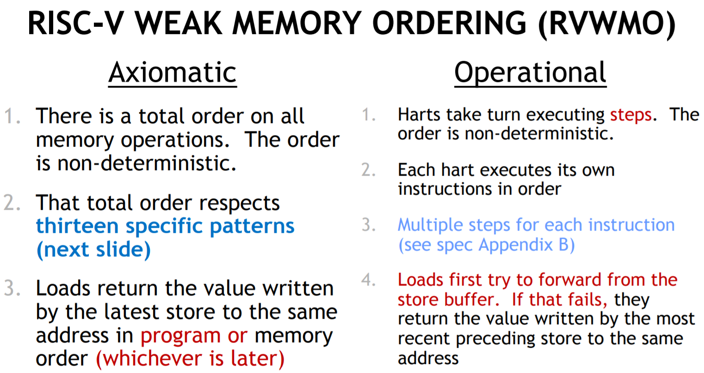

# [Memory Barriers: a Hardware View for Software Hackers](http://www.puppetmastertrading.com/images/hwViewForSwHackers.pdf) 论文阅读笔记

### SC

### TSO

- 有一个 total order，但 non-deterministic
- 满足 program order，除了 *Loads May Be Reordered with Earlier Stores to Different Locations*
- load 得到的值是该内存位置的 latest store in **program** or **memory** order

### RVWMO (RISC-V WEAK MEMORY ORDERING)

## Reference

- [slides - MRAS Team](http://lzz5235.github.io/assets/resource/slides.pdf)
- [A formal kernel memory-ordering model (part 1)](https://lwn.net/Articles/718628/)
- [A formal kernel memory-ordering model (part 2)](https://lwn.net/Articles/720550/)
- [Paper: Memory Barriers: A Hardware View For Software Hackers](http://highscalability.com/blog/2013/6/6/paper-memory-barriers-a-hardware-view-for-software-hackers.html)
- [内存屏障Memory Barrier: a Hardware View](https://zhuanlan.zhihu.com/p/66085562) - 知乎
- [Memory Model - RISC-V](https://www.youtube.com/watch?v=QkbWgCSAEoo) - YouTube [slides](https://content.riscv.org/wp-content/uploads/2018/05/14.25-15.00-RISCVMemoryModelTutorial.pdf)
- [From Weak to Weedy: Effective Use of Memory Barriers in the ARM Linux Kernel - W. Deacon, ARM](https://www.youtube.com/watch?v=6ORn6_35kKo) - YouTube
- [Linux-Kernel Memory Ordering: Help Arrives At Last!](https://www.youtube.com/watch?v=ULFytshTvIY) - YouTube
- [内存模型和缓存一致性协议入门](https://legacy.gitbook.com/book/ljalphabeta/a-primer-on-memory-consistency-and-cache-coherenc/details) - gitbook
- 《Intel® 64 and IA-32 Architectures Software Developers Manual》
- 《Intel® 64 and IA-32 Architectures Optimization Reference Manual》
- [《The microarchitecture of Intel, AMD and VIA CPUs》](https://www.agner.org/optimize/microarchitecture.pdf)
- [LINUX KERNEL MEMORY BARRIERS](https://www.kernel.org/doc/Documentation/memory-barriers.txt)
- [MESI protocol](http://en.wikipedia.org/wiki/MESI_protocol) - wiki
- [Size of store buffers on Intel hardware? What exactly is a store buffer?](https://stackoverflow.com/questions/54876208/size-of-store-buffers-on-intel-hardware-what-exactly-is-a-store-buffer) - SO
- [IA 架构下memory ordering的一些思考](https://blog.csdn.net/adambynes/article/details/52076298) - CSDN
- [Does it make any sense to use the LFENCE instruction on x86/x86_64 processors?](https://stackoverflow.com/questions/20316124/does-it-make-any-sense-to-use-the-lfence-instruction-on-x86-x86-64-processors) - SO
- [store buffer and invalidate queues](https://blog.csdn.net/demianmeng/article/details/22898079) - CSDN
- [Why Memory Barrier？](https://sstompkins.wordpress.com/2011/04/12/why-memory-barrier%EF%BC%9F/)
- [what is a store buffer?](https://stackoverflow.com/questions/11105827/what-is-a-store-buffer) - SO
- [Cache一致性和内存模型](https://wudaijun.com/2019/04/cpu-cache-and-memory-model/)
- [ARM指令之精髓DMB,DSB,ISB指令](https://blog.csdn.net/guojing3625/article/details/16877639) - CSDN
- [DMB DSB ISB以及SMP CPU 乱序](http://www.wowotech.net/77.html)
- [Real-life use cases of barriers (DSB, DMB, ISB) in ARM](https://stackoverflow.com/questions/15491751/real-life-use-cases-of-barriers-dsb-dmb-isb-in-arm) - SO
- 《Memory Consistency Models for Shared-Memory Multiprocessors》 - WRL Research Report 95/9
- 《A Primer on Memory Consistency and Cache Coherence》