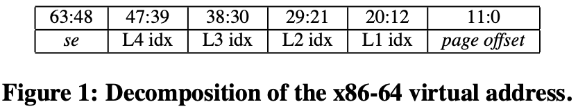
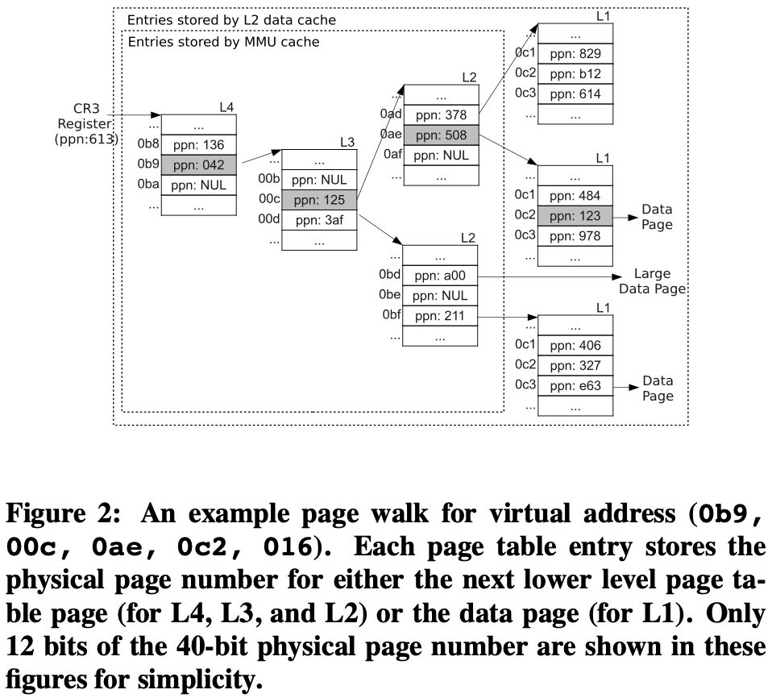
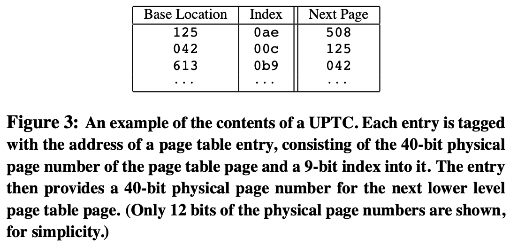
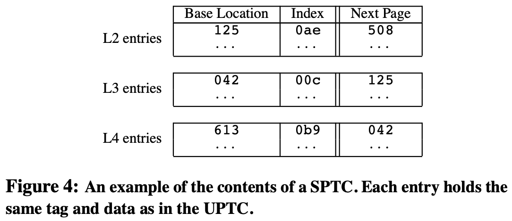
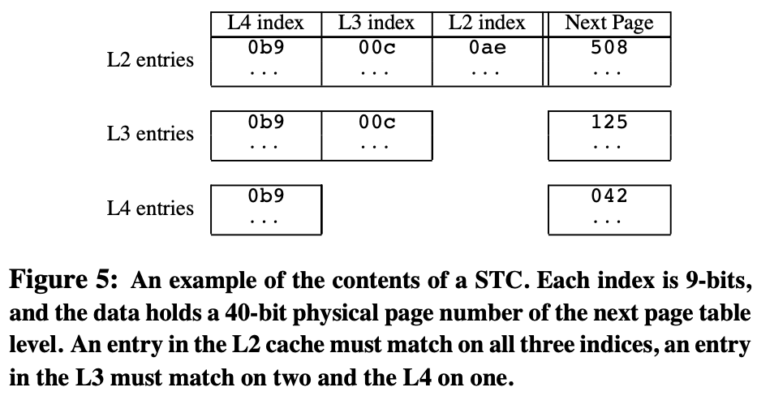
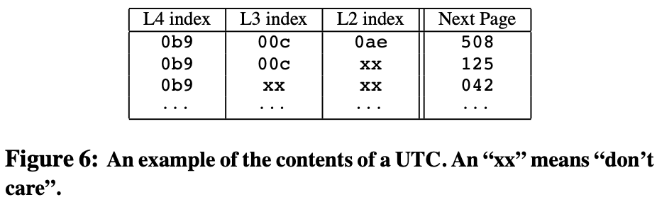
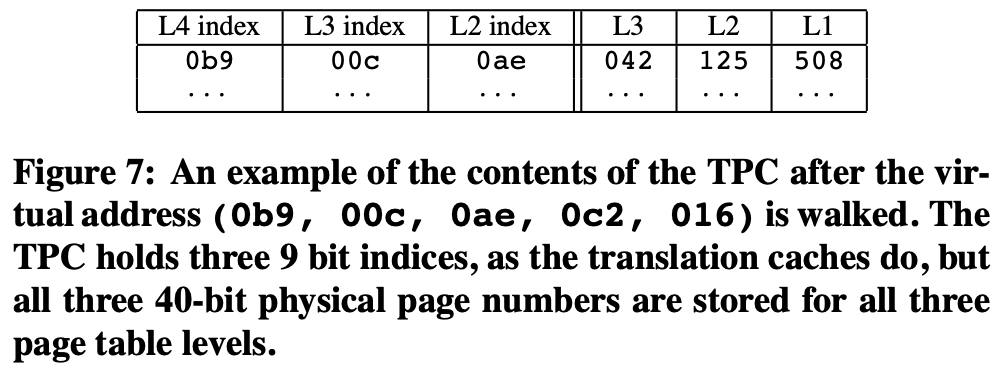
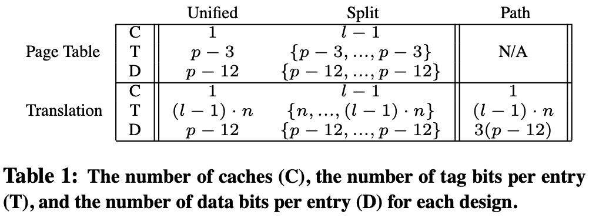
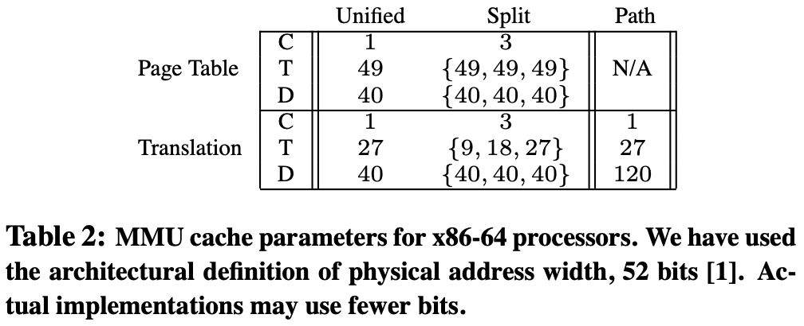

# [Translation caching: skip, don't walk (the page table)](https://dl.acm.org/doi/10.1145/1816038.1815970) 论文阅读笔记

背景：TLB miss 然后 MMU Page Table Walk (radix tree)，额外 memory access，所以引入 MMU Page Table cache for PTE

- Page Table Cache: AMD Page Walk Cache
  - 索引使用物理地址 + 对应虚拟位的偏移，每次只能跳一层
  - (pte PA + level_i_offset(VA)) -> pte of some level
- Translation Cache: x86 Paging Structure Cache
  - 索引使用部分虚拟地址，从最高位起，尽可能长（极端情况就是长到 VPN，那么就变成 TLB），可以一次跳过好几层
  - partial VA -> pte of some level

## Page Table Cache

某一层 pte 的 base PA + 该层对应的 offset VA => 下一层 pte 的 base PA

### Unified Page Table Cache

### Split Page Table Cache

## Translation cache

VA 延续到某一层的 prefix => 该层 pte 的 base PA

### Split Translation cache

### Unified Translation cache

## Translation-Path Cache

对 Translation cache 的实现优化，但是上层会有冗余

## Design Space Comparison

- index
- partition
  - app VA access pattern
      - dense：使用更底层的 page table
          - unified 可能导致上层 page table 被 replace
      - sparse：使用更上层的 page table
          - split 浪费大量空间
      - replace 时考虑 reload 成本，LRU 考虑 dynamic insertion recency
- coverage: access pattern
- complexity: organization

## Cache Design Simulation

best pracrice: unified translation cache + LRU

- TLB miss penalty
  - small memory app
  - large memory app
- cache size
- replacement policy
  - 不同层级 insertion recency

## Alternate Page Table Format

- hashed page table (inverted page table)
  - no spatial locality
- traslation storage buffer (SPARC, TLB miss handled in software)

## Reference

- [ppt](http://isca2010.inria.fr/media/slides/barr-ISCA10.pdf)