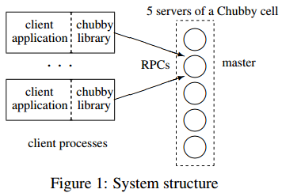
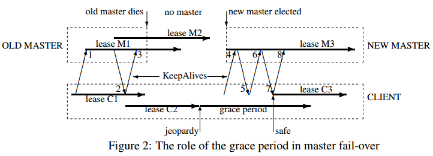

# [The Chubby lock service for loosely-coupled distributed systems](https://dl.acm.org/citation.cfm?id=1298487) 论文阅读笔记

特点：高可靠、高可用、粗粒度锁服务、小文件存储   
主要用于高可用的集群配置管理和系统元数据

- GFS：使用 Chubby lock 任命 master server
- Bigtable
  - 选举 master
  - master 轮询获得下面的 server
  - client 找到 master

## 设计

- 选择锁服务，而不是分布式共识服务
- 支持小文件，让 leader 可以写入参数，而不是维护另一个服务

情况

- 很多 server 读配置参数
- 当 leader 变更，server 需要通知机制
- consistent server caching

### 系统结构

每个 Chubby cell 根据分布式共识算法来选出一个 master，master 负责读写操作，其他都是 replica。（外界怎么知道谁是 master）

### file, directory, handle

Chubby 的命名结构类似文件系统，每个 directory 包含一个所有 sub-file 和 sub-directory 的列表，而每个 file 包含一串二进制字节。file 和 directory 统一叫做 node。node 在其所在的 Chubby cell 内只有一个名字，没有符号链接和硬链接。   
node 可以是 permanent 或者 ephemeral。

### lock 和 sequencer

由于 communication 的复杂与不稳定性，在使用锁服务的交互中使用序号，即虚拟时间戳。
> 我认为引入时间戳是因为锁有 fence 语义，所以要保证其中事件的同步。

如果一个锁是因为持有者停止工作或者不可访问，锁服务将阻塞其他的 server 在一个被称作锁延时(lock-delay)的时间段内索取该锁。

### event

client 可以注册一些监听事件，当某些动作发生时，就可以收到消息。这样减少了轮询的开销。

### consistent client caching

客户端缓存文件数据和结点元数据，有两种方式使得缓存过期：   
1. 超过 lease 的时间   
2. 接收到 master 发出的 invalidation 信号（消息延迟怎么处理？标记序号？）

当数据将被修改时，master 先**阻塞写操作**，发出 invalidation 信号，并且可能等待 lease 超时。**直到确保 client 缓存失效后才执行写操作**。（要么因为客户端答谢了过期信号，要么因为客户端让它的缓存租期(cache lease)过期。）

> 如果两个机器的时间速率不一样咋办？

### Session 和 KeepAlive

client 发起 KeepAlive RPC，master 阻塞直到 client 的 lease 快过期才返回，并延长 lease。client 在收到上一个回复以后立即发起一个新的 KeepAlive RPC，这样 client 保证几乎总是有一个 KeepAlive RPC 阻塞在 master 上。   
KeepAlive 还可以搭载事件，比如 cache invalidation。   

如果 client 的 lease 过期了，那么这个 session 称为 jeopardy。这之后的一段指定时间内，给一个被续的机会。如果没有被续上，那么这个 session 就过期了。

### 故障切换

说了那么多，总之就是向应用程序保证，仿佛 master 没有发生过故障。

## Reference

- [Chubby: A lock service for distributed coordination](https://medium.com/coinmonks/chubby-a-centralized-lock-service-for-distributed-applications-390571273052)
- [Google Chubby(中文版)](https://blog.51cto.com/zorro/1433558)
- [Chubby Lock Service（理论篇）](http://systemdesigns.blogspot.com/2016/01/chubby-lock-service_10.html)
- [Google利器之Chubby](https://blog.csdn.net/historyasamirror/article/details/3870168)
- [[论文笔记] Chubby 分布式锁服务](https://blog.csdn.net/chen_kkw/article/details/81144157)
- [Chubby的锁服务](http://catkang.github.io/2017/09/29/chubby.html)
- [Zookeeper vs Chubby](https://zhuanlan.zhihu.com/p/30991749)
- [The Chubby lock service for loosely-coupled distributed systems](http://www.cnblogs.com/fxjwind/archive/2013/04/27/3046976.html)
- [关于bigtable中chubby锁失效时的一点思考](https://zhuanlan.zhihu.com/p/60272604)