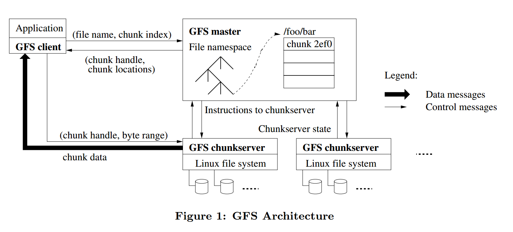
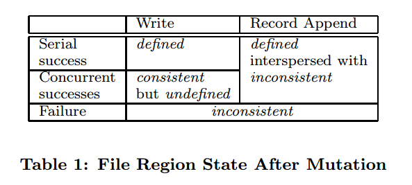

# [The Google File System](https://storage.googleapis.com/pub-tools-public-publication-data/pdf/035fc972c796d33122033a0614bc94cff1527999.pdf) 论文阅读笔记

> 这篇看得我非常难受，很多 trade-off 我一个学生根本无法体会，也就跟着意思意思罢了。   
> 补：没代码也没具体算法，，说个鬼。。。   
> 我个人还是喜欢比较偏数学的算法一点。。。   

## 背景

- 机器廉价，failure常见，需要持续的监控，
- 文件偏大，支持小文件但不优化
- 读多是sequential，少部分随机读
  - 注重性能的应用通常对小范围读取做 sort 和 batch，在文件中持续向前，而不是来来回回
- 大量的顺序写，即append；写了很少改，小范围随机写可以不优化
- 文件的 concurrently append 是 atomic 和 efficient
  - 用于 多路归并 和 生产者消费者队列
- 追求 持续的高吞吐量 而不是 低延迟

## 整体架构

一个 GFS 集群 = 1\*master + n\*chunk servers   
都是运行在普通linux系统上的用户进程   
文件被分为固定大小的 chunk，master 给每一个 chunk 全局唯一id   
chunk server 将 chunks 存储在硬盘上，通过 id 和 offset 来操作   
每个 chunk 默认存3个副本   
master 维护文件系统的所有元数据：namespace，access control，file 到 chunks 的映射，chunks 的位置   
master 还管理 chunk lease，废弃的 chunk，chunk 迁移   
master 定期通过心跳消息 给每个chunk server下达指令 并 收集状态

client 与 master 交互 元数据，所有数据传输直接通过 chunk server   
client 和 chunk server 都不需要 cache，因为都是大文件顺序操作，cache 反而为一致性加大了难度   
client 只在有限时间内缓存 元数据

只有一个 master，容易做决策   
client 所有数据交互都不通过 master，只向 master 询问 chunk server 的信息   
client 缓存元数据，之后的操作与 chunk server 交互

chunk size 设置为64MB，优点：   
1. 减少 client 和 master 的交互，对于顺序读写有利   
2. 减少 client 的网络开销   
3. 减少 metadata 的体积，因此可以放进内存   
缺点是   
1. 小文件 chunk 少，某个 server 有可能成为热点。不过实际中通常是顺序读取大文件

#### metadata
metadata 分三种：   
1. file/chunk namespace   
2. 从 file 到 chunk 的映射   
3. chunk replica 的位置   
前两种metadata持久化到硬盘并且保留远程副本，chunk的位置并不持久化，而是在master启动 或 chunk server加入时询问

master为每个64MB的chunk维护的metadata至多64B

每个chunk server上存储的chunk是server自己说了算的，master的数据仅作为参考，定期通过心跳消息交互。（这样省去了同步的问题）

#### Operation Log
Operation Log 记录metadata的变化，相当于全局事件   
其实就是WAL，local和remote记录下operation之后才返回client   

### Consistency Model

- consistent：client从任意replica读到的数据都一样
- defined：写操作时consistent，并且client能够看到写入操作的结果

GFS保证

- 所有replica上的操作顺序一致
- 使用chunk version number检测server是否stale
- stale的副本不参与交互，会被GC

注意到metadata会被client缓存一段时间，于是有可能某个server的chunk stale

有可能写入重复数据，app可以加入id来判断

## 系统交互

最小化所有结点和master的交互

- 数据变更
- 原子append
- snapshot

### Lease（租约）
使用lease来维护一个chunk的所有replica的写操作的顺序   
设计租约机制的目的是为了最小化master节点的管理负担   

master 选择一个 chunk replica 作为 primary chunk，primary chunk 对该chunk 的所有写操作做序列化

1. client 询问 master 关于 primary chunk 和 replica 的位置
2. client 缓存 master 的答复
3. client 向所有 replica 发送数据（顺序未指定，通常从网络距离近的发）
4. 所有 replica ack 之后，client 向 primary chunk 发送写请求；primary chunk 将所有写请求（可能来自多个 client）串行化编号
5. primary chunk 发送写请求到其他 replica，按照串行编号执行
6. 其他 replica ack 成功
7. primary chunk 回复 client，并报告所有 error

注：

- 如果 primary chunk 写 fail，那么 ⑤ 之前就结束

> 有个问题，既然 lease 是针对 chunk 的，那有可能一个 server 拥有多个 primary chunk，那么 overhead 有可能较大。关于 lease 的分布文章中貌似没有讨论？？？

### 数据流
为了充分利用 network bandwidth，数据沿着 chunk server 的一条链推送

### atomic append

append 保证至少一次的原子写入

如果 append 会超出这个 chunk，primary chunk 先 padding，并且其他 replica 同步，然后回复 client 对下一个 chunk append

### ！！没懂！！
如果 append 在任一 replica 上 fail，那么就重试。   
这将导致 replica 数据不一致。（某些 replica 的内容会变长？？）

> 问题：   
> 1. replica 数据不一致，读的时候怎么处理？？？   
> 2. 每次 append 怎么保证所有 replica 写入的起始位置相同？？？   
> 3. 怎么维护所有 replica 的当前写入位置？？？   

### Snapshot

快照，拷贝 file 或 directory tree，使用 COW

- master 收到创建快照请求
- master 首先回收该 file 相关 chunks 的 lease（没有 primary chunk，这保证之后的写操作都会先询问 master）
- master 写 log，然后 copy 一份 metadata
- master 收到 client 的写请求（因为回收了 lease）
- master 检查 chunk 的引用计数超过1，于是让所有 replica 创建一个该 chunk 的新副本，给这个新副本选一个 lease，回复 client（为什么选择新副本进行修改的原因见下）

一些理解：   
snapshot 持有一簇 chunks 的 handle   
每个 chunk 在 master 的 metadata 中的引用计数都可能大于1    
master 维护 snapshot 和 chunk 的信息   
于是当修改一个 chunk，并且其引用计数是若干，那么只要复制一个新副本，并且当前引用计数-1，然后写操作应用于新副本即可；因为有若干 snapshot 持有旧 chunk 的 handle，否则还要维护 chunk 到 snapshot 的对应关系。

## master 管理

### namespace
namespace 是 绝对路径 到 metadata 的 k-v 映射

目录是一个虚拟概念，只是一个路径的字符串，每一个绝对路径名都关联一个读写锁   
例如操作 d1/d2/.../dn：获取 d1, d2,..., dn-1 的读锁，然后获取 dn 的写锁   
不需要获得 dn-1 的写锁，因为目录只是虚拟概念（在目录下创建文件 被认为 并不更改目录）

采用这种锁方案的优点是支持对同一目录的并行操作。比如，可以再同一个目录下同时创建多个文件：每一个操作都获取一个目录名的上的读取锁和文件名上的写入锁。目录名的读取锁足以的防止目录被删除、改名以及被快照。文件名的写入锁序列化文件创建操作，确保不会多次创建同名的文件。（摘抄自GFS中文译版）

### replica location

replica location 的选择目标：数据可靠性（data reliability），可用性（availability）

分布在多个机架间，写操作在多个机架间通信的开销可以接受

### replica 管理

创建 replica 的3中途径：   
1. chunk creation   
2. re-replication   
3. rebalancing

- 创建策略
  - 平衡硬盘使用率
  - 限制 chunk server 上进行创建操作的频率
  - 在机架间分布副本   
- 复制策略—复制优先级
  - replica 与 规定值的差
  - 活跃优先级
- 重新负载均衡

### Garbage Collection

文件被app删除时记录log，然后做标记：把文件名改为一个包含删除时间戳的、隐藏的名字（允许“反删除”）   
当 master 对文件系统 namespace 做常规的GC扫描时，把所有超过规定时间的文件真正删除（metadata 被删除，切断了和 chunks 的联系，之后 master 和 server 交互时，chunks 被删除）

### Stale Replica Detection

master 保存了每个 chunk 的 version number，用来检测是否过期

## 容错

### 高可用

- Fast Recovery
- Chunk Replication
- Master Replication

### 数据完整性

checksum（没看懂他增量更新是怎么来。。。）

## Reference

- [Google File System 论文详析](https://zhuanlan.zhihu.com/p/33944479)
- [经典论文翻译导读之《Google File System》](https://kb.cnblogs.com/page/174130/)
- [[转载]分布式文件系统综述](http://blog.sciencenet.cn/home.php?mod=space&uid=76290&do=blog&id=441105)