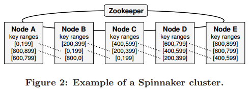

# [Using Paxos to build a scalable, consistent, and highly available datastore](https://dl.acm.org/citation.cfm?id=1938549) 阅读笔记

## 简介
- 所有 server 都在一个 data center，Network Partition 比较罕见，所以选择 CA 模型
- 按 key 分区（shard），每一个 key range 有3个副本，放到3个 server 上
- 提供 kv get/put 接口
  - 读操作可以指定一致性：strong，timeline（可能读到 stale data，性能好）
- replication 基于 Paxos，与 commit log，recovery 整合

## 相关工作

- 2PC
  - 不满足可用性
  - 性能差
- DB replication
- Dynamo, Bigtable, and PNUTS

## 整体架构

包含同一个 key range 的 servers 构成一个 *cohort*，通常一个 key range 有3个 replication

> - 为什么要把一个 server 上 3 个 cohort 的 log 放在一起？？？
> - 有句话没看懂：为了 share same log，server 上的每个 cohort 都使用自己的 LSN（不是说 LSN 是全局唯一吗？）

Committed write 被写入 memtable，变为 imm，并且落盘成 SSTable（参考 levelDB）

使用 zookeeper 来做协调与容错，存储 meta data，并且管理节点failure。

## Replication 协议

replication protocol 有两个阶段：

- **leader election phase**：如果没有 failure，leader 不变
- **quorum phase**：leader 发起写操作，follower accept

### 写流程
- client 发起一个写操作 `W`，总是被发送给所属 key range 的 leader（怎么找这个 leader）
- leader append `W` 到自己的 `log`
- 将 log 写入 disk
- 与上一条同时，leader append `W` 到 `commit queue`，并且向 followers 发送 `W` 的 propose message

当 follower 收到 propose message 时

- 将 log 写入 disk
- append `W` 到 `commit queue`，并回复 ack

-----
### ？？？follower 收到的消息乱序怎么办？？？
**最好一个 datacenter 内是 FIFO communication，不过还得考虑 drop packet**   
翻了一些资料：

- [Discrete Event-based Neural Simulation using the SpiNNaker System](http://wotug.cs.unlv.edu/files/CPA2015/papers/paper-02.pdf)：没细看，貌似说每条 link 可以被视为 FIFO
- [Towards Causal Datacenter Networks](https://www.microsoft.com/en-us/research/uploads/prod/2018/03/causal-papoc18.pdf)：
  - 和 spinnaker 无关，但是探讨了 datacenter 怎么做一个 causal 通信模型（比FIFO强）
  - 有一句话比较好 “*Modern networking hardware is capable of inserting a peroutgoing-port sequence number on each packet and checking that each incoming packet’s sequence number matches the expected one for that port. This can be used to verify that a link is indeed a FIFO channel.*”
  - 文中说可以做到让 packet loss 很少
- [Designing Distributed Systems Using Approximate Synchrony in Data Center Networks](https://www.usenix.org/system/files/conference/nsdi15/nsdi15-paper-ports.pdf)：
- [Just say NO to Paxos Overhead: Replacing Consensus with Network Ordering](https://www.usenix.org/system/files/conference/osdi16/osdi16-li.pdf)：
- [High Performance Datacenter Networks - Architectures, Algorithms, and Opportunities](https://static.googleusercontent.com/media/research.google.com/zh-CN//pubs/archive/37069.pdf)：通过 back pressure 让 router buffer 不会满，于是 no packet loss
- 如果 network topology 是 tree，那么只要正确处理 packet loss，就可以成为 FIFO

没有找到有文献明说 Spinnaker 的 datacenter 是 FIFO 通信模型。

-----

当 leader 收到至少1个 ack时，（3个中的多数）

- 执行 `W` 进 memtable
- 返回 client

leader 周期性地发送 commit msg，包含一个 last commited LSN

> server 上 3 个 cohort log 放一起，怎么 commit？？？

## Recovery
一个结点，作为3个cohort成员同时恢复，这里只讨论1个cohort

### Follower Recovery
- local recovery：回放 log 直到 `f.commitedLSN`（回放是指写 memtable，然后 dump 成 SSTable）
- catch up：向 leader 请求 `f.commitedLSN` 之后的 commited log

Logical Truncation：另外 log 是混在一起的，所以要额外维护一个 skipped-LSN-list，区分哪些不需要，这样做避免了 log compaction 的磁盘IO

### Leader Takeover
leader fail 之后开始选举，新 leader 需要有所有已经 commied log。先不响应 client 的写请求，让所有 follower 同步 commit 到 `committedLSN`，等多数同步完之后，对 log( `committedLSN`, `lastLSN` ] 发起写操作（正常的 replication protocol），再响应 client 的写请求。

## Leader 选举
使用 zookeeper 来协调选举，在 zookeeper 下有目录 /r，r 为 cohort 所属的 key range。首先清除上一次的信息，每个 server 都作为 candidate，把自己的 `lastLSN` 写到 /r/candidates 下，当大多数 server 参与时，就可以选出新 leader（因为一定存在 server，含有旧 leader 最后 `commitLSN` 的 log）。拥有最大的 `lastLSN` 的 server 成为新 leader ，并将自己的信息写入 /r/leader，这样就达成了共识。

## Discussion
### 可用性
对于 3 replication

- 写操作：2 结点
- 强一致性读：2 结点（因为强一致性，所以读之前的写入必须成功）
- 时间线读：1 结点

## Reference

- [Spinnaker — 使用 Paxos 构建分布式数据库](https://zhuanlan.zhihu.com/p/40825849)
- [论文阅读之Spinnaker](https://www.jianshu.com/p/d4f3294aaece)
- [论文研读之Spinnaker](https://oven-yang.github.io/%E8%AE%BA%E6%96%87%E7%A0%94%E8%AF%BB/paper-spinnaker/)
- [Spinnaker论文要点关于《Using Paxos to Build a Scalable, Consistent, and Highly Available Datastore》论文的概括和个人总结](http://urdandskuld.top/2019/01/11/Spinnaker%E4%B8%AA%E4%BA%BA%E7%90%86%E8%A7%A3/)