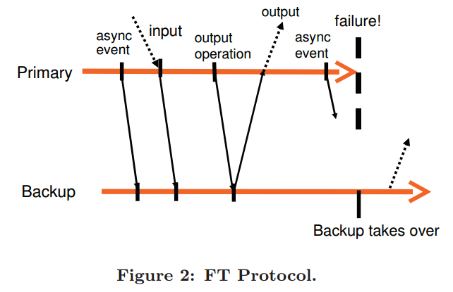

# [The design of a practical system for fault-tolerant virtual machines](https://dl.acm.org/citation.cfm?id=1899932) 阅读笔记

## 介绍

容错思路是 primary / backup，那么就保证两者尽可能同步就好，但是同步内存和IO等操作消耗巨大，所以转变思路：   
假设 primary / backup 初始状态相同，那么只需要同步状态迁移操作即可。（为了达成这么nice的property，我们需要证明它是一个“确定性状态机”，即 deterministic state machine）   
因此使用 VM 来保证确定性状态机的性质：因为所有操作都是经过 VM 控制的。对于本身就确定的操作，直接 sync log 然后 replay 即可；对于非确定性的操作，VM 采用一些手段 sync 到 backup。

## 基本设计

primary 与 backup 的执行是一样的，但 backup 的 output 被 hypervisor 抛弃掉。   
检测 fail：心跳消息；监控 logging channel。   
防止 split brain：atomic lock   

### Deterministic Replay Implementation
目标：在不影响性能的情况下，捕获所有输入和非确定性操作并正确地执行于 backup。

主要细节在 [ReTrace: Collecting Execution Trace with Virtual Machine Deterministic Replay](https://labs.vmware.com/academic/publications/retrace)

把输入和非确定性以日志流形式记录   
对于非确定性事件：记录发生时的具体指令   

### FT protocol
**Output Requirement**：如果 backup 接替 primary 执行，backup 的执行必须满足 与 primary 之前向外界的输出完全一致。

**Output Rule**：为了满足 Output Requirement，primary 必须延迟向外界 output，直到 backup ack *生成 output 的 log*

无法保证所有 output 只 produce 一遍，因为 backup 无法得知 primary fail 前是否 produce output。不过有网络机制可以解决dup问题。

### 故障检测与相应

- UDP 心跳消息
- 监控 logging traffic

对于 network partition 造成的 split-brain 问题，使用 shared storage 上的自旋锁，保证最多只有一个 VM *go live*。

## 实现

### VM 的启动与恢复

[Fast transparent migration for virtual machines](https://dl.acm.org/citation.cfm?id=1247385)

### Logging Channel

primary buffer 满了之后就 stop，对外界有影响；backup buffer 满了之后就 stop，对外界无影响。

record log 和 replay 的开销大致相同。

为了 replay 用时少，控制 primary 和 backup 之间的 lag。

VM 管理 disk IO，并串行化；使用 bounce buffer 控制 IO。

## Reference

- [容错虚拟机分布式系统的设计](http://blog.luoyuanhang.com/2017/05/20/ftvm-notes/)
- [分布式系统经典论文概述（1）](https://zhuanlan.zhihu.com/p/31918557)
- [MIT 6.824 2018 Lec 4: Primary/Backup Replication](http://hw2007.com/2018/11/29/MIT-6-824-2018-Lec-4-Primary-Backup-Replication/)
- [Primary-Backup Replication 总结](https://mr-dai.github.io/primary-backup-replication/)
- [ReTrace: Collecting Execution Trace with Virtual Machine Deterministic Replay](https://labs.vmware.com/academic/publications/retrace) 待看
- [Fast transparent migration for virtual machines](https://dl.acm.org/citation.cfm?id=1247385) 待看