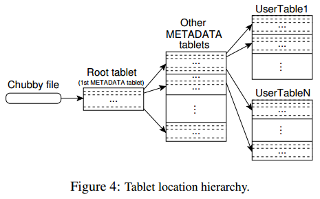

# [Bigtable: a distributed storage system for structured data](https://dl.acm.org/citation.cfm?id=1298475) 论文阅读笔记

## 数据模型

(row: string, column: string, timestamp: int64) -> string

对 row 的单个操作是原子的，将 row 按照 key 排序，一个 row range 作为一个 tablet，即若干个 SSTable（这也提供了缓存优化的依据）

时间戳：维护数据的多个版本

## 基础构件
- 使用 GFS 存储 log 和 data
- 存储格式是 SSTable（参考 levelDB，顺序写）
- Chubby 提供一套 **文件锁** 和 **监听服务**
  - Bigtable 的可用性依赖于 Chubby 的可用性
  - 同时最多只有一个 master
  - 存储 Bigtable 数据的引导启动位置
  - 查找 tablet server，并且在 tablet server 失效后善后
  - 存储 schema 和 访问控制列表

## 实现
- master server
  - 分配 tablet 给 tablet server
  - 检测 tablet server 的变化，做负载均衡和GC
- tablet server：管理一个 tablet 集合
  - 处理读写请求，直接与 client 交互，数据不通过 master
  - 当过大时 split

### Tablet 位置
client 几乎不与 master 交互，减少了 master 负载。 client 根据如下3层结构确定 tablet server 的位置。

- 第一层 Chubby file 存储 Root tablet 的位置
- Root tablet 中的 METADATA 表，存储了其他 METADATA tablet 的位置
- 每个 METADATA tablet 存储用户 tablet 位置

client 缓存 tablet 位置，如果未命中，则递归向上找。

### Tablet 分配
每个 tablet server 管理的 tablet 集合交空。master 记录当前活跃的 tablet server，和 tablet 的分配信息。master 根据负载来分配当前未分配的 tablet。   
Bigtable 使用 Chubby 来跟踪记录 tablet server 状态，**一个 tablet server 是活跃的并且提供服务，当且仅当这个 tablet server 占有 Chubby 中相应的文件锁**。master 通过监控服务器目录来监控 tablet server。

- 当 tablet server 断线重连后，试图重新获得相应的文件锁，如果文件已不存在，说明不被认为是 server，那么自动退出
- master 通过轮询文件锁的状态来判断 tablet server 是否活跃并提供服务。如果一个 tablet server 无法提供服务，或者 master 最近几次连接不到 tablet server，那么 master 尝试占有文件锁并删除，之后重新分配这个 tablet server 下的 tablets
- master 在与 Chubby 会话过期后自动退出，Chubby 中有一个唯一的 master 锁，保证任何时刻最多只有一个 master

**master 启动**

- 从 Chubby 中获取 master 锁
- 扫描 server 目录，获取当前正在提供服务的 tablet server
- master 和每个 tablet server 通信，获取这个 tablet server 下的所有 tablets
  - 如果发现 Root tablet 未被分配，那么 master 就把 Root tablet 加入到未分配集合
- master 扫描 Root tablet 中的 METADATA 表来获取所有 METADATA tablets

**tablet 分割** 要特殊处理，因为这是由 tablet server 完成。分割操作完成后，tablet server 通过向 METADATA 表记录新的 tablet 信息来提交这个操作。提交完成后， tablet server 向 master 通知。

### Tablet 服务
读写都是和 levelDB 差不多。

### Compaction
就是 levelDB 的 Compaction。

## 优化
- locality group：分组提高读效率
- Compression

## Reference

- [Bigtable 论文详述](https://mr-dai.github.io/bigtable/)
- [Google论文之Bigtable详解](https://3gods.com/bigdata/Google-Paper-Bigtable.html)
- [回顾Bigtable的经典设计](http://www.nosqlnotes.com/technotes/bigtable-keydesign/)
- [浅析 Bigtable 和 LevelDB 的实现](https://draveness.me/bigtable-leveldb)
- [Bigtable设计的”得”与”失”](http://www.nosqlnotes.com/techpoints/bigtable-design-analysis/)
- [再读Bigtable论文](http://loopjump.com/bigtable_paper_note/)
- [BigTable小结](http://www.cnblogs.com/wangyonghui/archive/2011/08/31/2161432.html)
- [【译】理解 Hbase 和 BigTable：Understanding HBase and BigTable](https://lunatictwo.github.io/2017/09/25/Hbase&&BigTable/)