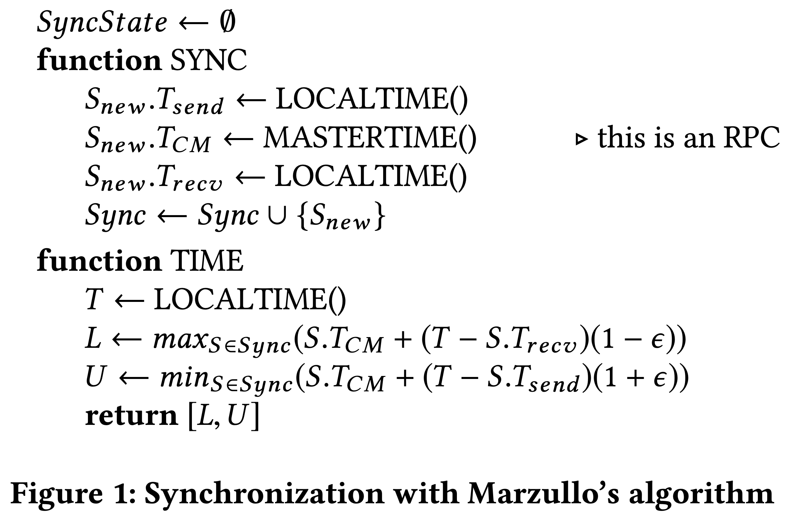
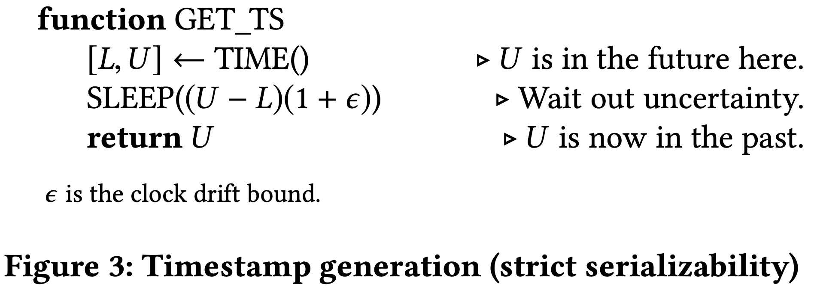
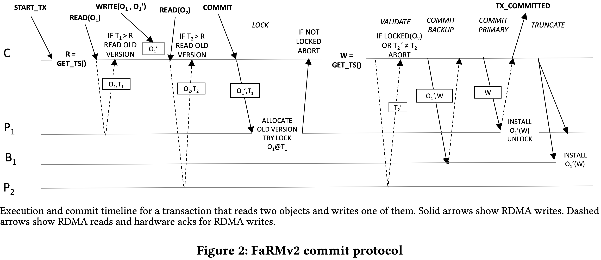
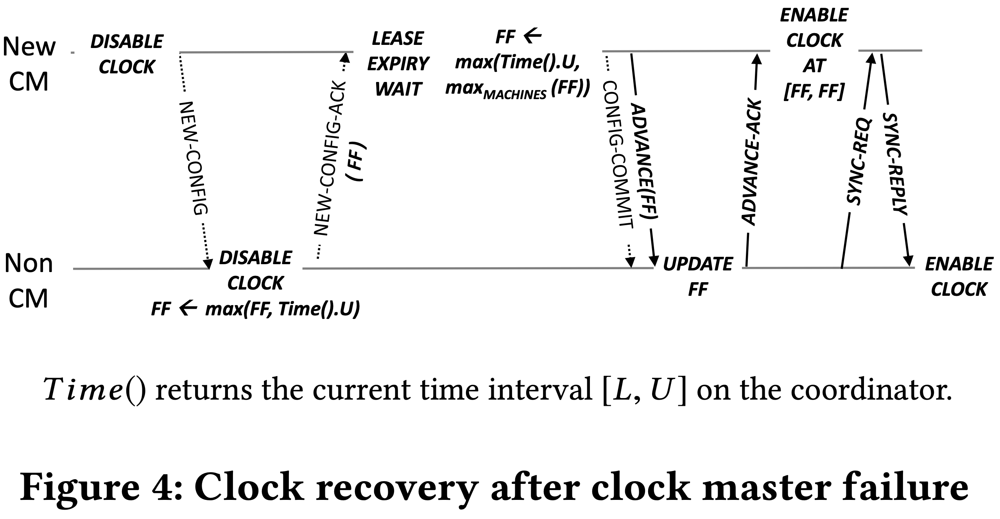
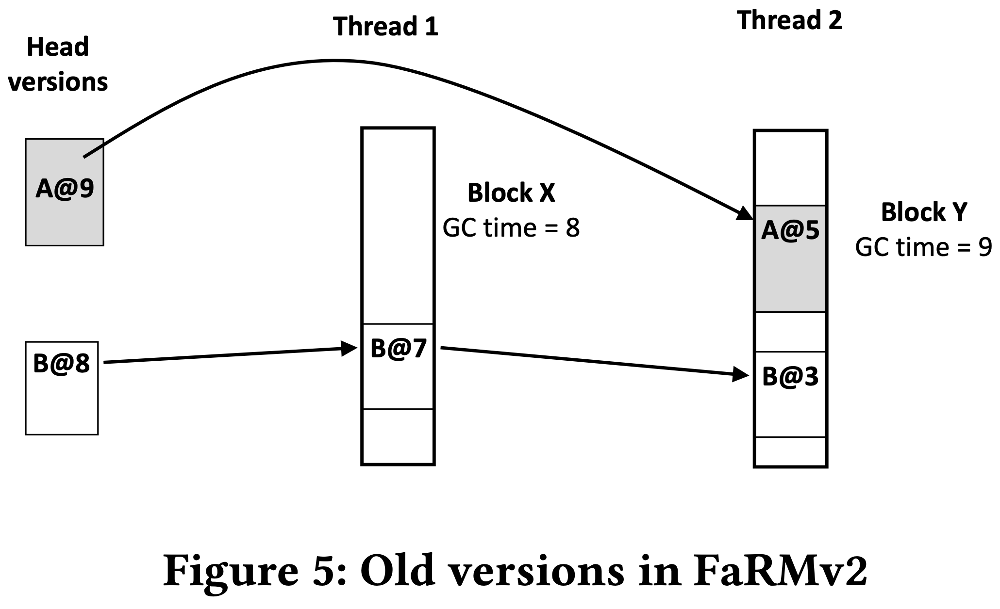

# [Fast General Distributed Transactions with Opacity](https://www.microsoft.com/en-us/research/uploads/prod/2019/01/mod057.pdf) 论文阅读笔记

> **相比 FaRM V1，通过时钟同步，引入了 Multi-Version。**   
>    
> index 怎么搞？？如何给 multi-master 共享？？只想到了2条路：   
> - fixed-length key，大范围内不需要 index   
> - **在 node 级别上搞 MESI-like protocol**   

- 为什么说 Spanner 使用 read lock 悲观控制需要 two-way messaging？FaRM 乐观控制需要 3 次 RDMA

## Clock Synchronization

## Transaction Model

- 问题：是否是全序可比的？是否与外界 causality 相一致？

- lock
- get commit-ts
- validate
- commit backup：记录 write 信息
  - 是否需要记录 lock 信息？可以不要，因为向 backup 写 log 时 primary 上持有 lock。因此对于同一数据的修改 log 总是有序的
  - 对于不同数据的修改，log 可以是无序的。即同一 replica 的不同 backup 上的 log 顺序可以不同
- commit primary：primary install 新版本，unlock
- truncate backup：backup install 新版本，unlock
  - replay log 时可以并发，如果不记录 lock，需要做类似 memory disambiguration 的机制

## Clock Failover

## Multi-Version

- head version 是 in-place，也就是说每次要 copy 出去成为 old version

## GC

- copy old version 时就记录下来 (commit-ts, ptr)
- 维护全局 oldest active transaction
- 注意 stale snapshot reads

## Reference

- [Fast General Distributed Transactions with Opacity - SIGMOD 2019](https://av.tib.eu/media/42950)