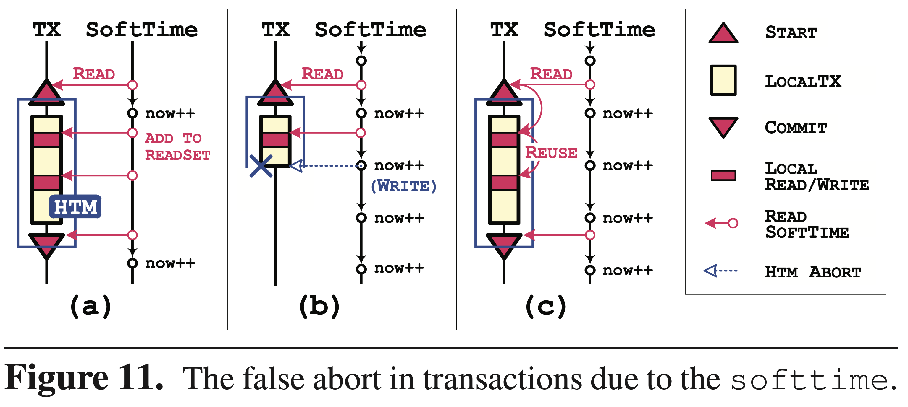

# [Fast In-memory Transaction Processing using RDMA and HTM](https://ipads.se.sjtu.edu.cn/_media/publications/drtm-sosp15.pdf) 论文阅读笔记

> 使用 HTM 的一个原因居然是 RDMA CAS 与 local CAS 不兼容。。。   
>    
> 学到一招：用 expired time 作为 shared lock，一定程度上减少了来回通知及故障检测的开销。   

## Distributed Transaction

> 有个问题：虽说 serialization point 是 HTM 提交时，但是这时就记录 log 是否合理？因为之后可能 validation fail。   

- lock remote writes/reads-sets
  - prior knowledge
  - read lock 使用 lease，写入了 expierd time
- log **remote**
- local HTM
  - normal processing
  - log **local & remote** (HTM on NVM)
- validation read lease
- install write & unlock

- RW txn 的 serialization point 是 HTM 成功提交时

- 先 shared lock，然后 validation
- RO txn 的 serialization point 是最后一个读操作

- local HTM 前 log remote
- local HTM 最后 log local & remote (HTM on NVM)

## Memory Store Layer

- 缓存 (k, addr)，不缓存 value payload

- long update interval of time thread

## Reference

- [Fast in-memory transaction processing using RDMA and HTM - SOSP15](https://www.youtube.com/watch?v=gJa6g-omuho)
- [Fast In-memory Transaction Processing using RDMA and HTM - the morning paper](https://blog.acolyer.org/2015/10/26/fast-in-memory-transaction-processing-using-rdma-and-rtm/)
- [Distributed Transaction with RDMA and HTM 笔记](https://github.com/dyweb/papers-notebook#distributed-transaction-with-rdma-and-htm)
- [Fast In-Memory Transaction Processing Using RDMA and HTM 笔记](https://nan01ab.github.io/2019/01/DrTM.html)