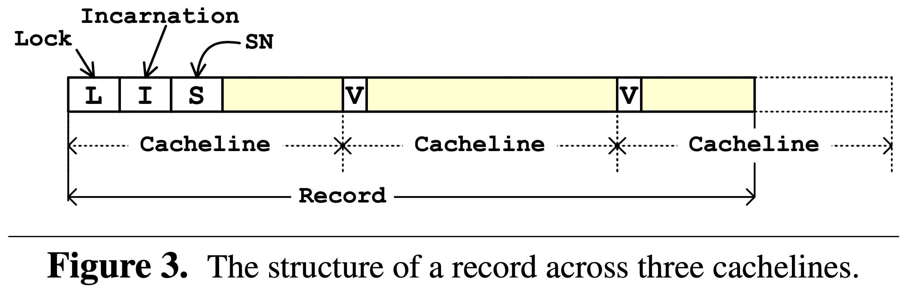
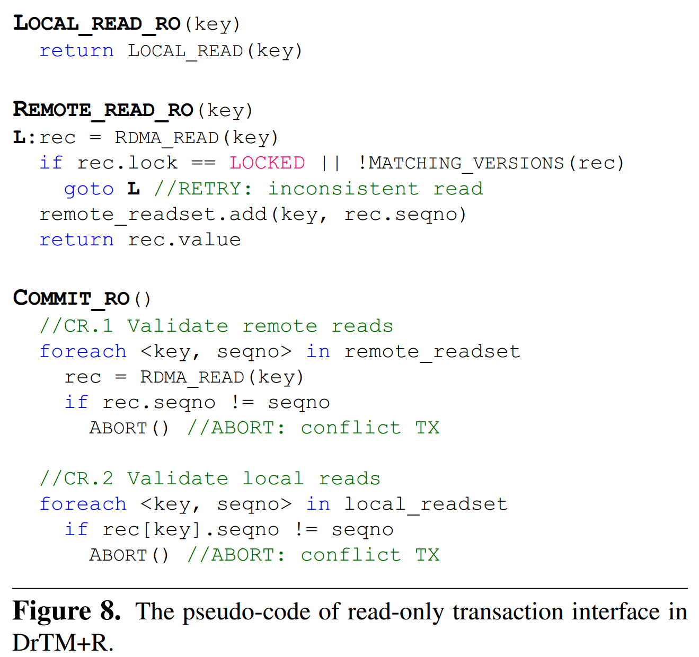

# [Fast and General Distributed Transactions using RDMA and HTM](https://ipads.se.sjtu.edu.cn/_media/publications/drtm2-eurosys16.pdf) 论文阅读笔记

> distributed transaction 和 FaRM V1 类似，使用 HTM 替代了 local write lock，但是要补上 remote read lock。   
>    
> index 是每个存储节点自己维护，对外提供 KV 接口。   

## Architecture

- 存储层提供 KV 接口，计算层发送 KV 请求

## Transaction Model

- lock
- validation
- update & unlock

- 每个 record 新起一个 cacheline
- header
  - lock
  - incarnation
  - sequence number
  - version：和 sequence number 作用一样，作为这个 cacheline 的版本，保证单个 record 读是 atomic

- 为什么 remote read 的 match & retry 不交给对面来做？

- lock *remote* reads/writes-sets
- validate *remote* reads-sets
- (HTM) validate *local* reads-sets & update *local* writes-sets
  - 注意检查一下有没有 *remote* 来这里 lock
  - HTM 保证了 *local* txn 对 *local* reads/writes-sets 的操作是等价于 lock
      - 这暗示若 *local* reads/writes-sets 过大，则可以考虑 lock，这是兼容的
  - **RW txn 的 serialization point 就是 HTM 成功提交时**
- update *remote* writes-sets
- unlock *remote* reads/writes-sets

- validate *remote* reads-sets
- validate *local* reads-sets
- **RO txn 的 serialization point 就是最后一次读操作，即 commit 刚开始**

## Replication

- 由于 validation 和 commit local write 在同一个 HTM，相当于没有 replicate log 就 commit。因此需要让 HTM 提交后设置数据“未提交”，直到 backup 收到 log
- 使用 seqlock 的奇数表明数据“未提交”，所有访问操作都会失败

## Implementation

### HTM Fallback Handler

- local HTM abort 次数过多时，可以考虑 lock

### Memory Store
