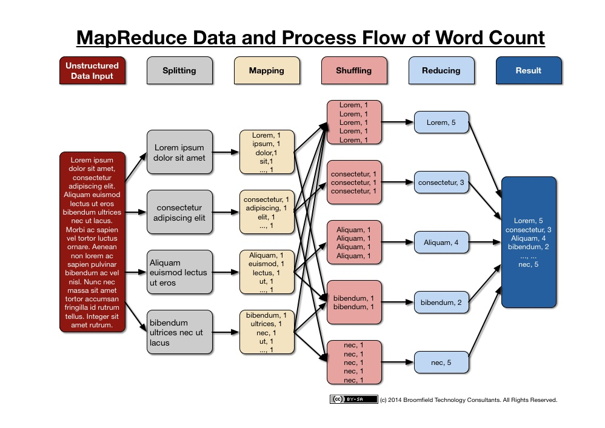
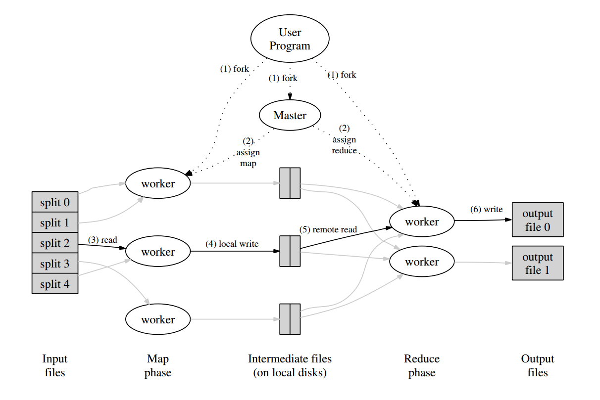

# [MapReduce: Simplified Data Processing on Large Clusters](https://pdos.csail.mit.edu/6.824/papers/mapreduce.pdf) 论文阅读笔记

- **Map**: `(k1, v1)` -> `list(k2, v2)`
- **Shuffle**: `list(k2, v2)` -> `(k2, list(v2))`
- **Reduce**: `(k2, list(v2))` -> `list(v2)`

`k1` 通常被忽略   
`list(v2)` is supplied to reducer via an iterator.(to save memory)   
> 后面说要对 key 排序，那还是要全部读完啊？？？   
> 又看了一下，貌似中间可以优化成不断地去取这些data，反正最后key一样的都堆到一起就行了。    

Common usage: 统计频次，倒排索引，分布式排序

## 执行流程

- 用户程序把输入文件分为 M 份，并在多个机器上开启程序副本
- 有一个 master，给其他 worker 分配任务（M 个 map 任务 + R 个 reduce 任务，master 选择 idle workers 派发一个 task）
- map worker
  - 读相应的 split input，将每一对 `(k1, v1)` 用 `Map()` 处理，生成中间结果 `list(k2, v2)` 并存储在 memory
  - 中间结果被周期性地写入 local disk，被 *partitioning function* 分为 R 个区域
  - 把 location(抽象表示) 告知 master，master 负责转发给 reduce worker
- reduce worker
  - 被 master 通知，通过 RPC 读取 map worker 的数据
  - 读完之后对 key 排序（从每个 map worker 读 R 分区的其中之一；如果数据过大，就使用外排序）（感觉排序没什么用，反正最后都是分堆放）
  - 遍历每一个 key 的结果，并调用 `Reduce()`，输出 append 到一个最终输出文件
- 所有任务完成后， master 唤醒用户程序，并返回到用户代码中的 `MapReduce()`（结果不用合并，通常作为下一个 `MapReduce()` 的输入）

master 维护 worker 的状态：*idle*, *in-progress*, *completed*

## Fault Tolerance

- master
  - fail 直接向 user 返回
- map worker
  - `A` fail 后，master 标记为 idle，并重新找一个 worker `B` 执行，向 reduce worker 通知 `B`
  - 还没有读 fail 的 map worker `A` 的 reduce worker 将读新的 map worker `B`（已经读了 `A` 的咋办？？）
- reduce worker
  - 提交是 atomic

## master 调度

### Locality

- GFS 把输入文件分成一些 64MB blocks，每个 block 通常存 3 copies 在不同的机器上
- master 根据分布信息来 schedule map worker
  - 通常在含有某一 replica 的 idle node 上运行相应的 map task
  - 如果 idle node 上没有相应的 replica，就把**离相应 replica 近的** idle worker 分配 map task（例如 on the same network switch）
- 意义：
  - 大多数 map worker 读 local data
  - 不消耗 network bandwidth

### Task Granularity

每个 node 执行多个 task

### Backup Task

Straggler：拖后腿（bad disk, disabled cache ...）   
Solution：当一个 `MapReduce()` 快完成时，master 为 *in-progress* 的 task 开启 backup execution，并等待其中任意一个完成

## Refinement

对于平凡的交换半群操作，允许用户提供 `Combiner function`，对在 `Map()` 得到的中间数据可以先做一些处理，（k重复，即对k的Merging），通常这个函数也是 `Reduce()`

## Reference

- [6.824 2018 Lecture 1: Introduction](https://pdos.csail.mit.edu/6.824/notes/l01.txt)
- [Google MapReduce中文版](https://wenku.baidu.com/view/1aa777fd04a1b0717fd5dd4a.html)
- [[分布式系统学习] 6.824 LEC1 MapReduce 笔记](https://www.cnblogs.com/lichen782/p/6995482.html)