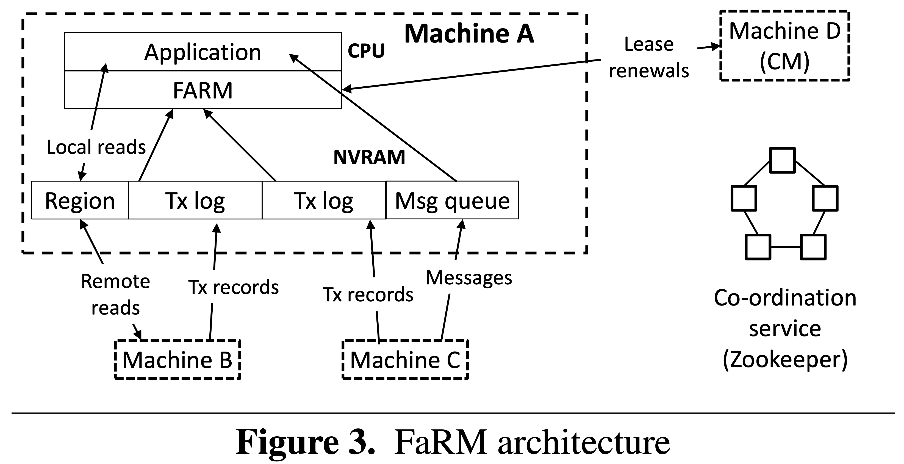
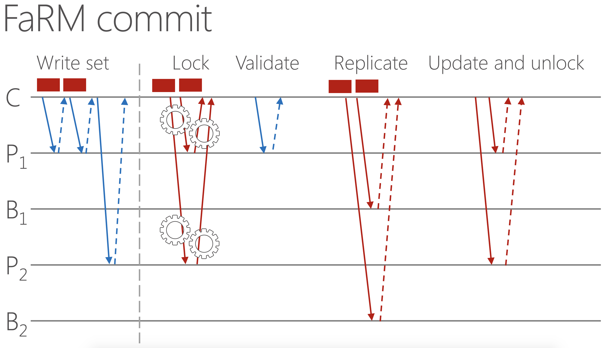
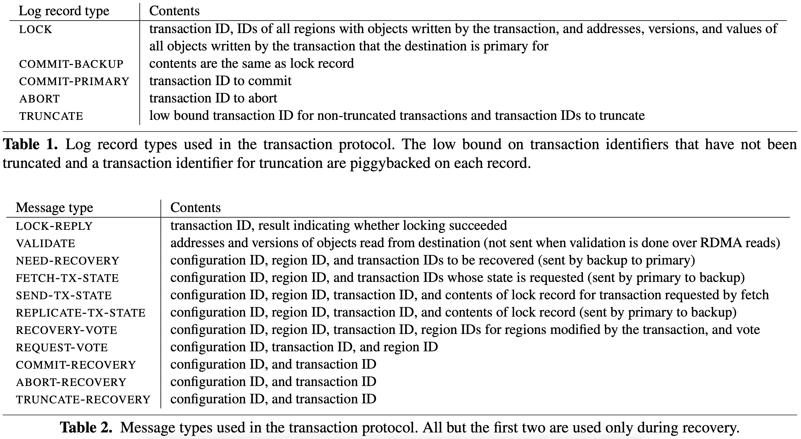
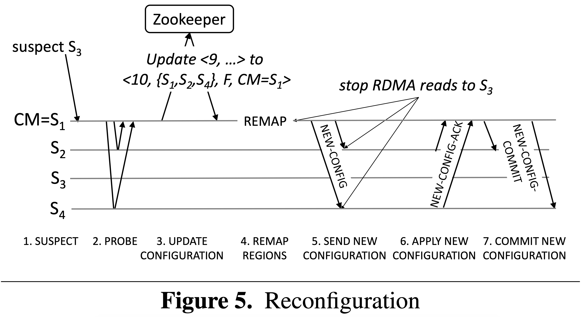
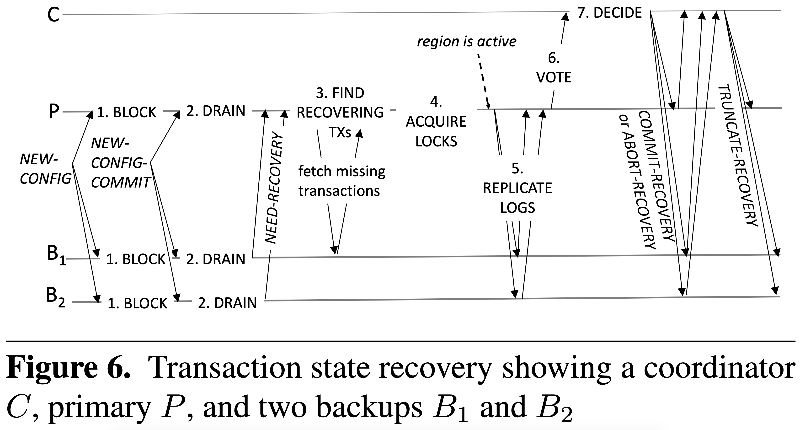

# [No Compromises: Distributed Transactions with Consistency, Availability, and Performance](https://pdos.csail.mit.edu/6.824/papers/farm-2015.pdf) 论文阅读笔记

- one-sided RDMA without remote CPU

> 不能使用租约和传统的事务提交方式主要是因为现在的这套方案主要是靠网卡直接操作内存，绕过了CPU。   
>    
> 没看懂故障恢复。。。   

## Transaction Model

- execute phase
  - 写操作缓存在本地
- commit protocol
  - **lock** (RDMA write primary)
      - 向每个 write object 的 primary 写一条 LOCK log（包含 after-image）。并且那个 primary 在 version 上 CAS 上锁
      - 如果 version 采用 seqlock，那只用 CAS 将偶数变为奇数就行，失败就 abort
  - **validation** (RDMA read primary)
      - 检查 version
      - read set 只在 coordinator
  - **commit backups** (RDMA write backup)
      - 向 backups 写 commit log，内容与 LOCK log 一致
  - **commit primaries**
      - 记录 txn-id
      - install write & unlock (RDMA write primary)
  - **truncation**

### 一些观察：

- single version?
- version 使用 seqlock，不需要 commit-ts
- 读者不需要 ts 分辨版本
  - **这要求 data in place，不能出现间接寻址**；否则要考虑 RCU 或者 epoch-based
- 为了保证可串行化，**read-only txn 需要 validation**！！
  - 因为没有 ts，使用 seqlock 理论上等价于*串行化在最后一次读操作*
  - 另外 read-write txn 等价于*串行化在拿锁之后*
- read set 只在 coordinator，为什么说需要等待 commit primary 是为了保证 validation？commit backup 之后不就意味着 validation 已经成功？难道 validation 和 commit backup 是并发的？

## Fault detection and Recovery

### Failure Detection

- 使用租约

### Reconfiguration

- suspect：检测到 lease 失效
- probe：新 CM 开始探测其他服务器，直到收到多半响应
- update configuration
- remap region：新 CM 重新映射故障服务器负责的区域
- send new configuration
- apply new configuration
- commit new configuration

### Transaction State Recovery

- block access to recovering regions
- drain logs
- find recovering transactions：commit phase 跨 configuration
- lock recovery
- replicate log records
- vote
- decide

### Recovery Data

### Allocator State Recovery

- 维护 slab

## Reference

- [ppt](https://www.cl.cam.ac.uk/research/srg/netos/SCALEWS2016/presentation/alexandar.pdf)
- [lecture - Microsoft Research](https://www.youtube.com/watch?v=VtUpBtAOizc)
- [lecture - ACM](https://www.youtube.com/watch?v=fYrDPK_t6J8)
- [No Compromises: Distributed Transactions with Consistency, Availability, and Performance - the morning paper](https://blog.acolyer.org/2016/01/14/no-compromises/)
- [No compromises: distributed transactions with consistency, availability, and performance——MIT6.824](http://www.lucienxian.top/2019/10/10/No-compromises-distributed-transactions-with-consistency-availability-and-performance%E2%80%94%E2%80%94MIT6-824/)
- [No Compromises: Distributed Transactions with Consistency, Availability, and Performance - jianshu](https://www.jianshu.com/p/fd94a2e84af6)