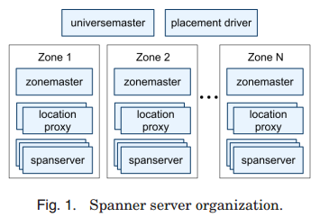
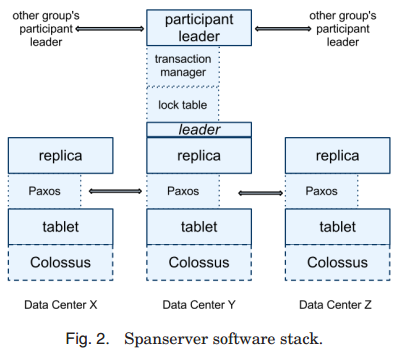
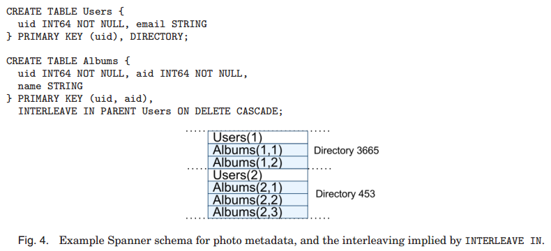
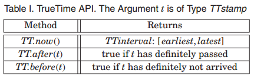
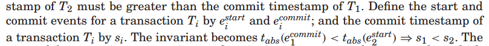
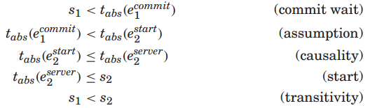
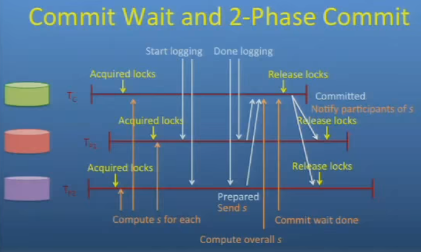
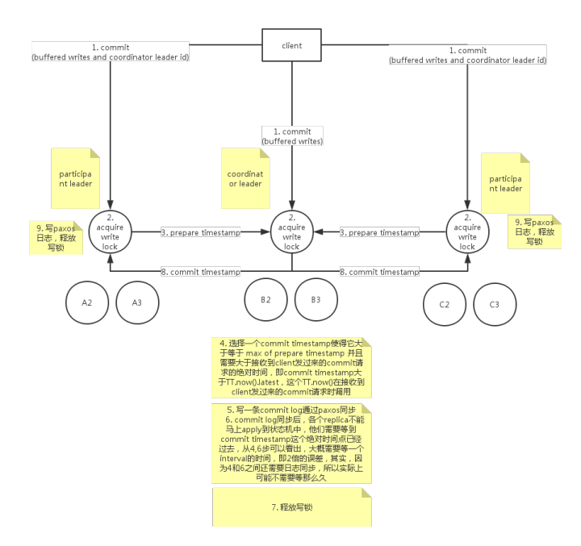

# [Spanner: Google's globally-distributed database](https://dl.acm.org/citation.cfm?id=2387880.2387905) 论文阅读笔记

> 重点就是**如何用 TrueTime 做 MVCC**

## 介绍

- 分布式多版本数据库：(key, timestamp) -> row
- 外部一致性：**第一个事务提交后，第二个事务开始，那么第二个事务提交时间戳一定大于第一个事务提交时间戳**

## 实现

- placement driver：定期与 span server 通信，判断数据是否应该移动，做负载均衡
  - 移动单位是 directory，也就是 key-range
- universe：一个 spanner 的部署，用来监控整体状态
- zone：span server 的集合
  - 一个 zone master：负责把数据分配给 span server
  - location proxy：帮助 client 定位 span server
  - 成百上千个 span server：处理 client 请求
      - 每个 span server 包含 100-1000 个 tablet

为了支持多副本，每个 span server 都在 tablet 上实现了 single paxos 状态机。图中的 lock table 用来做并发控制，记录了 key range 对应锁的状态。   
如果一个事物只涉及到一个 paxos group，那么直接组内做即可。否则需要用 txn manager 来实现 participant leader：如果事务涉及到多个组，那么这些组的 leader 们会协调完成二阶段提交。其中的一个组会被选为 coordinator：这个组的 participant leader 会被当作 coordinator leader，这个组剩下 slave 们则被称为 coordinator slave。每个 txn manager 的状态会被保存到 paxos 组。

### 数据模型

> 什么叫 *rows must have names* ？

## TrueTime

**TrueTime 保证了任何 server 的时间戳差距是有上限的，只要等待超过这个上限，就可以保证之后的任何时间戳都比之前的大。**

### MVCC

- **start**：为一个写事务 (Paxos写操作) 分配时间戳 `s >= TT.now().latest`
- **commit wait**：commit绝对时间 要确保比 commit时间戳(`s`) 大，即等待到 `TT.after(s)` 为真，然后开始 2PC 的第二阶段

> 事务开始(t1, ε)，事务结束(t2, ε)   
> 保证 t1+ε < t2-ε 即可

外部一致性Proof：

**2PC 准备阶段中，每个 server 给 coordinator leader 发送时间戳，coordinator 选择一个提交时间戳，必须比所有时间戳都晚。然后 commit wait 直到过了这个提交时间戳，于是之后发起的事务的开始时间，都不会比这个事务的结束时间早了。然后 coordinator 将提交时间戳发送给 client 还有其他的 server，server commit，释放锁。**

Ref[1] 演讲第17min

> 图片来自 https://zhuanlan.zhihu.com/p/20868175

## Reference

- [Wilson Hsieh - Spanner: Google's Globally-Distributed Database - OSDI 2012 - YouTube](https://www.youtube.com/watch?v=NthK17nbpYs)
- [Spanner, TrueTime & The CAP Theorem](https://static.googleusercontent.com/media/research.google.com/zh-CN//pubs/archive/45855.pdf) ----- [中文翻译](https://ying-zhang.github.io/doc/Spanner-TrueTime-CAP.pdf)
- [Google Spanner (中文版) - 本论文由厦门大学计算机系林子雨翻译自英文论文，转载请注明出处，仅用于学习交流，请勿用于商业用途。](http://dblab.xmu.edu.cn/wp-content/uploads/2012/09/20120925_094508_876.pdf)
- [简单解释Spanner的TrueTime在分布式事务中的作用](https://zhuanlan.zhihu.com/p/44254954)
- [Google-Spanner论文的思考](https://www.jianshu.com/p/6ae6e7989161)
- [[论文笔记] Google Spanner Distributed Database](https://blog.csdn.net/chen_kkw/article/details/81262140)
- [Spanner 论文笔记](http://int64.me/2017/Spanner%20%E8%AE%BA%E6%96%87%E7%AC%94%E8%AE%B0.html)
- [谈谈如何实现具备 ACID 事务的分布式 KV 存储](https://ericfu.me/google-spanner-storage-impl/)
- [Spanner的分布式事务实现](https://zhuanlan.zhihu.com/p/20868175)
- [Google Spanner](http://zouzls.github.io/2016/10/18/Google%20Spanner/)
- [Google Spanner论文解读](http://loopjump.com/google_spanner/)
- [浅谈数据库并发控制 - 锁和 MVCC](https://draveness.me/database-concurrency-control)