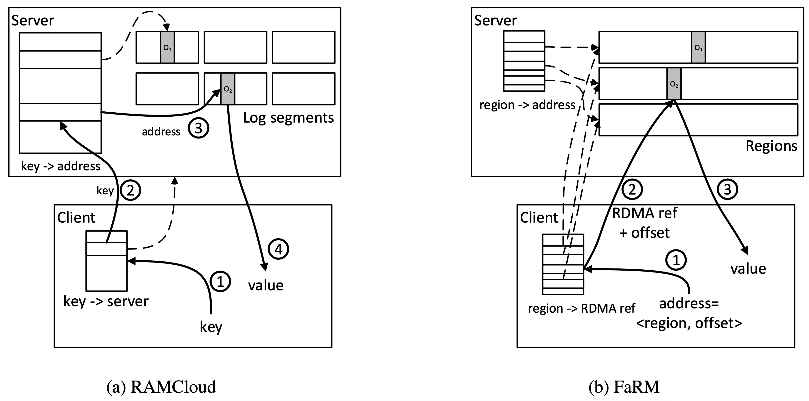
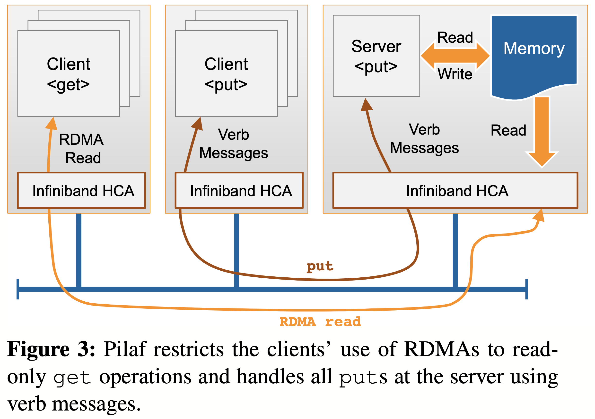
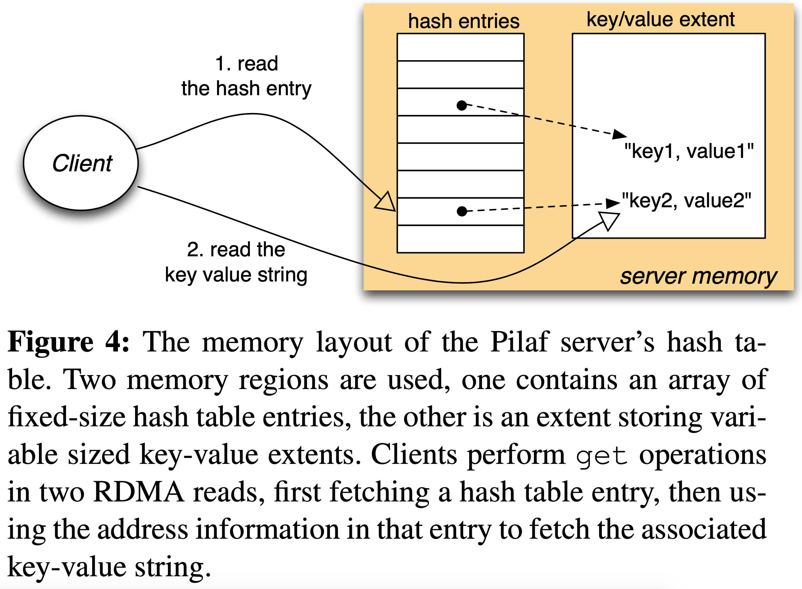
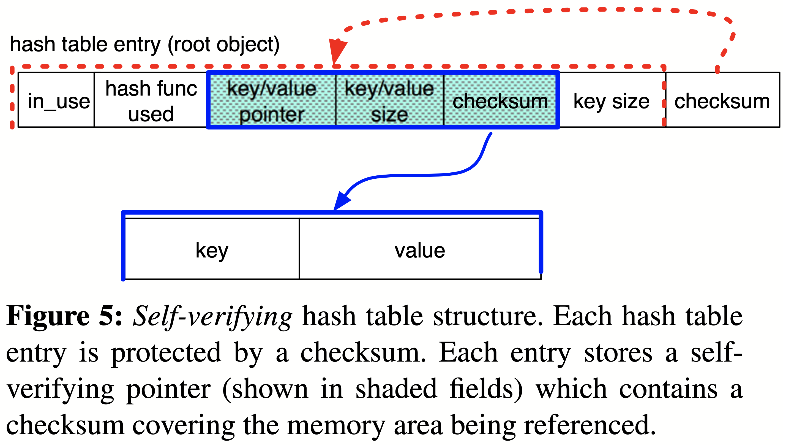

# [Using One-Sided RDMA Reads to Build a Fast, CPU-Efficient Key-Value Store](https://www.usenix.org/system/files/conference/atc13/atc13-mitchell.pdf) 论文阅读笔记

- 写操作需要分配，释放内存等复杂操作，让 server 处理
- client 只进行 RDMA read

- 要读数据，首先要知道数据地址，于是需要一个索引。索引设计需要考虑到**并发**，**访问次数**等问题
- 另一种方式是没有索引，直接按照地址寻址

- 并发冲突，给读数据加入 checksum
  - 这里的 payload 是不修改的，只有 entry pointer 是修改的，但是 ISA 天然保证了单个 etnry 的 atomicity
  - 如果是直接共享内存上修改，那可能需要
      - 每个 cacheline 上保留 seqlock
      - 或者 从 header 的 seqlock 开始写，每写一个 cacheline 就要 SFENCE

## Reference

- [Presentation Video](https://www.usenix.org/conference/atc13/technical-sessions/presentation/mitchell)
- [RDMA Reads - To Use or Not to Use?.pdf](https://www.cs.utah.edu/~stutsman/cs6450/public/papers/rdma.pdf)