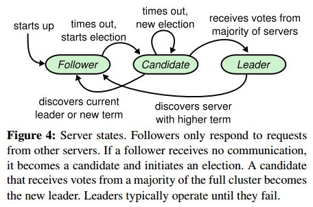
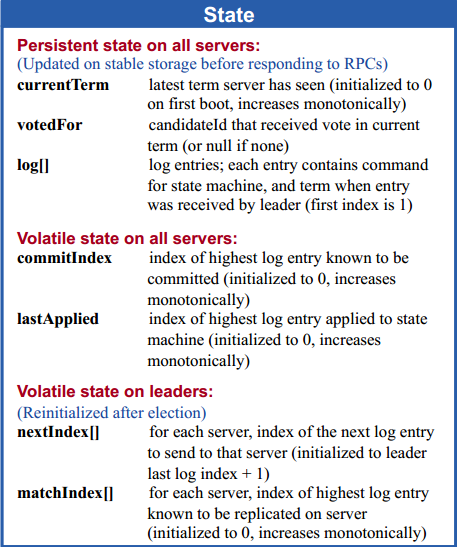
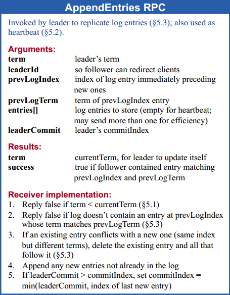
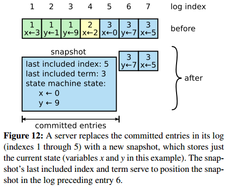

# [In Search of an Understandable Consensus Algorithm (Extended Version)](https://raft.github.io/raft.pdf) 阅读笔记

## Replicated State Machine

replicate log 来达成确定性状态机

共识算法需要保证 replicated log 一致性。

## Paxos的问题

难以理解，难以实现。   
Paxos 让每个 instance 独立，所以还需要合并成 sequential log；应该围绕 log 来设计整个系统。

## Raft

> 只要看懂两个基本就能懂了：   
> 1. 全局维护的协议（Figure 3）   
> 2. 执行流程（Figure 2）

对系统的要求：*broadcastTime* ≪ *electionTimeout* ≪ *MTBF*（结点平均 crash 时间）

### 全局维护的协议

- Election Safety：每个 term 最多只有一个 leader
- Leader Append-Only：leader 绝不 覆盖 或 删除 自己的 log
- Log Matching：如果2个 log 拥有相同的 term 和 index，那么 <= index 的所有 log entry 相同
- Leader Completeness：leader 拥有 commit 过的所有 log
- State Machine Safety：如果某个结点 apply 了 index 的 log，那么其他节点如果在这个 index 的 log 不一样，则不能 apply（这条感觉没啥用，毕竟 apply 之前都 commit 过了）

### Raft 基础

每一个 server 有三种 member 状态：follower, leader, candidate。

每一个 term 最多只有一个 leader。term 通常由 election 和 normal operation 两个阶段组成。

### 每个 server 的 state
- 被持久化在 server 上的数据
  - **currentTerm**：见到的最大的 term
  - **votedFor**：在这个 **currentTerm** 给谁 vote（没有就是 null）
  - **log[]**：log entries
- 在 server 内存中的数据
  - **commitIndex**：commit 的最大的 log 的 index
  - **lastApplied**：apply 到 state machine 的最大的 log 的 index
- 在 leader 内存中的数据（每次 election 后初始化）
  - **nextIndex[]**：`nextIndex[i]` 表示发送给 `server[i]` 的下一个 log index
  - **matchIndex[]**：`matchIndex[i]` 表示同步到 `server[i]` 的最大 index

### Server 执行
- 所有 server
  - 如果 **commitIndex** > **lastApplied**，apply log 到 state machine
  - 如果发现 term T > **currentTerm**，就设置 **currentTerm** = T，变为 *Follower*
- *Follower*
  - 回复 *Candidate* 和 *Leader* 的 RPC
  - 如果超时，没有 *Leader* 的 Append-Log RPC 或者 *Candidate* 的 Vote RPC，就变为 *Candidate*
- *Candidate*
  - 变为 *Candidate* 时，开启 election
      - **currentTerm++**
      - vote 自己
      - 重设 election timer
      - RequestVote RPC 发向其他 server
  - 如果获得 majority votes，就变为 *Leader*
  - 如果收到 Append-Log RPC，并且 **term** >= **currentTerm**，就变为 *Follower*
  - 如果超时，开启新的 election
- *Leader*
  - election 成功后，发送 空Append-Log RPC（heartbeat），防止超时
  - 收到 client 的请求，append local log。回头 apply 到 state machine 后向 client 回复
  - 如果 log index > **nextIndex[i]**，就向 server[i] 发送 Append-Log RPC，发送 log 从 **nextIndex[i]** 开始
    - 如果成功，更新 **nextIndex[i]**
    - 如果因为 log inconsistent 失败，**nextIndex[i]--** 并 retry
  - 如果存在一个 N 使得 (1) N >**commitIndex**，(2) majority **matchIndex[i]** >= N，并且 (3) **log[N].term** == **currentTerm**，就设置 **commitIndex** = N
      - 注意到当 leader 更新 commit 时就可以 apply 到自己的 state machine 了；更新 commit 之后的 AppendLogRPC 中会带有这个新的 commitedIndex。这里有一个细微的点需要考虑：即使 leader 这时 crash 或者 network 原因导致这个新 commitedIndex 消息丢失（而 leader 已经向 client 返回成功），大多数 server 最终还是会 commit。

### Vote 规则
- 参数
  - **term**
  - **candidateId**
  - **lastLogIndex**
  - **lastLogTerm**
- 返回值
  - **term**：**currentTerm** ，*Candidate* 落后，让其更新自己
  - **voteGranted**：bool 值，表明是否 vote
- vote 规则
  - reject 如果 *Candidate*.**term** < **currentTerm**
  - 如果 **self.votedFor** 为 **null** 或者 **candidateId**，并且 *Candidate*.log 不旧于自己，就 vote（**votedFor** 为 **candidateId** 还要再发，是因为 *消息可能乱序*）

### Append-Log RPC
- 参数
  - **term**：leader.term
  - **leaderId**
  - **prevLogIndex**：下面 **entries[]** 之前的 entry 的 index
  - **prevLogTerm**：下面 **entries[]** 之前的 entry 的 term
  - **entries[]**：empty 表明 heartbeat
  - **leaderCommit**
- 返回值
  - **term**：**currentTerm** ，*Leader* 落后，让其更新自己
  - **success**：true 表明 **prevLogIndex** 和 **prevLogTerm** match 并更新
- 接受者规则
  - 返回 false 如果 *Leader*.**term** < **currentTerm**
  - 返回 false 如果 **prevLogIndex** 和 **prevLogTerm** 对不上
  - **prevLogIndex** 和 **prevLogTerm** 对上之后，后面全部替换为 **entries[]**
  - 如果 **leaderCommit** > self.**commitIndex**，就设置 self.**commitIndex** = min(**leaderCommit**, last index of log)

### AppenLog Consistence

每次发送 **entries[]** 和 之前一项的 **term** + **index**。   
如果 **prevLogTerm** + **prevLogIndex** 全部吻合，那么之后就替换或者追加；如果不吻合，就再往前发。

文中说有一个优化，如果不匹配，*Follower* 可以返回冲突 entry 这个 term 的第一个 index，然后 *Leader* 就可以跳过这个 term 的所有冲突 entry。这个没有搞懂，因为你还不能知道 *Follower* 在这个 term 中同步（commit）到哪个位置。

### proof：我们限制 *Leader* 一定保有所有 commited 的 log，并且最终一定会有 *Candidate* win

commit 一定是超过半数的结点通过，那么只要注意到最后一波 commit 的这些结点不可能给其他结点 vote，最终成为 *Leader* 一定是最后一波 commit 之中的。

### *Leader* 只 commit 自己的 log，前面的根据 Log-Matching Protocol 自动同步了
*Leader* 当选后通常会 send dummy log，来同步之前 term 的 log

### Cluster membership changes 关于集群成员变更

这里只讨论 single change，即每次只**加入**/**移除**一个结点。

上图表明 **加入**/**移除** 一个结点分别在当前数量是 **奇**/**偶** 的情况。成员变更将整个集群分为两种认知，在这两种认知中的 majority 一定交非空，所以保证了不会在同一个 term 中出现不同的 leader

使用 Configuration log entry 来同步

> 感觉 c, d 好像写反了

### Log Compaction

## Reference

- [The Raft Consensus Algorithm](https://raft.github.io/)
- [Designing for Understandability: The Raft Consensus Algorithm - YouTube - 非常好](https://www.youtube.com/watch?v=vYp4LYbnnW8)
- [mit6.824 Lecture 5: Raft](https://pdos.csail.mit.edu/6.824/notes/l-raft.txt)
- [mit6.824 Raft FAQ](https://pdos.csail.mit.edu/6.824/papers/raft-faq.txt)
- [Raft算法原理 - codedump](https://www.codedump.info/post/20180921-raft/)
- [Raft共识算法 - Calvin's Marbles](http://www.calvinneo.com/2019/03/12/raft-algorithm/)
- [Raft 一致性协议](https://zhuanlan.zhihu.com/p/29678067)
- [Raft一致性算法 - B LOG](http://ts25504.github.io/2017/03/19/Raft%E4%B8%80%E8%87%B4%E6%80%A7%E7%AE%97%E6%B3%95/)
- [Raft Q&A](https://thesquareplanet.com/blog/raft-qa/)
- [Students' Guide to Raft](https://thesquareplanet.com/blog/students-guide-to-raft/)
- [Instructors' Guide to Raft](https://thesquareplanet.com/blog/instructors-guide-to-raft/)

# Raft 博士论文 [CONSENSUS: BRIDGING THEORY AND PRACTICE](https://ramcloud.stanford.edu/~ongaro/thesis.pdf)
