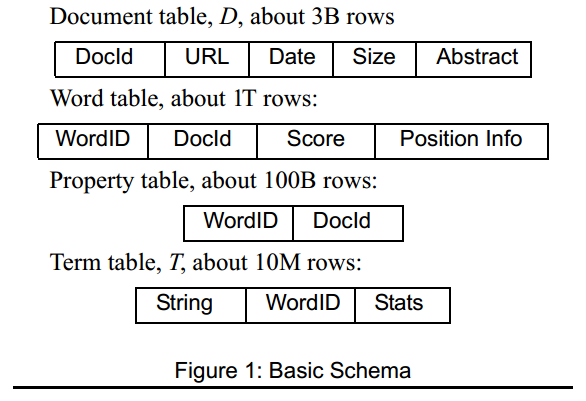
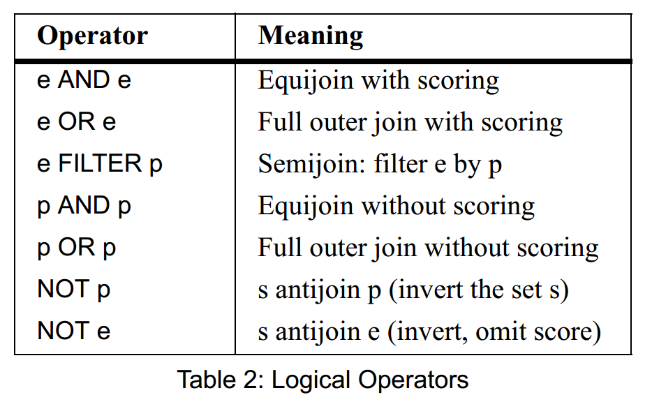

# [Combining Systems and Databases: A Search Engine Retrospective](https://people.eecs.berkeley.edu/~brewer/papers/SearchDB.pdf) 论文阅读笔记

看重可用性，对一致性要求不高，主要处理大量 read-only query

## Overview

- crawler: collect docs
- indexer: analyse, score
- server: query process (parse, rewrite, optimize, execute)

## Query

- doc: words (score) + properties (bool)
- query term: a word / a property
- query
  - simple: a list of terms
      - property: match
      - word: how well match
  - complex: expr of AND/OR/NOT

### Query Plan

找到 score 前k的doc：score 由 doc本身 和 word匹配程度 计算

- access：**有序倒排索引**上的顺序访问
  - 倒排索引：word -> list(doc)
      - 对于这些 word，join doc
  - 有序：**multiway** merge join

## Update

- 定期做 table/chunk 级别的 atomic update
- 如果需要及时的更新，将条件放入 filter 结点

## Reference

- [Paper Review: Combining Systems and Databases: A Search Engine Retrospective](https://sookocheff.com/post/databases/combining-systems-and-databases/)