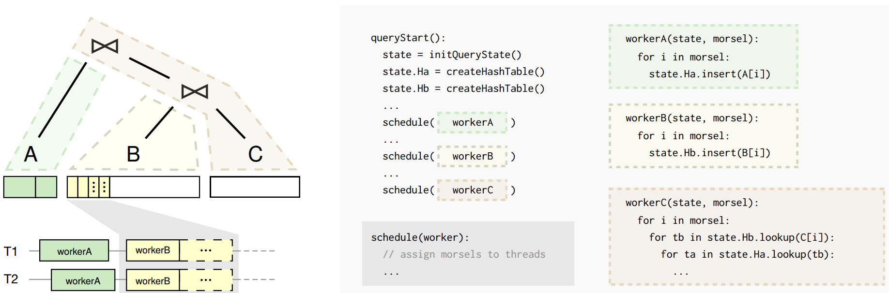
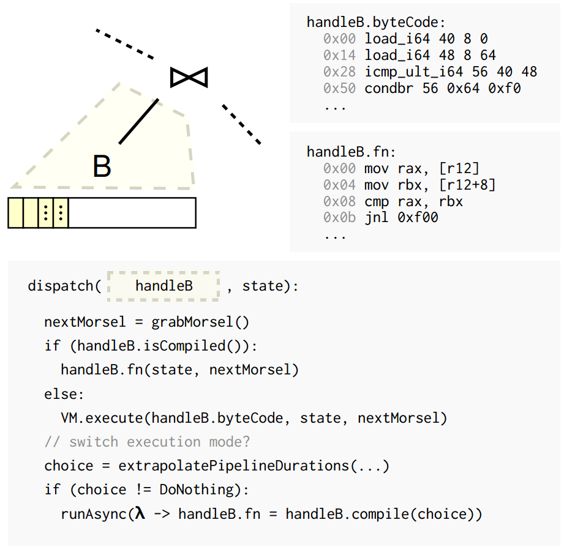

# [Adaptive Execution of Compiled Queries](https://db.in.tum.de/~leis/papers/adaptiveexecution.pdf)

query processing 时自动从 interpreted bytecode 切换到 compilation code

- **track**
  - volcano 中按照 block (morsel) 为单位处理数据
- **switch**
  - query processing 使用相同的数据结构 `state`
  - 每执行完一个 block，就看看能不能切换。（一旦 compile 好了，就一直用）
- **decision**
  - 估计 bytecode 和 (opt) machine code 效率

&nbsp;   

## Fast Bytecode Interpretation

> 这块我还没研究过，回头再看看 sqlite。。

### Register Allocation

> 编译器后端没学过，SSA 感觉挺硬核的。。

这块其实算是本文的核心了，但是我看不懂。。（太菜了）

## Reference