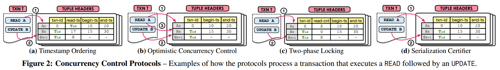
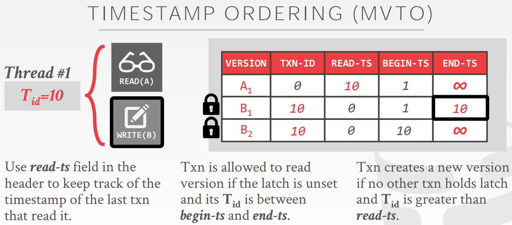
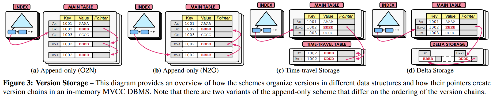
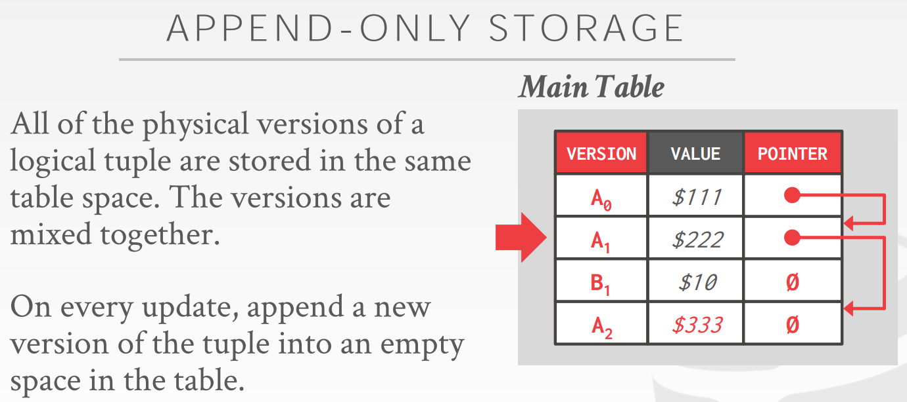
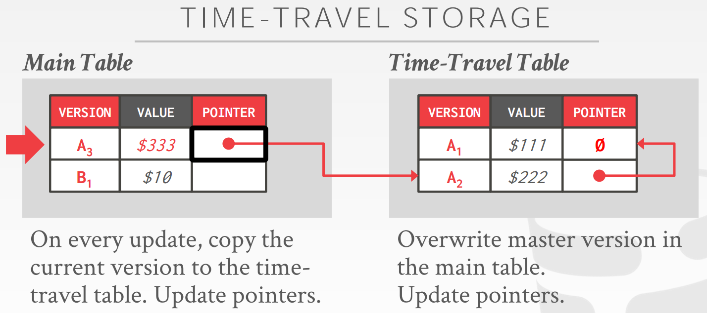
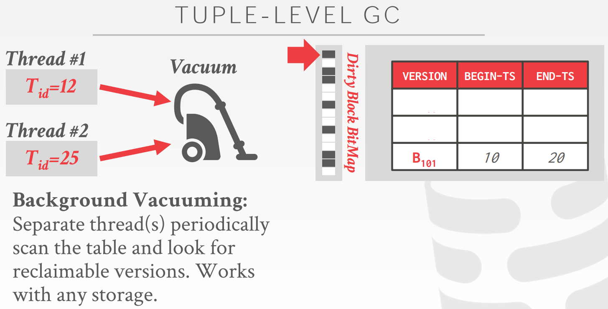

# [An Empirical Evaluation of In-Memory Multi-Version Concurrency Control](http://www.vldb.org/pvldb/vol10/p781-Wu.pdf) 论文阅读笔记

> Ref[1]中他讲了这篇论文名字的变化历程。。。   
> 上课笔记：[03 Multi-Version Concurrency Control Design Decisions](https://github.com/rsy56640/Database_Learning/tree/master/CMU%2015-721%20Advanced%20Database%20Systems%20(Spring%202019)#03-multi-version-concurrency-control-design-decisions)

- [Concurrency Control Protocol](#concurrency_control_protocol)
- [Version Storage](#version_storage)
- [GC](#gc)
- [Index Management](#index_management)

### DB meta data

- txn-id：ts，作为写锁
- begin-ts：tuple version lifetime
- end-ts：tuple version lifetime
- pointer：指向之前的 version

都是64bit，使用 CAS update

## Concurrency Control Protocol

这里只讨论 **serializable** execution

> 我这里尽量把 MVCC 和 Version Storage 结合起来考虑，因为这俩关系密切。如果考虑 GC 的话，就太复杂了，就先单独考虑 GC。   
> 由于 Time-Travel Storage 和 Delta Storage 只差一个压缩，就认为是同一种，称作 new table 和 old table

### MVTO

- version-data 是一个 pointer，指向数据（可以带 ref count，GC 时清除顺便管理）
- txn-id 表示时间戳，为0表示没有人在写，非0表示正在写
- 每个 tuple 还有一个 pointer，指向 older tuple，指针的读写是 atomic
- txn-id 和 read-ts 只有 new table 有，old table 没有。相当于 old table 只有 （version, begin-ts, end-ts, pointer）
- 事实上 new table 中的 end-ts 总是 infinity

**我觉得这里应该把 version-data, txn-id，read-ts 和 begin-ts 放到一个256bit寄存器，然后 CAS**   
**下面是我结合自己的理解写的，统一了 MVTO 和 Version Storage**

#### 读操作

- 先访问 new table，原子读 (version-data, txn-id, read-ts, begin-ts)，如果 txn-id 非0就 spin
- 如果命中区间 (beign-ts, inf)
  - 若 Tid > read-ts，则 CAS 更新 (version-data, txn-id, Tid, begin-ts)，如果失败
      - 如果失败原因是 txn-id 被持有写锁，那么 abort-restart
      - 如果是 read-ts 被修改，那么重新尝试
  - 读 version-data
- 如果 begin-ts 比 Tid 大，进入 old table
  - 除了 GC 以外根本不可能 overwrite old table，写操作是 append
  - 所以随便读，不需要 read-ts

> 如果读不存在怎么办？

#### 写操作

- 准备 new-version-data
- 访问 new table，原子读 (version-data, txn-id, read-ts, begin-ts)
- 如果
  - read-ts, begin-ts > Tid，就 abort-restart
  - txn-id 非0就 spin
- latch：CAS 更新 (version-data, Tid, read-ts, begin-ts)
- 把这个 tuple copy-append 到 old table，即 (version-data, begin-ts, Tid)
- CAS 更新 (new-version-data, 0, read-ts, Tid)，绝对不会失败因为自己拿着写锁

注：overhead 大概是写操作时的 tuple copy-append 到 old table

### MVOCC

- read phase (start-ts)，和 MVTO 差不多
- validation phase (commit-ts)
- write phase

### MV2PL

- (txn-id, read-cnt) 整个原子操作，作为 write-read lock
- commit 时先获取 commit-ts，更新 begin-ts，然后释放锁
- deadlock protocol：No_Wait 性能不错

### Serializability

SSI：锁 + 前驱图

## Version Storage

> 我有一个问题一直没搞明白，如果试图**访问一个不存在的 tuple** 怎么办，这时候好像必须要上锁了，然后还得面临一大堆问题。。。   
> 比如 Tid=8 write(C)，Tid=10 read(C)。如果 T8 还没有开始，T10 难道还要自己创建一个 C（更新 index，然后 return null），然后 T8 发现 null-C 的 read-ts=10>8 所以 abort？   
> 感觉可行的方案也就是 index 上锁，但是这样就太 overhead，其他优化基本就没有意义了    
> 或者是 index 使用 hash + atomic-list？？？

## GC

- *detect expired versions*: check whether a version’s end-ts < Tids of all active txns
- *unlink those versions from their associated chains and indexes*
- *reclaim their storage space*

## Index Management

logical pointer 好，update 时方便

## 实验分析

很重要的一部分，但是他课上(Ref[1])讲了不少，就不写了。

## Reference

- [CMU Advanced Database Systems - 03 Multi-Version Concurrency Control Design Decisions (Spring 2019)](https://www.youtube.com/watch?v=BShOt5gYiPs&list=PLSE8ODhjZXja7K1hjZ01UTVDnGQdx5v5U&index=4)