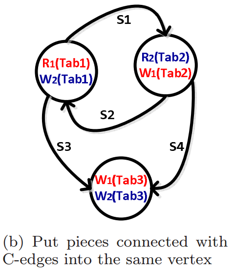
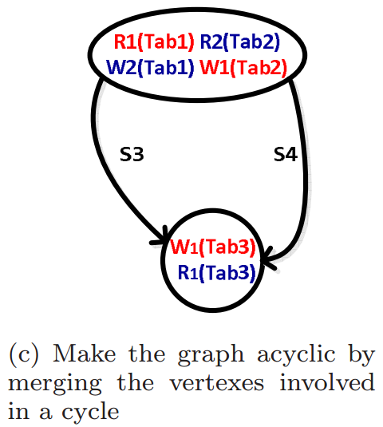
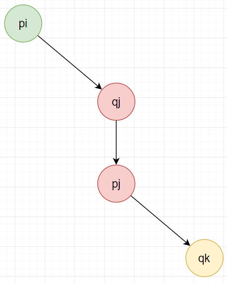
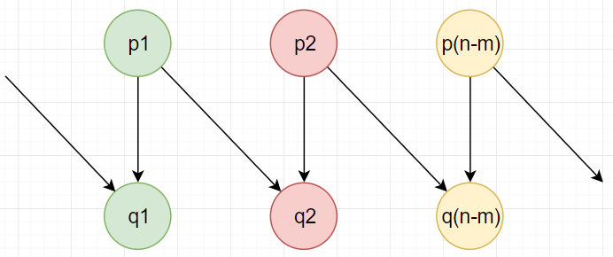
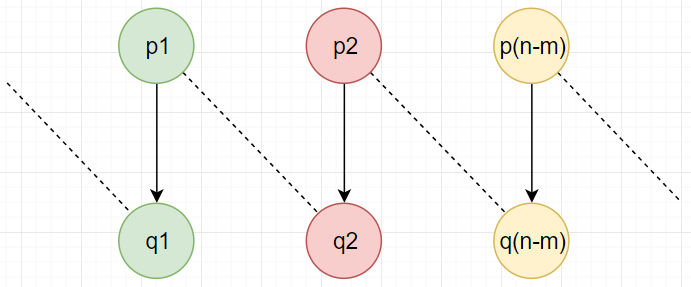

# [Scaling Multicore Databases via Constrained Parallel Execution](https://dl.acm.org/citation.cfm?id=2882934) 论文阅读笔记

serializability <=> txn 前驱图是 DAG。困难在于：

- 识别产生依赖的 access (fine grained)
- 依赖的传递性

## IC3

朴素方法：txn 在执行中发现 direct dependency，等待 commit。这样丢失了 parallel execution，于是引入 static analysis 来获得 fine-grained concurrency。考虑 T2 当前要执行的 access 依赖于 T1，这个 access 可以执行，

- 如果 T2 的这个 access 不会导致 T1 transitive depends on T2
- 如果 T2 的这个 access 与 T1 之后有 access conflict，那么 T2 等到 T1 的那个 access 之后

> 注：第二条可以通过静态分析得出；第一条感觉很麻烦。

### Static Analysis

连续的读写操作打包成一个 piece，一个 txn 由多个 pieces 构成。   
piece 是 **execution** 或 **access conflict edge** 单位。   
piece 是 atomic 执行。

### piece 执行

- `T`：维护一个 dependet queue，初始为空
- 每个 record 维护一个 accessor list

对于一个 txn `T` 即将要执行 piece `p`：

- Wait Phase
  - 如果 `p` 不和其他 piece 冲突，进入 Execute Phase
  - 否则，对 `T'` in T.depqueue
      - 如果 `T'` 存在 `p'` 和 `p` 冲突，那么就等待 `p'` 完成
      - 否则就等待 `T'` commit
- Execute Phase
- Commit Phase
  - validation
  - 更新 depqueue 和 record 的 accessor list

#### 先假设1个access是1个piece，讨论 abort 和 deadlock
##### 可能导致 abort 的情况

- 没有提前检查依赖
  - W1(A), W2(A), W1(A)
  - W1(B), W2(A), W2(B), W3(C), W3(A), W1(C)

##### 可能导致 deadlock 的情况

- W1(A), W2(B), W1(B), W2(A), ..., W1(C), W2(C)

> 其实我一开始还在想：为啥不在 piece 即将执行之前就确定 dep-queue，这样可以少一些 abort，但是发现这样有可能直接 deadlock

> piece 作为一个 atomic 来执行，piece 太细导致 abort 和 deadlock，太粗导致 poor concurrency。

## piece 划分

- S-edge 是 txn 内的顺序依赖关系
- C-edge 是 txn 间的冲突关系（在 static analysis 阶段是 **undirected**，直到 runtime 才会有依赖关系，变成 **directed**）

&nbsp;   

- directed：顺序关系
- undirected：冲突关系

&nbsp;   

- 将 undirected 视作等价关系，合并
- 保留顺序关系

&nbsp;   

- 合并所有的有向环

&nbsp;   

- 按 txn 拆分
- 拆分后还需要检测 C-edge

> 怎样证明：最终的 SC-graph 中不存在一个有向环？   
> 这并不是一个单纯的图论问题，因为最后按 txn 分拆的时候需要重新检测 C-edge

## Proof of Serializability

基本思路：假设 runtime 时 txn 产生 cyclic，那么可以推出会有如下的 piece 依赖关系，然而这与 static analysis 相矛盾。

&nbsp;   

对于 qj before pj 的情况，pj commit 一定要等 Txn_i 的一个 piece commit

&nbsp;   

将中间这个 Txn_j 忽略掉，就得到了

&nbsp;   

将 q 在 p 之前的事务忽略掉，重复 m 次，就得到如下

&nbsp;   

变成 SC-graph

&nbsp;   

存在有向环，与 static analysis 矛盾。

## 总结

所有 txn 是提前已知的，主要针对 OLTP，通过 static analysis 和 runtime piece execution 来尽可能地提高并发。

## Reference
