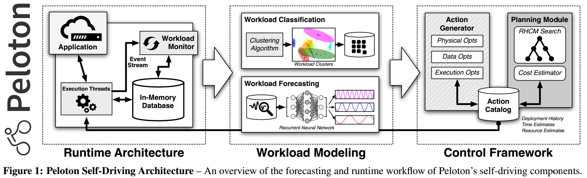

# [Self-Driving Database Management Systems](https://www.pdl.cmu.edu/PDL-FTP/Database/p42-pavlo-cidr17.pdf) 论文阅读笔记

### Action

- index
- storage layout
- partition
- resource
- query optimization

## Architecture

- cluster
  - runtime metric
  - logical semantic
  - rebuild
- workload forecasting
- action planning

总的来说就是：prediction，然后据此 tune system's configuration

## Reference

- [Peloton: The Self-Driving Database Management System by Andy Pavlo | DataEngConf NYC '16](https://www.youtube.com/watch?v=mzMnyYdO8jk)
- [slide](http://cidrdb.org/cidr2017/slides/p42-pavlo-cidr17-slides.pdf) - CIDR2017 Andy Pavlo
- [What is a Self-Driving Database Management System?](https://www.cs.cmu.edu/~pavlo/blog/2018/04/what-is-a-self-driving-database-management-system.html) - Andy Pavlo
- [Self-Driving Databases: Current and Future](https://medium.com/db-journal/can-dbmss-drive-themselves-59e79916d513)
- [数据库DBMS的“Self-Driving“之路 - 知乎](https://zhuanlan.zhihu.com/p/35691365)