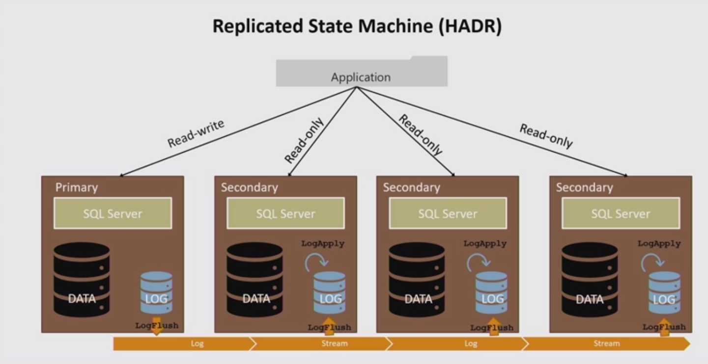
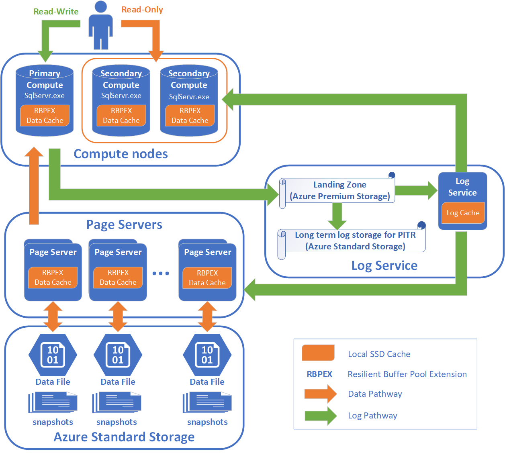

# [Socrates: The New SQL Server in the Cloud](https://dl.acm.org/citation.cfm?id=3314047) 论文阅读笔记

## Introduction

### 传统架构的问题

- 需求
  - large databases：100TB OLTP
  - database-as-a-service：高可用，高性能
  - pay-as-you-go：提供服务随着 workload 弹性变化
- 问题
  - **storage capacity** (Azure SQL 4TB)
  - 弹性服务，资源利用
  - 单机数据迁移困难

常见架构大概有2种：

- 按 key range 切分，上层任务分割到下面执行再合并结果返回
  - Spanner 利用 TrueTimeAPI 做 2PC；PAXOS 保证多副本的可用性和一致性
  - Calvin 确定性并发控制（deterministic 2PL）
      - sequencer 和 scheduler 保证传递顺序是 FIFO，deterministic 2PL 保证 commit 顺序是 FIFO。于是所有执行节点处理事务不需要协调者。
- 不切分数据
  - 正常并发控制；持久性基于 replica；可用性基于 redo log 的状态机

*log-based replicated state machine*

**每一个节点都在本地保留整个 db 的 copy**

page cache 维护一个假象：所有 page 都位于内存中，在 B+树上操作时，通过 pageid 向 page cache fetch，问题就是整个数据库大小受限于硬盘大小，Azure SQL Server 中的限制是 4TB。这种情况下存储是很难扩展的。

### 现在已经达成的

- **Durability**：log is db + checkpoint（加速recovery）
- **Availability**：replica

### 需要解决的问题：Scalability

- storage 的线性扩展（**本文解决的问题**）
- computation 的线性扩展（？）

## Main Idea：fetch-page 的抽象

### 把 **fetch-page** 这个请求从 **page-cache层** 抽象到 **page-server层** 去执行

存储引擎不用动，只需要改 page cache。原来是维护内存和硬盘间的换入换出，现在改为向 remote page server 拿 page

这样就把计算和存储完全分离开。

### Socrates Architecture

- 恢复类似 aries，但是只需要 analysis 和 redo，不需要 undo
- from ***shared nothing*** to ***shared disk***：每个结点都保留所有的 page，难以扩展
- **将计算和存储彻底分离**（有点类似CPU）

分为4层：

- **Compute node**：computation
  - 只负责处理读写事务，产生log
  - 并不保留完整的db copy
  - page evict 时**并不写回** page server，所以读 fetch page 时要带上 lsn
  - **fetch-page(X, X-lsn)** 中的 X-lsn 很难准确维护，因此采用伪共享
- **Secondary Compute node**
  - lsn 可能滞后，如果出现不一致，就等待 log apply thread 做新的 apply（什么玩意）
- **XLOG service**：durability
  - log persistence
- **Page Servers**：scalability of storage（存储容量线性扩展）
  - stateless
  - checkpoint
  - **pull** log：不需要维护 page servers 的元信息
  - 对于 fetch-page(X, X-lsn) 请求
      - 阻塞直到 log持久化的 lsn 达到 X-lsn
      - apply log 并返回（apply可以在阻塞的同时做）
  - 存储条带化，利于 range query，减少读放大
- **XStore**：保证 page servers 的 availability

## Future Prospects

这篇文章迈出了第一步，把计算单元和存储单元完全分离，有点向cpu发展的意思

### 计算层如何扩展

现在仍然是只有主节点负责TP

- page server 负责自己的 TP
  - shared nothing
  - 锁请求开销
  - 任务切割向下传递（如何控制提交：2PC？）
  - 问题：不需要 internal node 做 guide，多此一举。直接把数据按 key range 分割，类似 Spanner 或 Calvine。
  - 所以这种方案不行！！!
- 多个主节点（类似多核CPU）
  - shared disk
  - page contention
  - 全局数据结构怎么维护：`trx_sys_t`，需要一个专门的服务管理 `trx_t`
  - 如何维护 lsn：专门有一个服务 `atomic_fetch_add`
  - 扩展的最大难点在于：所有 TP 都要走 root page！！！（表大了之后 root page 比较稳定，变为 shared state，类似 MESI）
  - 新的 index 结构？（DRAM bank 就是纯hash）

### 存储层扩展之后面临的诸多问题

- page 分布
  - 有无状态
  - 根据 access pattern 设计有利于并发fetch的分布
- 写回
  - 本文的策略是不写回
- **若fetch-page成为瓶颈**，有可能学习CPU的技术
- **prefetch**
  - 难点：CPU直接访问物理地址，DRAM Controller 提前知道；B+Tree 的 pageid 随着 split 和 merge 会变得比较随机，很难从树形结构上估计出 pageid
  - 新的 index
- **out-of-order-execution**
  - 按照拓扑顺序执行（DAG调度）
  - 逻辑写 virtual page，放入 store buffer，事务提交相当于 `release_fence`。读 page 先去 store buffer，再去 pape server。（逻辑写无redo-log，但是后面的事务又依赖这个值（比如先读，再写其他）；也就是说，如果逻辑写能够明确redo-log的size，这种优化就是有意义的，因为后续事务可以完成redo-log。只要真正的page一到，把redo-log一补，这些事务就都可以提交）

## 总结

- 计算和存储完全分离，除了index以外，类似CPU
- **shared nothing** -> **shared disk**

## Reference

- [Socrates: The New SQL Server in the Cloud - SIGMOD 2019](https://av.tib.eu/media/43050)
- [How Microsoft Is Building the Biggest Cloud Database](https://redmondmag.com/articles/2019/07/03/microsoft-building-biggest-cloud-database.aspx)
- [Spanner vs. Calvin: Distributed Consistency at Scale](https://fauna.com/blog/distributed-consistency-at-scale-spanner-vs-calvin)