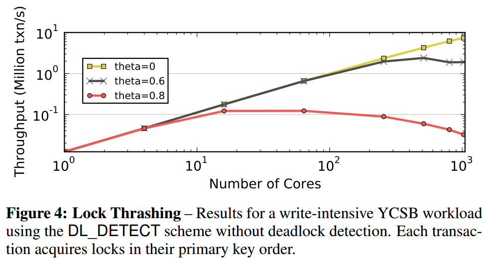
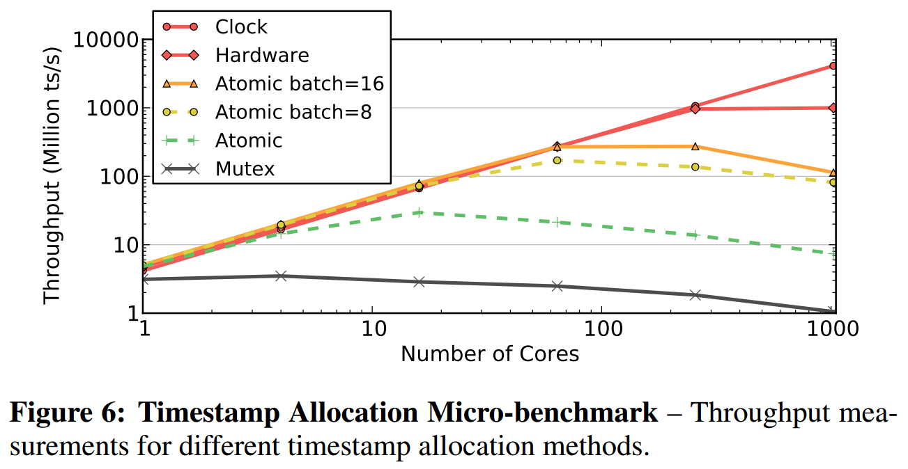
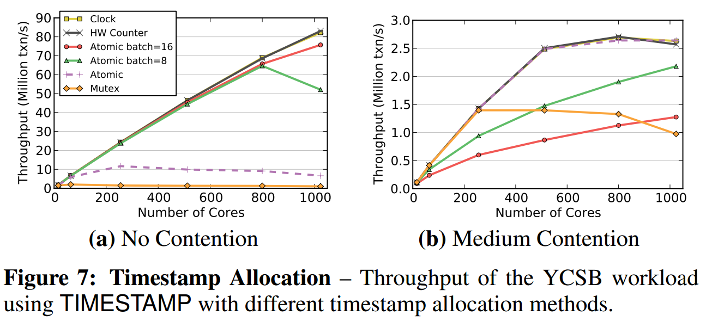
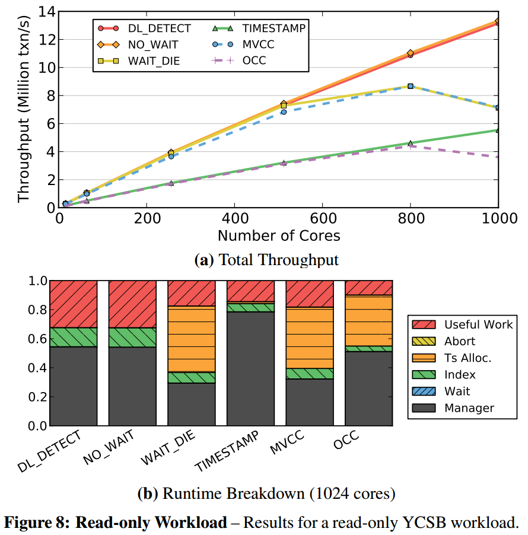
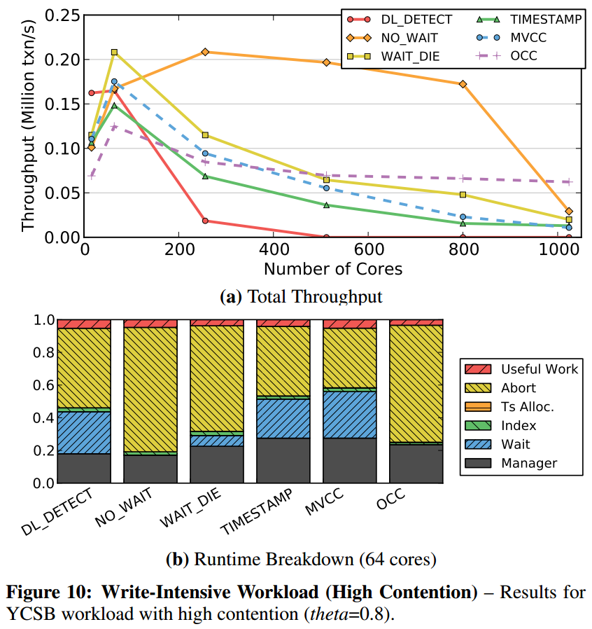

# [Staring into the Abyss: An Evaluation of Concurrency Control with One Thousand Cores](https://dl.acm.org/citation.cfm?id=2735511) 论文阅读笔记

## Concurrency Control Scheme

OLTP txns workload:

- short-lived
- small subset of data using index look-ups
- repetitive with different input


**测试 Isolation level 是 serializable**（因此一些 concurrency control 与通常有些差异）

### 2PL

- *deadlock detection*：检查 wait-for 图，并且选择合适的 txn abort
- *non-waiting deadlock prevention*：在 growing phase，如果拿锁失败（不等待），立即 abort
- *wait-and-die deadlock prevention*：允许较早的 txn 等待 之后的 txn 释放资源；如果较新的 txn 请求资源，abort 并在某些延迟后重启，序号不变。

### Timestamp Ordering 

分类标准：1. 检查冲突的粒度（tuple, partition）；2. 检查冲突的时间（事务中还是结束时）

- *TimeStamp*：每次操作检查 ts，如果落后，就 abort；读操作 copy，为了 repeatable。（有些实现在一个 tuple 上有 read ts 和 write ts）
- *MVCC*：读操作不阻塞
- *OCC*：写操作在 private workspace；validation phase：read set 是否与其他 txns 的 write set 交集
- *H-Store*：


## Design Choices and Optimization

造成 overhead 的几个方面

- lock thrashing
- ts allocation
- memory allocation / copy

### 2PL Optimization

- deadlock detection：把 wait-for graph 从多线程共享数据结构分解为比较独

**2PL 最大的 bottleneck 是 lock thrashing**



theta 从 0 到 0.8 表示对某一部分的 hotspot data 的访问频率增加。（就是 theta 越大，越针对某一个热点区域）


当 timeout 较小时，abort rate 较大，某种程度上减少了 lock thrashing   
当 timeout 较大时，abort rate 较小，lock thrashing 严重，吞吐量低   
要达到高吞吐量，既需要执行更多的 txns，还需要降低 lock thrashing

### TimeStamp Ordering Optimization

#### TimeStamp allocation

- batching atomic addition
- CPU clock
- hardware counter



Figure 6 是只测试多线程获取 ts 的性能   
atomic 下降的原因是 *the cache coherence traffic from writing back and invalidating the last copy of the corresponding cache line for every timestamp.*   
batch 方法会遇到 contention

&nbsp;   


Figure 7 测试 real workloads   
在 contention 下，batching atomic 方法是低效的，因为如果 abort，那么从这个 batch 中再挑一个 ts 还是落后于冲突 txn ts，这样一个 txn 会不断 abort 和 restart，直到一个 batch 的 ts 被耗尽。

> 这个问题其实可以解决，比如一个 batch=8，那么分配 x 代表可以获得以下8个：x, x+8, ..., x+56。不过这样需要counter在每隔8个就要跳跃一下：x, x+1, ..., x+7, x+64。伪代码如下：   

```c++
static std::atomic_flag lock = ATOMIC_FLAG_INIT;
static uint32_t help_cnt = 0;
static uint32_t cnt = 0;

uint32_t get_ts() {
    while (lock.test_and_set(std::memory_order_acquire)) 
        ;
    uint32_t ts = cnt;
    help_cnt++;
    help_cnt &= 0x7;
    cnt++;
    unsigned int overflow = (~help_cnt) >> 31;
    cnt += (overflow << 6) - (overflow << 3);
    lock.clear(std::memory_order_release);
    return ts;
}
```


## 实验分析

- *scalability*: 增加 core
- *sensitivity*: 改变某个测试参数（比如热点访问）

参数 theta

- 0: 所有 tuple 以相同频率访问
- 0.6: 10% 的热点数据被 40% 的 txns 访问
- 0.8: 10% 的热点数据被 60% 的 txns 访问

### Read-Only Workload



- deadlock detection 和 No_Wait 都没有 contention，所以不会 abort，效率高。（话说 shared mutex 在多核下性能不知道怎么样，毕竟是系统调用）
- Wait_Die 和 MVCC 因为 ts allocation 导致性能下降
- OCC 和 TS 因为要 copy read set 保证 repeatable read，所以性能低

### Write-Intensive Workload


- deadlock detection 要做大量的 wait-for graph 检测工作，持有锁时间较长，引发大量的 lock thrashing
- No_Wait 和 Wait_Die 在 growing phase 就判断是否 abort（实验中 abort 和 restart 开销较小）
- 与 TO，OCC 相比，MVCC 表现较好，因为不影响 read
- OCC 效果差因为即使会在 validation phase 检测出冲突，也会把整个 txn 做完

&nbsp;   


- No_Wait 大量时间用于 abort 和 restart，持有锁时间较短，所以性能好一点（实验中 abort 和 restart 开销较小）
- OCC 在多核下性能平稳，因为 validation phase 总能保证至少一个 txn commit

&nbsp;   


- 随着 data contention 增加，所有算法的性能都下降

### Working Set Size


- 这幅图的**斜率**是 milion txn/s
- deadlock detection 和 No_Wait 的性能随着锁持有时间增长而下降

### Read/Write Mixture


- TO 和 OCC 要 copy
- MVCC 在 write request 较少时性能较高，因为不阻塞读操作


## 关于多核性能的讨论


需要 software-hardware co-design


## Reference

- [CMU Advanced Database Systems - 02 Transaction Models & In-Memory Concurrency Control (Spring 2019)](https://www.youtube.com/watch?v=DyYO3yaA1wc&list=PLSE8ODhjZXja7K1hjZ01UTVDnGQdx5v5U&index=2) start from 1h 05min -> 1h 25min