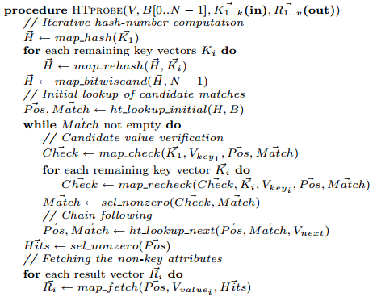
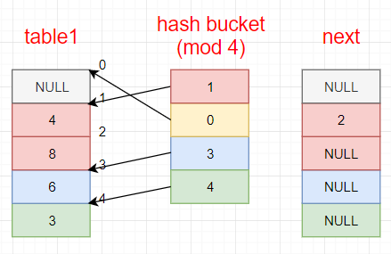
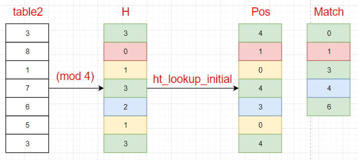
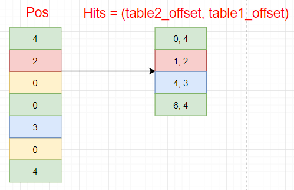

# [Vectorization vs. Compilation in Query Execution](https://dl.acm.org/citation.cfm?id=1995446) 论文阅读笔记

## Projection

### Vectorization

对于复杂表达式，会产生很多中间列，多余的 load/store

### Compilation

直接把复杂表达式写成一条，无需按表达式树执行，并且省去了多余的 load/store

## Selection (conjunctive)

通常 branchless 比 branch 要快

### Vectorization

**把 where expression 拆开对单个列做 filter**，这时候如果存储模型是 **column store**，对单个 column 的 where filter 就非常友好，然后**把 selection vector 做成 chain 调用**，一步步向下传递。（参考论文中 *Algorithm2*）

> A vectorized conjunction is implemented by chaining selection primitives with the output selection vector of the previous one being the input selection vector of the next one, working on a tightening subset of the original vectors, evaluating this conjunction lazily only on those elements for which the previous conditions passed.

### Compilation

**对每一个 tuple 做完整的 where filter**，可以 branchless

## Join

### Vectorization

#### 流程
&nbsp;
0. 对原表做 permute-and-rank，得到 **table1** 和 **bucket**。**bucket** 中记录 **table1** 的 offset；**next** 中记录所在 bucket chain 的下一个   
   
1. 对所有 probe-table 的 key 做 hash（多个 key 做抑或(^)）；然后调用 `ht_lookup_initial()` 得到 **Pos** 和 **Match**，此时 **Pos** 的值是每个 key 对应 **bucket** chain 的 head

- **Pos**：长度与 **table2** 相同，表示该 **table2** key 可能与 **table1** 对应位置 key 相同。（比如 `Pos[0]=4` 意味着 `table2[0]` 可能等于 `table1[4]`）
- **Match**：需要被检测的 **Pos** 的位置。（比如 `Match[2]=3` 意味着 `Pos[3]` 需要被检测）

   
2. 检测这些 key，如果相同了，则 **Check** 结果为0；然后选择非0作为 **Match**（思路是：已经成功的地方 **Pos** 就不改变了，比较失败的顺着所在 **bucket** 继续向下比较）   
   
3. 顺着 **bucket** 刷新 **Pos** 和 **Match**（比如 `Pos[1]=1` 所在 **bucket** 还有 `next[1]=2`；而 `Pos[3]=4` 所在 **bucket** 没有元素了，即 `next[4]=0`）   
   
4. 继续步骤 2-3 直到 **Match** 为空   
   
5. 将结果导出做 concatenate   
   

&nbsp;   
### Compilation

- pipeline prefetch, outstanding load
- Vectorization 在 row-store 和 column-store 上的性能区别（考虑到 selectivity）
- cache/TLB miss

## Reference

- [Just-in-time Compilation in Vectorized Query Execution](https://homepages.cwi.nl/~boncz/msc/2011-JuliuszSompolski.pdf)