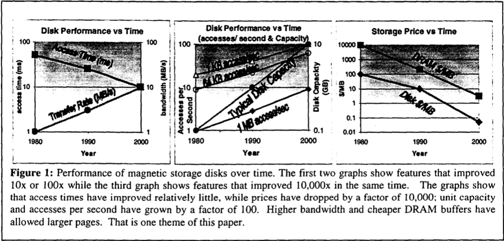
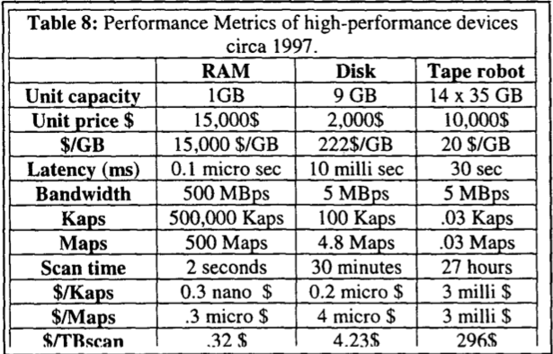
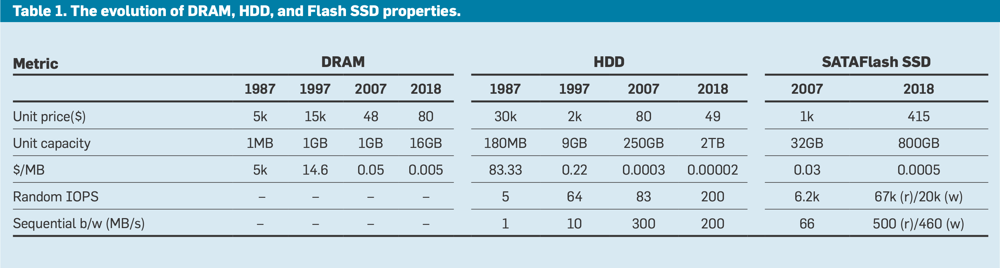

# 5 minutes rule

5/1 min 以内 random/sequential access 的 disk page 缓存到 memory

访问间隔阈值 = (page 大小 / disk 吞吐) * (单位存储 disk 价格 / 单位存储 memory 价格) = read page latency * 价格比

小于该阈值的建议缓存

## [The five-minute rule ten years later, and other computer storage rules of thumb](https://dl.acm.org/doi/10.1145/271074.271094)

前者比例降低，后者比例增加，5mr 仍然适用

- HDD 成本趋于 0，只关注 latency, 
- bandwidth 更大，应用使用流式处理数据

## [The Five-Minute Rule 20 Years Later: and How Flash Memory Changes the Rules: The old rule continues to evolve, while flash memory adds two new rules.](https://dl.acm.org/doi/10.1145/1413254.1413264)

[The Five-Minute Rule 20 Years Later 翻译](http://duanple.com/wp-content/uploads/2018/11/13.The-5-Minute-Rule-20-Years-Later.pdf)

对于 disk 变成 1.5h；对于 flash 变成 15min

- flash 对 memory 的利用率比 disk 高 6 倍
- flash 和 disk 的 bandwidth 差不多，但是 flash latency 低
- page access pattern
  - track & replace
  - prefetch
  - read ahead & write behind

## [The five-minute rule 30 years later and its impact on the storage hierarchy](https://dl.acm.org/doi/10.1145/3318163)

[The five-minute rule 30 years later 翻译](https://wingsxdu.com/posts/note/the-five-minutes-rule/)

DRAM-HDD 4h；DRAM-SSD 5min

- SSD 对 memory 利用率比 HDD 高 50 倍
  - 不仅提高性能，还减少了缓存数据所需的 DRAM 数量，因此也更经济
- DRAM-SSD-HDD storage tiering
- SSD 优化针对 random access, IOPS
- HDD 优化针对容量，成本
- NVM 发展
