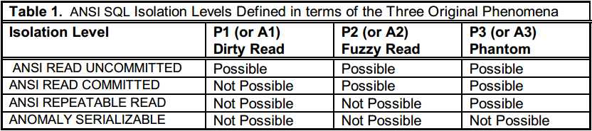
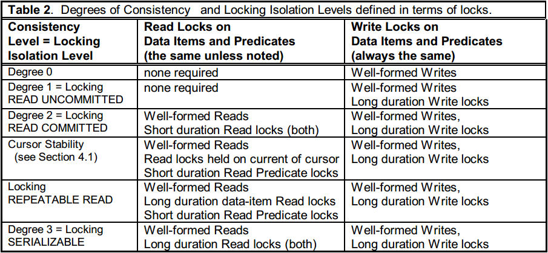
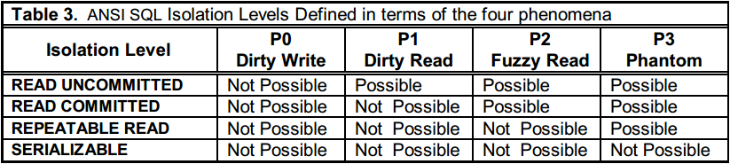

# [A Critique of ANSI SQL Isolation Levels](https://dl.acm.org/citation.cfm?id=223785) 论文阅读笔记

这篇文章有助于理解 isolation level   
用 **lock-based 隔离级别定义** 取代了 **phenomenon-based 隔离级别定义**

## 介绍

ANSI SQL 92 定义了4种隔离级别

- read uncommitted
- read committed
- repeatable read
- serializable

及3种异常现象

- dirty read
- non-repeatable read
- phantom

## Isolation 术语

data item（数据项）：row, page, table

### 可串行性

事务的前驱依赖图

### ANSI SQL 隔离级别

- **dirty read**：T1 修改了 item，之后的 T2 在 T1 *commit* 或 *rollback* 之前读到了被修改的值，如果 T1 之后 *rollback*，那么 T2 读到了根本不存在的值
- **non-repeatable read**：T1 读 item 的值，然后 T2 修改或删除了 item，T1 重新读 item，就会读到被修改的值或者发现已被删除
- **phantom**：T1 查找满足某些条件的行的集合，然后 T2 添加，修改或删除并且 *commit*，使得 T1 再读的时候这个集合发生变化

`w[x]` 表示对数据项 x 的写（添加，修改和删除）   
`r[x]` 表示对数据项 x 的读   
`P` 表示谓词   
`w[P]`, `r[P]` 表示对满足谓词 `P` 的数据项的写和读    
（我自己造的）`w[P->Q]` 表示对满足谓词 `P` 的数据项写，值域是满足谓词 `Q` 的数据项    
`c`, `a` 分别表示 COMMIT 和 ABORT

对于 dirty read，出现异常的有3种   
1. w1[x], r2[x], a1, c2   
2. w1[x], r2[x], c2, c1   
3. w1[x], r2[x], c2, a1 

对于 non-repeatable read，异常是   
1. r1[x], w2[x], c2, r1[x], c1

对于 phantom，异常是   
1. r1[P], w2[x in P], c2, r1[P], c1   
2. r1[P], w2[Q->P], c2, r1[P], c1   
3. ...

关于 *COMMIT* 和 *ABORT* 的顺序和在事务执行中的位置都比较复杂，上面列的都是按照论文中的，然后我修改了一点

### Locking

- **谓词锁**：锁住了当前满足谓词 P 的数据项，以及有可能会满足 P 的幽灵数据项
- **数据项锁**：特定的谓词锁
- **良式(well-formed)读写**：操作之前持有谓词锁
- **良式事务**：读写是良式的
- **lock duration**：如果事务 commit 或 abort 之后释放锁，称为 *long duration*；否则是 *short duration*

well-formed 2PL 蕴含了可串行性

下图用 **lock-based 隔离级别定义** 取代了 **phenomenon-based 隔离级别定义**

> 读写操作默认是原子的

定义隔离级别的可比性：对于隔离级别 L1, L2，称 L1 < L2，如果满足 L2 的不可串行化历史也满足 L1，并且存在一个不可串行化历史满足 L1 但不满足 L2。   
如果 L1 与 L2 都存在对方不满足的不可串行化历史，则不可比，记作 L1 >< L2

**结论1：Locking READ UNCOMMITTED < Locking READ COMMITTED < Locking REPEATABLE READ < Locking SERIALIZABLE**

## 分析 ANSI SQL 隔离级别

locking-based 隔离级别强于对应的 phenomenon-based 隔离级别

**dirty write**：T1 写 item，之后 T2 在 T1 结束前写 item，然后 T1 abort，T2 abort

## 其他隔离类型

### 游标稳定性

**lost update**：T1 读 item，T2 修改 item，然后 T1 修改 item，T1 提交

r1[x], w2[x], w1[x], c1

将游标读设置为 获取当前项的 long duration read lock

**READ COMMITTED** < **Cursor Stability** < **REPEATABLE READ**

### 快照隔离

事务开始时获得一个开始时间戳 start-timestamp，读已存在的快照并不阻塞。

写事务 T1 在提交前获得一个提交时间戳 commit-timestamp，大于现有的任何时间戳。如果写事务 T2 与 T1冲突，并且提交时间戳位于 T1 的 [start-timestamp, commit-timestam] 之间，那么 T2 成功提交，T1 abort。这称为 “先提交者成功”（First-committer-wins）。

**当一个事务提交时，其更改对于所有开始时间戳大于其提交时间戳的事务可见。**

**读偏 Read Skew**：r1 [x], w2 [x], w2 [y], c2, r1 [y]   
**写偏 Write Skew**：r1 [x], r2 [y], w1 [y], w2 [x]

Read Skew（包含了 non-repeatable read） 不会发生在快照隔离下；但是 Write Skew 可能发生。    
repeatable read 不允许 Write Skew，但可能出现 phantom。快照隔离不允许 phantom 但是允许 Write Skew。   
因此：**可重复读 >< 快照隔离**

## Reference

- [A Critique of ANSI SQL Isolation Levels 论文翻译](https://yq.aliyun.com/articles/77965)
- [《A Critique of ANSI SQL Isolation Levels》论文实验](https://zhuanlan.zhihu.com/p/38334464)
- [A Critique of ANSI SQL Isolation Levels](https://blog.acolyer.org/2016/02/24/a-critique-of-ansi-sql-isolation-levels/)
- [再谈数据库事务隔离性](https://www.cnblogs.com/ivan-uno/p/8274355.html)
- [Repeatable Read Is Not Repeatable](https://medium.com/db-journal/repeatable-read-is-not-repeatable-c700b2ce1c76)
- [一致性模型](https://segmentfault.com/a/1190000016785044)
- [重读A Critique of ANSI SQL Isolation Levels](https://blog.csdn.net/zedware/article/details/42399375)
- [CMU Database Systems - 16 Concurrency Control Theory (Fall 2017)](https://www.youtube.com/watch?v=LNOomyGJp8Y&list=PLSE8ODhjZXjYutVzTeAds8xUt1rcmyT7x&index=17)