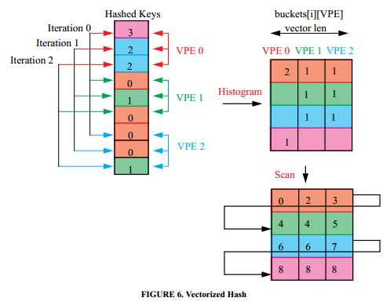
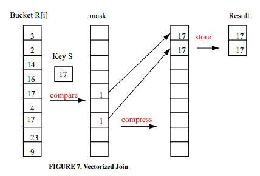

# [A Vectorized Hash-Join](https://pdfs.semanticscholar.org/3fc2/7e335c054b3ea1e35565d0e8697092e895b6.pdf) 论文阅读笔记

> 96年的文章了，补漏一下 Vectorization

### Grace Hash-Join

把数据放到 hash bucket 里面，单独一个 bucket 大小足以放进内存中。每次只拿出来一个 bucket，那 probe 那方怎么办？   
它说得莫名其妙，我觉得就2种：   
1. 2方都 hash（使用相同的 hash 策略），然后每次取出两边相同的 bucket 来 join   
2. 对于 probe 方，循环 bucket_num 次，每次拿一个 bucket 出来 probe

里面用了一个方法叫 “Rank and Permute” 来 group key，缓存友好。

## Vectorization

### Vectorized Hash

> 上面这个图是错的。

| VPE0 | VPE1 | VPE2 |
| ------ | ------ | ------ |
|    | 2 | 2 |
|    | 1 | 1 |
| 2 |    |    |
| 1 |    |    |

### Vectorized Join

利用 SIMD 加速，然后 *selective load/store/scatter/gather*

## Reference
