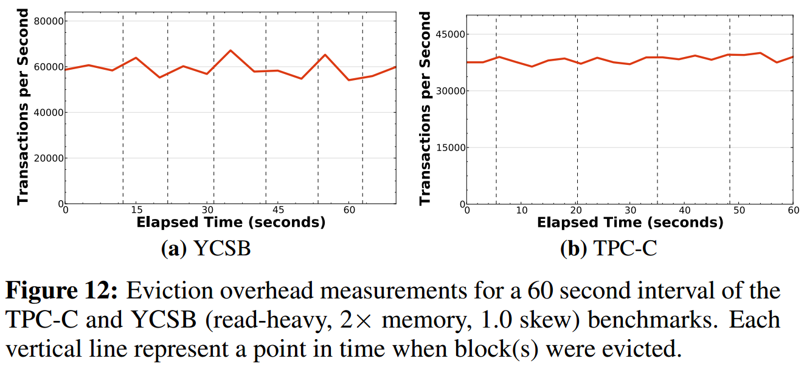

# [Anti-Caching: A New Approach to Database Management System Architecture](http://www.vldb.org/pvldb/vol6/p1942-debrabant.pdf) 论文阅读笔记

> 将竖向的每个执行线程中由于 dbpage fault 引发的 sync-fetch 改为横向的 async-fetch。   

## Architecture

- 每个 tuple 要么在 memory，要么在 disk
  - *什么意思？按照这个说法怎么做 recovery*
  - snapshot 时不能 evict
- fine-grained eviction: tuple level
- non-blocking fetch: txn abort, async fetch, txn restart

## Experiment

- data size 增加，性能下降
- skew 降低，性能下降
- 对于 中等偏高skew workload，anti-caching 表现好
  - async fetch
  - lightweight concurrency control & logging

## Reference

- [Anti-Caching - H-Store](https://hstore.cs.brown.edu/documentation/deployment/anti-caching/)
- [Anti-Caching：一种新型数据库管理系统架构](https://blog.csdn.net/Meditator_hkx/article/details/50976999)
- [Caching vs. Anti-Caching [缓存和反缓存]](https://csruiliu.github.io/blog/20161218-cache-vs-anticache/)