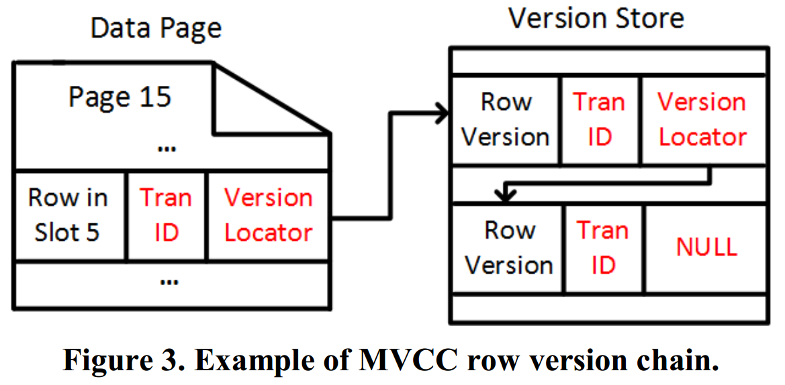

# [Constant Time Recovery in Azure SQL Database](https://www.microsoft.com/en-us/research/uploads/prod/2019/06/p700-antonopoulos.pdf) 论文阅读笔记

> 好多细节还没有理清，感觉有点复杂。（考虑到并发和故障场景会把所有东西搞乱）   

不需要 undo，因为：

- 1. 存储多版本
- 2. Aborted Txn Map
- 前两条理论上就可以恢复到 crash 时的状态
- 3. background cleanup

## 传统 ARIES

- redo 可以并行，但需要保证 in-page order

## MVCC

## Constant Time Recovery

- DML
  - 持久化 MV for instant UNDO：**只需要将 uncommitted txn 标记为 ABORT**
      - 事实上，这要求 record 上记录 (state, txn-id)，访问 record 时需要一个中心化服务来判断 txn 状态
- structrual modification
  - index, allocation 等

## Version Store

- in-version store：page 中记录 latest 和 earlier version reconstruct information
  - 什么叫避免“*generating an off-row version, and logging the version as a separate operation*”
- off-version store：in-version 放不下就存到一个全区位置，没有 index，通过 in-version 的指针来获取（如何gc）

## Logical Revert

### ATM: Aborted Transaction Map

- abort 时，记录到 ATM，并且生成 `ABORT` log
- revert 结束后生成 `FORGET` log
- checkpoint 时记录，restart 时恢复 ATM

## Non-Versioned Operations

### SLOG: Secondary Log Stream

- 对于从 redo开始lsn 到 uncommitted-txn-table最小lsn 之间，只需要做 Slog

## Redo Locking Optimization

- 因为访问需要经过中心化的 txn manager，在这里做一个等待-通知机制
  - 允许 undo 同时恢复 TP
  - *我还是对并发方面的问题表示很担忧*

## Background Cleanup

### Logical Revert & In-Row

没啥意思

### Off-Row

## Reference

- [Accelerated Database Recovery - MS doc](https://docs.microsoft.com/en-us/azure/sql-database/sql-database-accelerated-database-recovery)
- [Accelerated Database Recovery](http://www.nikoport.com/2019/09/18/accelerated-database-recovery/)
- [Research Paper Week: Constant Time Recovery in Azure SQL DB](https://www.brentozar.com/archive/2019/08/research-paper-week-constant-time-recovery-in-azure-sql-db/)