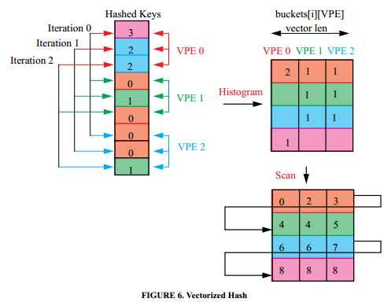

# [Design and Evaluation of Main Memory Hash Join Algorithms for Multi-core CPUs](http://pages.cs.wisc.edu/~jignesh/publ/hashjoin.pdf) 论文阅读笔记

- no partition：普通 hash
- rank and permute：hash group by key
- shared partition：多线程向 public partition 生产
- independent partition：多线程生产在 private，之后汇聚到 public partition

## parallel multi-pass radix partition

- 用 map-reduce 的方式计算出 histogram prefix sum，也就是知道了每个 partition 中的 key 对应着 shared hash 的起始位置
- 第二次遍历，每个线程将数据放置在对应位置

大概如上图（图里面 iteration 不是按 range 切分的，而是模3分的；应该改range 分）

> 实验还是挺丰富的，之后看

## Reference
