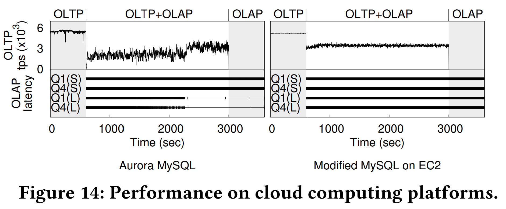

# Diva：Making MVCC Systems HTAP-Friendly 论文笔记

## Abstract
MVCC DBMS 在 HTAP 工作负载下面临2个耦合的痛点：

1. 用少量IO快速定位到版本
2. 高效回收旧版本减轻存储空间压力

本文试图设计一种对 HTAP 友好的 MVCC 模型，提出 DIVA (**D**ecoupling **I**ndex from **V**ersion d**A**ta) 将**版本索引与版本数据分离**，以及**基于时间间隔的垃圾版本回收**。

## Introduction

本文重新审视基于 disk 的 MVCC DBMS 设计复杂性，以应对 HTAP 工作负载。传统 MVCC 在 TP 的设计中通常与事务，存储模型，恢复等都是紧密耦合的。比如 MVCC 需要记录多版本来提供 point-in-time snapshot，而恢复需要最新提交的版本，传统数据库的做法是将多版本与恢复信息耦合到同一个存储模型中，从而产生3个耦合问题：**恢复**，**版本搜索**，**版本清理**。类似的设计与实现出现在 Oracle, SQL Server, MySQL, PostgreSQL 中。这3个耦合问题在 HTAP 工作负载下，尤其是更新事务以及复杂分析查询的环境中，引擎会表现出糟糕的性能指标：**低更新成功率**，**长查询延迟**，**空间使用率**。传统的版本清理是找一个安全的水位，在这之前的版本都可以清理，但是 HTAP 负载下长查询会将这个水位拉的很低，导致有大量版本其实可以回收，但是却无法回收。如果做间隔的回收，又要维护版本链关系而引发IO开销，同时版本搜索依赖的查找结构又会受版本清理的影响，于是在 HTAP 负载下需要重新审视版本搜索和版本清理的设计。  
本文提出：  
- 最近提交的版本和未提交的版本放在主索引中，以便将恢复和MVCC分离
- 版本搜索与版本清理分离
  - 版本搜索引入临时索引提高效率，不需要遍历和额外的IO
  - 基于时间间隔的垃圾版本清理，规定时间间隔记录可见版本与活跃事务，并批量清理版本
- 在 MySQL 与 PostgreSQL 上验证表明 DIVA 通过解耦使得 MVCC 模型对 HTAP 友好

- MVCC & Recovery 耦合：UNDO
- 版本搜索与版本清理耦合：版本链的重组
  - MySQL 如果选择性回收 undo log，会带来大量的 IO 成本
  - RocksDB 是 valuelog，并且可以选择性回收旧版本
  - vWeaver 采用高效的版本搜索结构，但是细粒度的版本回收可能导致这些结构频繁重构

## Design Overview of DIVA

- MVCC & Recovery
  - 将最新提交的版本放在主索引上，其他放在单独的版本存储中
- 版本搜索和版本清理
  - 版本索引：构建多级数组来索引，非持久化的，版本清理后要整理内部碎片
  - 版本清理：划分时间间隔，将版本放置在对应段中（可能跨越若干段），一旦某时间段没有活跃事务，就可以清理对应的所有版本

## Provisional Version Indexing

版本索引类似 inode  
- 索引可以直接指向一个版本，或者间接的指向一组可变数量的版本块
- 预分配节点共享池
区别：  
- 多粒度：TP/AP 版本窗口的宽窄
- 不需要ACID

p-leaf 每条都包括（版本id，生命周期，版本寻址信息）。最多支持两层，这样查找一个版本地址最多需要2次IO。

版本清理导致 p-leaf 中出现碎片  
- macro compaction：针对整个版本链的索引
  - 后台触发，ROW + deferred reclamation
- micro compaction：针对一个 p-leaf inplace 压缩
  - 前台事务触发，持有读写锁（注：seqlock 更好）

## Version Garbage Collection

版本清理分两个阶段：判断版本不可见，清理旧版本。并且**批量**清理可以显著提高IO效率，为了识别批量清理的版本，使用基于间隔的版本事务匹配；通过存储中的分层版本分割来减少IO。

传统模式跟踪单个版本的可见性，DIVA 采用区间来跟踪一批版本的可见性。

按照固定间隔分割 epoch 来构成叶子层，并且对该 epoch 的活跃事务计数。当某个区间计数为0就可以回收生命周期落在该区间的版本。由于一个版本生命周期可能跨越多个区间，所以需要一个结构能够表示连续区间的计数，并且每个区间能够记录其相关的版本。一个版本会放入能够容纳其区间的最小的一个节点。

interval tree：不需要旋转，并发性能差；lockfree 操作；插入总是在右侧叶子结点，删除可以在任意位置  
- insert new epoch
  - 从原最右边开始往上找，直到一个节点 node，其左子树范围 > 右子树范围（参考 Fig7-A），该 node 的右子树新建一个节点；没有就在最上面新建一个（参考 Fig7-B）
  - 新 node 左边放原来的子树，右边放 new epoch
  - 如果没有删除，就会形成完全二叉树（参考 Fig7-A）
- delete epoch
  - 向上收缩，如果一个节点只有一个子节点，那么该节点被干掉，参考 Fig7-BE（当然会有一个 grace period 保证并发访问安全）
  - 注意该节点允许代理之前的区间（参考 Fig7-F），因为可能还要有版本向该区间加入

最坏的插入情况，每次插入都新增 root

最大高度只依赖于最小活跃事务，也就是 epoch 区间宽度

## Design Principles in Action

- 如何实现 p-leaf index 整合到 DB：pk record header 找地方放 locator 指向 p-leaf index
- 在 MySQL 由于 undo 是差量 old image，需要遍历回放，不能直接寻址到对应 record。（猜测实现仍然保留 undo 用于 abort，但是事务提交后 undo page 可以直接释放）
- 后台触发 macro compaction 的指标：p-leaf index 和 interval tree 的空间差异。因为 p-leaf index 只会增长，中间出现空洞，而 interval tree 可以收缩避免空洞
- 猜测版本存储实现：RocksDB Column Family

GC 实现优化：尽可能地把版本放置在容纳其生命周期的最小区间  
在放置版本时从 root 向下遍历到某个节点，如果版本生命周期  
- 与 2 个孩子节点相交，那么放入（参考 Fig10-1）
- 与 1 个孩子节点相交，继续向下（参考 Fig10-2）
- 与 0 个孩子节点相交，可以直接删除（参考 Fig10-3）
- 到达叶子节点，加入对应版本集合

## Experimental Evaluation

在 PostgreSQL13.1 和 MySQL8.0 上进行改造实验（原版对照组 PG 关闭 autovacuum， MySQL 设置 maximum purge lag，PG 有 [txn id wraparound 问题](https://www.postgresql.org/docs/current/routine-vacuuming.html#VACUUM-FOR-WRAPAROUND)，论文中认为可以先忽略）  
高端机器 96c, 2TB内存, SSD；低端机器 AWS Aurora MySQL t3.medium，2vc, 4GB内存, EBS  
Q(S) 表示单个的 AP 查询；Q(L) 表示所有 AP 查询都在 BEIGN 和 COMMIT 之间。  
关注三个性能指标：版本空间开销，OLAP 查询的延迟，OLTP 事务的吞吐  

### Sysbench OLTP with Analytic Queries 

- 对照组在 HTAP 阶段版本堆积，没有细粒度版本清理，空间开销增加，查询需要的 IO 增长，查询延迟增加，缓冲区竞争影响 TP 吞吐
- Postgres 短事务搜索时间长，因为 old2new
- DIVA 减轻了 IO 压力，减少缓冲区竞争，可以维持高 TP 吞吐
- 基于间隔的版本回收节省了 90% 的存储空间

- 内存压力导致缓冲区竞争 TP 吞吐下降明显
- DIVA 对内存压力有较好的抵抗能力

- 低端机器 cpu core 少，被 AP 占用，TP 吞吐降低。AP 延迟和版本空间开销仍有优势。

### TPC-CH Workloads

PG，低内存配置：4GB内存，其中2GB作为 bufferpool

- 对照组的波动：NewOrder事务更新stock表，AP遍历版本导致缓冲区竞争，淘汰 orderline 的 page。这两个表的竞争导致了波动

- Fig11-a Q4(L) 延迟分解：主要来自于 IO 和 purge latch 竞争

- sysbench update-only + long query
- DIVA 允许版本索引换出到存储介质上，因此在内存压力下仍然正常运作

- 大数据集，指标和之前相似

- 热key update场景，与 Fig11 相比原生 PG 的版本链太长导致 TP 吞吐量急剧下降
- DIVA 可以有效避免倾斜负载带来的长版本链导致的IO压力

## Conclusion

DIVA 通过分离版本搜索和版本清理并分别优化，帮助 MVCC DBMS 在 HTAP 工作负载下达成高 OLTP 吞吐，低 OLAP 延迟和紧凑的存储空间。

## REFERENCE

- [有slide](https://www.zhihu.com/question/524369148/answer/2673645895)
- [Long-lived Transactions 产生的影响 - 内核月报](http://mysql.taobao.org/monthly/2023/02/03/)