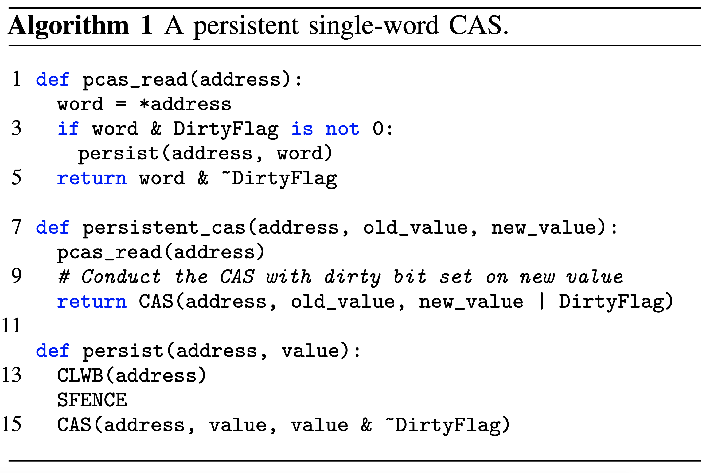
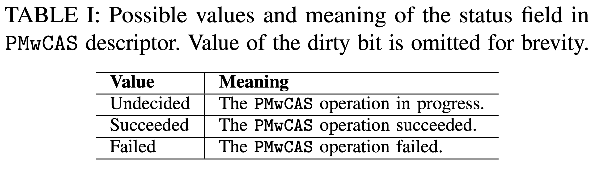
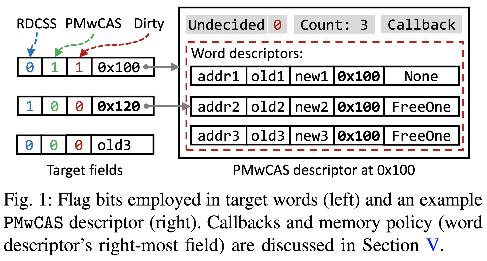
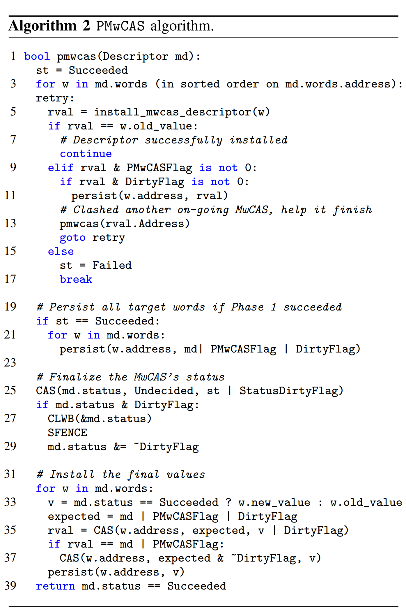
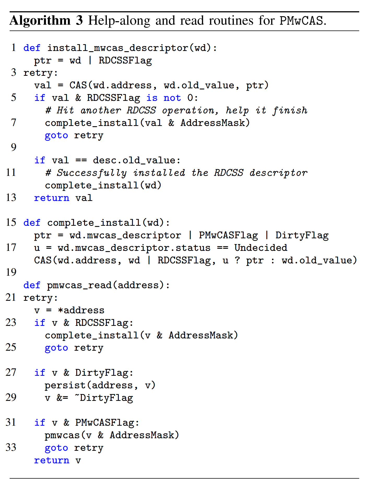
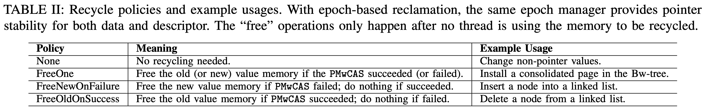
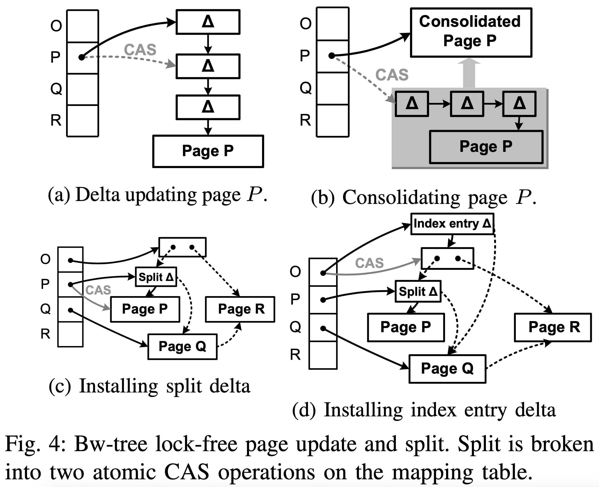

# [Easy Lock-Free Indexing in Non-Volatile Memory](http://justinlevandoski.org/papers/ICDE18_mwcas.pdf) 论文阅读笔记

> 没太搞懂，感觉有点侵入了，我还是倾向于 HTM   

- persistence guarantee
- instant recovery
- memory reclamation

## Persistent Single-Word CAS

一个问题：

- cas(init -> A)
- cas_read()
  - CLWB(A), SFENCE, 被抢占
- cas(A -> B)
  - CLWB(A), SFENCE, clear(A)
- cas(B -> A)
  - CLWB(B), SFENCE, clear(B)
- 恢复抢占 clear(A)！！！
- 之后的 read 都认为 A 已经 persist，但其实才 persist 到 B

## Persistent Multi-Word CAS

要求 target word （通常是指针）贡献出 3 个 bit

- 收集 CAS 操作
- 开始执行
   - 按地址顺序 CAS 拿锁
- 如果已经有别人 install descriptor，help，然后自己重来
- persist status, clear dirty bit
- 这里已经保证了成功
- 真正开始 CAS，将 new value 写到 target word

- crash recoery
  - 先扫描约定好位置的 descriptor pool
  - status
      - Succeeded 继续
      - Failed/Undecided 回滚
  - 对每个 word 进行对应操作

## Memory Management

- reserve
- activate

- 需要能够识别 double-free？

## 常见用法

- 分配一个 descriptor
- reserve entry
- 为 new value 分配空间，并初始化
- 执行 PMwCAS

## BwTree / BzTree

## Reference

- [Easy Lock-Free Programming in Non-Volatile Memory ∗](https://www2.cs.sfu.ca/~tzwang/pmwcas-nvmw.pdf)
- [PIRL 2019: Experience on building a lock-free B+-tree in persistent memory - youtube](https://www.youtube.com/watch?v=nAfMtiUlOqI)