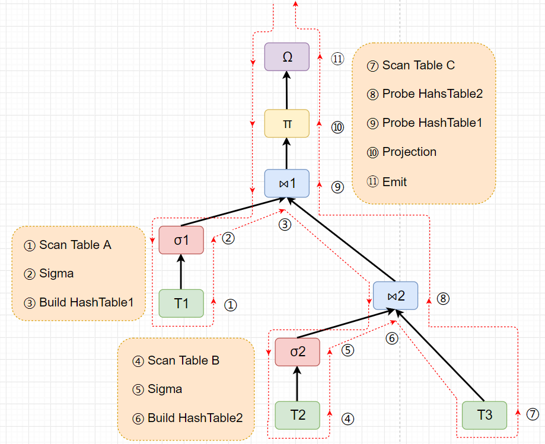

# [Efficiently Compiling Efficient Query Plans for Modern Hardware](https://www.vldb.org/pvldb/vol4/p539-neumann.pdf) 论文阅读笔记

- blockwise：以算子为单位，计算完传所有数据，之后传递给下一个算子
  - 并发好写，但是数据处理要切 cpu，这里涉及到 sync，还有 cacheline 命中问题
- pipeline：一个控制流内一份数据经过多个算子处理
  - 不利于并发（？），除非在数据源头就可以并发。数据命中 cacheline，甚至可以一直在 register
  - 这里的一份数据可以是一个 block，做 vectorization

混合方法：将算子合并为大算子，大算子内部是一个控制流，大算子之间可以并发。   
大算子的分界点就是 pipeline breaker。

从树转化到代码参考 [codegen - xjbDB](https://github.com/rsy56640/xjbDB/blob/query/doc/codegen.md)

文中给出的 produce 和 consume 其实就是递归形式遍历树了。个人还是倾向于显式使用 stack，这样对全局有一个掌控。

- compilation 是离线还是在线
- schema 的变化！！！

> ch4 后面有一个 while-branch 的例子，非常牵强，实测没啥用

## Reference
