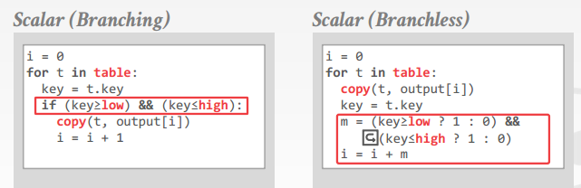

# [Everything You Always Wanted to Know About Compiled and Vectorized Queries But Were Afraid to Ask](https://dl.acm.org/citation.cfm?id=3284966) 论文阅读笔记

> 看了 Ref[1] 和 Ref[2]，基本就差不多了

Vectorization：materialization 开销，可以利用 SIMD 并行数据操作，最好是 column store   
Code gen：指令数少，利于计算密集型

- join (memory bound)：向量化快
  - memory load 消耗 CPU cycle，向量化减少 cache miss
- computation (CPU intensive task)：code gen 快
  - cache 压力小，code gen 指令数少，高效利用 register
- selection 使用 SIMD
  - 越多 select，越稀疏，column 上 offset 越大，导致 cache miss

消除分支的操作：`a>b?1:0` 可以被写成没有分支的语句 `setg`

## Reference

- [在 2019.4.20 杭州举办的 Infra Meetup No.98 上，我司 TiDB 研发工程师徐怀宇为大家带来了《Everything You Always Wanted to Know About Compiled and Vectorized Queries But Were Afraid to Ask》论文分享。](https://www.bilibili.com/video/av50329586/)
- [CMU 15-721 Advanced Database Systems (Spring 2018)](https://www.youtube.com/playlist?list=PLSE8ODhjZXjYplQRUlrgQKwIAV3es0U6t)
- [A Deep Dive into Query Execution Engine of Spark SQL - Maryann Xue - You Tube](https://www.youtube.com/watch?v=ywPuZ_WrHT0)
- [Vectorization vs. compilation in query execution](https://dl.acm.org/citation.cfm?id=1995446)