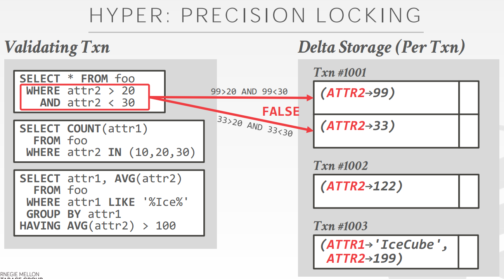

# [Fast Serializable Multi-Version Concurrency Control for Main-Memory Database Systems](https://dl.acm.org/citation.cfm?id=2749436) 论文阅读笔记

> 这是一篇好论文

## Serializable MVCC implementation

- 不允许 write-write（CAS更新？），commit-ts 作为 serialization order
- delta storage (undo buffer)
- validation phase（**避免 phantom, write-skew**）
  - 检查 read set 是否与最近（T's start-ts < txn's commit-ts < T's commit-ts） committed txn write set 有交集（本事务称作 T，最近提交的事务称作 txn）
  - 沿着这些 delta storage 检查
  - 保留 T's selection predicates，即 where clause，用于检测冲突
      - 对于 udpate：
          - 检查 update 的 txn's column 是否属于 T's read set
          - 检查 txn's content 是否满足 T's selection predicates
      - 对于 deletion：
          - 检查 txn's deleted tuple 是否满足 T's selection predicates
      - 对于 creation：
          - 检查 txn's created tuple 是否满足 T's selection predicates

> validation phase 是 critical section

### GC

如果 undo buffer (commit-ts) < 最小的 txn's start-ts，那么可以被清除

### Serializability 证明

serializability <=> 依赖关系遵循 commit-ts 顺序

对于 read txn，start-ts = commit-ts，相当于发生在一点。之前 commit 的可见，之后不可见。

对于 write txn，start-ts 记作 Sb，commit-ts 记作 Tc。下证明 txn 等价于发生在 Tc 这一点：   
首先发生在 Sb 之前的一定可见；Tc 之后的不可见；[Sb, Tc] 之间的和 read set 没关系，**这是 validation phase 保证的**；并且前文说没有 write-write conflict，我猜应该是用 CAS 或者锁。因此 update 在 Tc 时刻被实施，并且 Tc 时刻之前的和自己相关的依赖是可见的。

## Reference

- [CMU Advanced Database Systems - 04 Multi-Version Concurrency Control Protocols (Spring 2019)](https://www.youtube.com/watch?v=9EY0vYFNWxY&list=PLSE8ODhjZXja7K1hjZ01UTVDnGQdx5v5U&index=5&t=0s)