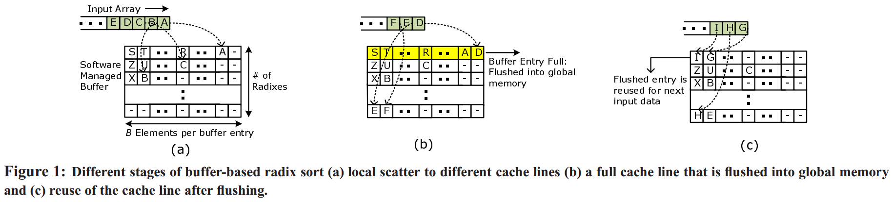

# [Fast Sort on CPUs and GPUs: A Case for Bandwidth Oblivious SIMD Sort](https://dl.acm.org/doi/10.1145/1807167.1807207) 论文阅读笔记

## Radix Sort

- 多线程并行统计 histogram
- barrier，整合 histogram
- 再计算自己 block 中的数据应该被 scatter 到哪些位置

就相当于每个线程 sequential read 自己的 input block，然后把数据 scatter 到各自 key 的对应位置。scatter 会造成 cache miss、TLB miss 并会提高 memory latency，即使 output 对应位置局部是 sequential write。



针对 scatter 的优化方案：批量写入 scatter 位置，以 hide latency

- 每个线程准备 2^D 个 local buffer（D 是每一轮 radix 处理的 bit 数）
  - 每个 buffer 大小可选为 cache line size
  - D 的选择要考虑到 TLB miss
- 第二次 SIMD 扫描时先 scatter 到对应的 local buffer，满了就整块 flush（sequential write 到 output）
- 最后 flush 所有 local buffer

> 另一种（可行的？）方案是：每个线程遍历所有 input，然后 scatter 到自己负责的 output 位置。这样 output 是 sequential write，对于 input 是 selective sequential read


## Merge Sort

- 将 merge sort 任务想象为一棵二叉树，多线程并行执行
  - 当到达某一层后，线程数 > 任务数，这时我们将任务切割为若干个独立任务，并且结果可以拼接。方法是：将两个有序的 input 序列按照等分点切割。（注意到找到两个有序数组第k个元素的复杂度是 (OlogN)）
- 单个 merge sort 任务内使用 bitonic merge network
  - 对于非2次幂感觉不对劲

### Bitonic Sort

```c++
// "" -> "/"
void bitonic_sort+(v[0 : n]) {
  if(len == 1) return;
  bitonic_sort+(v[0 : n/2]);
  bitonic_sort-(v[n/2 : n])
  bitonic_merge+(v[0 : n]);
}

// "" -> "\"
void bitonic_sort-(v[0 : n]) {
  if(len == 1) return;
  bitonic_sort-(v[0 : n/2]);
  bitonic_sort+(v[n/2 : n])
  bitonic_merge-(v[0 : n]);
}

// "Λ"/"V" -> "/"
void bitonic_merge+(v[0 : n]) {
  shuffle+(v[0 : n]); // "Λ"/"V" -> "∧∨"
  bitonic_merge+(v[0 : n/2]);
  bitonic_merge+(v[n/2 : n]);
}

// "Λ"/"V" -> "\"
void bitonic_merge-(v[0 : n]) {
  shuffle-(v[0 : n]); // "Λ"/"V" -> "∨∧"
  bitonic_merge-(v[0 : n/2]);
  bitonic_merge-(v[n/2 : n]);
}
```

- `bitonic_sort+/-`：将数组递增（递减）排序
- `bitonic_merge+/-`：将Λ或V的数组递增（递减）排序
- `shuffle+/-`：**比较**前后两半（真正的交换工作，模式非常朴素，可以设计 hardware 加速）
  - `+`：Λ 或 V -> ∧∨，前半 < 后半
  - `-`：Λ 或 V -> ∨∧，前半 > 后半


## Reference

- 《The Art of Multiprocessor Programming》 - Ch12.5 Counting Networks
- [CHAPTER 28: SORTING NETWORKS - USTC](http://staff.ustc.edu.cn/~csli/graduate/algorithms/book6/chap28.htm)
- [Bitonic sort - Flensburg University](https://www.inf.hs-flensburg.de/lang/algorithmen/sortieren/bitonic/bitonicen.htm)
- [Bitonic Sort - GeeksforGeeks](https://www.geeksforgeeks.org/bitonic-sort/)