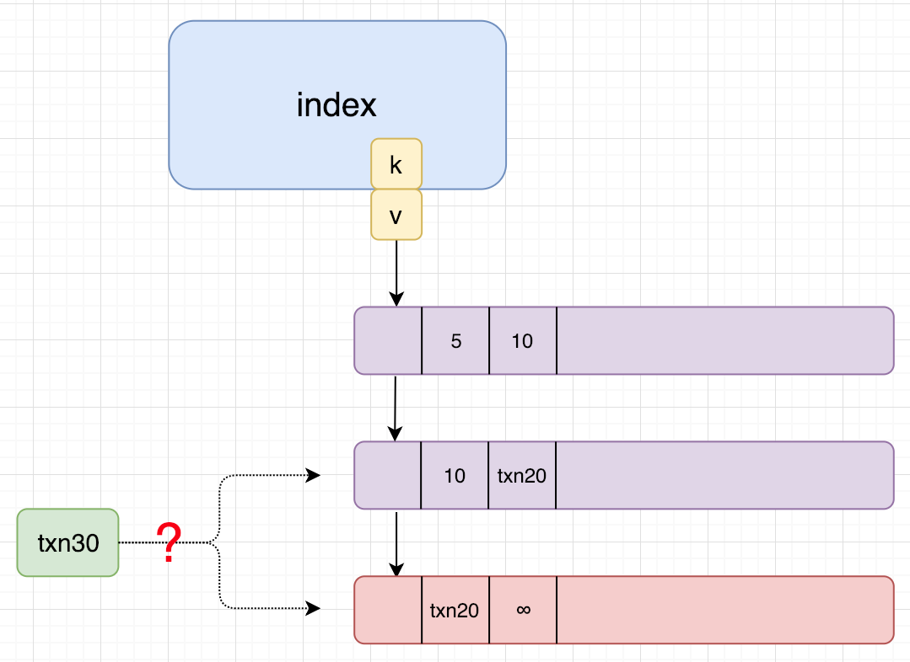
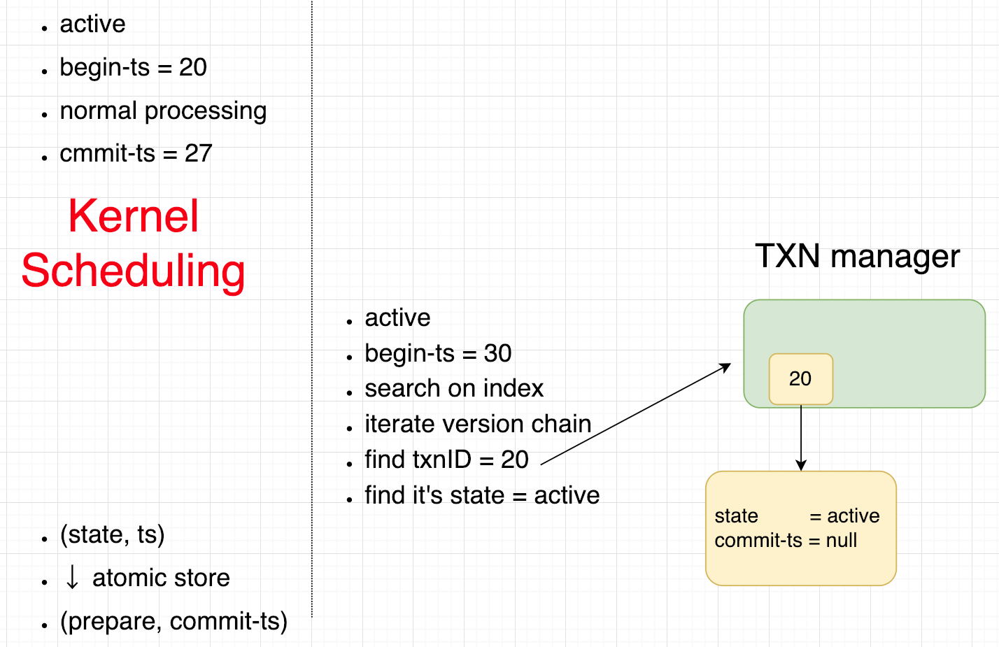
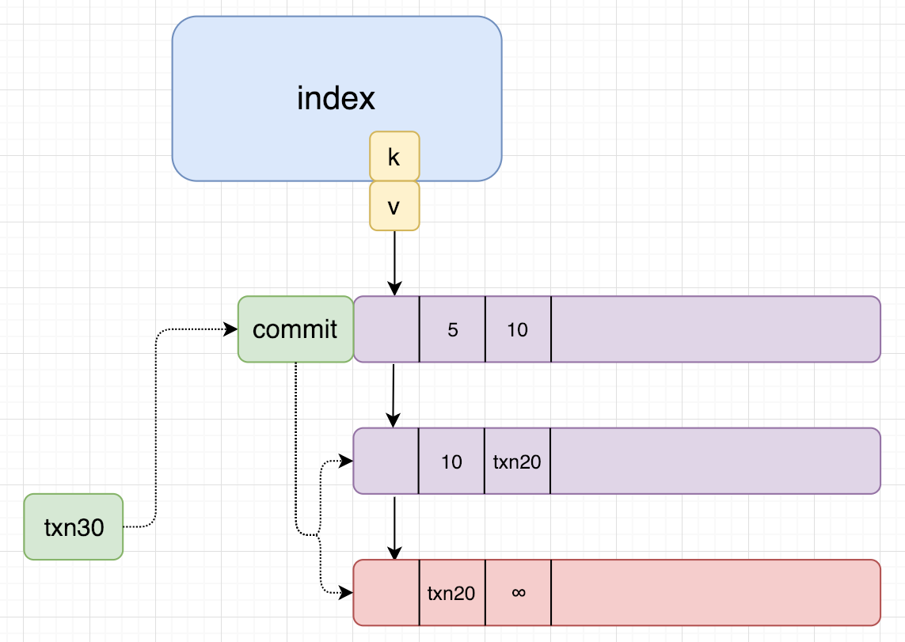
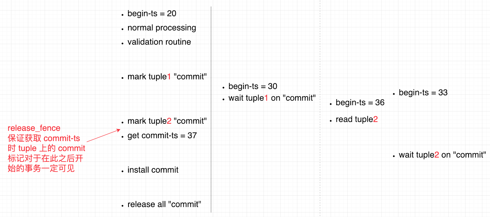

# [High-Performance Concurrency Control Mechanisms for Main-Memory Databases](https://dl.acm.org/citation.cfm?id=2095686.2095689) 论文阅读笔记

方案上有很多值得思考的点：

- version chain 顺序：N2O / O2N
  - GC：O2N 支持 cooperative GC
  - cache miss：O2N 遍历 version chain
  - CAS on index pointer：N2O 需要改变 index 的 pointer，而 O2N 的 pointer 永远指向 base
- version chain 存储格式
  - 全量
    - 内存分配策略
  - 增量
    - version chain 顺序
        - O2N：apply delta
        - N2O：undo buffer
    - 内存分配策略
    - 适用于 attr 比较多，而且每次修改的 attr 较少的情况
    - 每次恢复版本都要计算，delta compaction
    - 以列为单位的 MVCC 优化，增加 write-col（用于写写冲突），commit-col（用于预提交阶段）
- 如果有写操作还未 commit，这时读操作不知道会不会读到这个版本，有两种思路
  - 等待
      - 读操作等待
          - 尽可能地降低等待时间，例如：增加 commit 标记，validation 后，先占有 commit 标记（非原子占有所有tuple），获得时间戳，install，释放标记（非原子释放所有tuple）
          - 读操作原子读取 commit 标记
              - 若被占有，则自旋等待（这时无法确定 读操作ts 和 commit-ts 谁大）
              - 若不被占有，则读 old version
          - > 可实施的优化：commit 标记改为 “prepare-commit-ts”。读操作若发现 ts < prepare-commit-ts，则读旧版本；否则等待 commit 清空
          - 注意其中的 happens-before relation
      - 写操作等待
          - 用户态RCU？？
  - 不等待，但允许 commit 依赖（本文中的方案）
      - 即允许 speculatively read，这可能导致回滚
- GC
  - 分解为3个任务：
      - 发现需要回收的版本
      - 从 version chain 中 unlink 该版本
      - 回收内存
  - Vacuum GC
  - Cooperative GC (only O2N)
  - SAP HANA 中的 interval GC（主要针对 HTAP）
  - Epoch-based txn level GC
- Index
  - 除了B+以外的：Trie/Radix/Masstree，对 range query 的支持？
  - Radix: Hyper(ART)
  - Masstree: Silo

&nbsp;   

&nbsp;   
&nbsp;   
## Hekaton 中的 MVOCC

- 写操作
  - active：正常处理
    - 若 endfield 已经有其他 txnid，则 abort-restart
  - 结束后获取 commit-ts，原子更新（状态，commit-ts）->（prepare，commit-ts）
  - >>> *潜在的 bug*：获取 commit-ts 和 原子更新 是两步操作！！！有可能在中间一个读操作进来了，但其实 读ts > commit-ts；这时，读操作发现是 active state，命中 old version，但其实应该是 new version。（发生这种情况的可能性：写操作在获取 commit-ts 之后被内核调度了，然后一个新事务启动，其 begin-ts > commit-ts，进入 index，进入 version chain，发现txnID，拿着txnID去读状态，发现是 active）
  - prepare
      - validation（单线程，瓶颈？？）
          - read set
          - phantom
      - wait for commit dependency
      - log
  - commit：原子更新（状态，commit-ts）->（commit， 不变），并对修改的 tuple 写入 begin-ts 和 end-ts；并通知依赖事务
  - abort：
      - 允许其他事务观察到 abort 状态，并不等待 abort 事务完成最后的操作。因此在写 end-ts = inf 时，注意到若有事务ID，则不修改
      - 并通知依赖事务
- 读操作 with ts
  - 走到一个 version，endfield 是 txnid
  - 拿着 txnid 去 txn-manager，原子读（状态，commit-ts）
  - 根据状态
      - active：命中当前版本，无依赖
      - prepare：
          - ts < commit-ts：命中当前版本，无依赖
          - ts > commit-ts：speculatively read 下一个版本，并添加依赖（*潜在问题：从判断 prepare 到这里并非原子，此时如果该事物已经结束了怎么办，直接读新版本*）
      - commit：比较一下时间戳，试图往下走，往下走还有可能碰到写操作
      - abort：命中当前版本，无依赖

&nbsp;   
### 读操作不等待，所引发的潜在的bug

> 本质原因是 “获得commit-ts” 和 “对外展示commit-ts” 这两个操作并非原子的

#### 改进方案：
- **在 active 结束时，在 txn state 中占有一个 mark，fence，然后获取 ts，写入 commit-ts，fence，再释放 mark**
- **读操作若发现是 active，则尝试访问 mark**
  - **若被占有，则等待，之后按照 prepare 重新判断**
  - **若不被占有，则直接读**

事实上，如果业务方不需要感知 commit-ts，那么这并非 bug。考虑下面的情况：**并发的3个事务**

- Put(k, v1 -> v2) &nbsp; [commit-ts=27]
- Get(k) -> v2 &nbsp;&nbsp;&nbsp;&nbsp;&nbsp;&nbsp;&nbsp; [commit-ts=29]
- Get(k) -> v1 &nbsp;&nbsp;&nbsp;&emsp; [commit-ts=30]

如果业务方认为整个流程返回 ok 是 commit 了，那么这并非 bug（？待证明，如果只读这一个 tuple，那么没有不一致）   
如果业务方需要感知 commit-ts，那么这就有问题。

> 如果有 hardware transactional memory 支持，那么可以解决问题，但是要考虑 HTM 的开销，和普通分配 ts 的竞争冲突

&nbsp;   
### 尽可能减少读操作的等待时间

考虑非常细节的问题：如果 mark commit 之后读操作没有 load 到这个最新值，从而去读 old version   
这是ok的，原因如下：   
注意到该读操作的时间戳必然小于 commit-ts，否则由于 memory fence，必然读到 mark commit；   
于是该读操作理应读到 old version

> 可行的优化：在 install commit-ts 时，做一个解锁一个 commit mark(with release fence)

如果读操作是**读写事务**，那么在 repeatable-read 下，之前读到 old version，之后 validation 必然会 **abort**。   
如果是 SI，ok，但是这会导致 rw，即 anti-dependency

> 为了避免这些 abort，参考   
> [Improving Optimistic Concurrency Control Through Transaction Batching and Operation Reordering](https://www.microsoft.com/en-us/research/uploads/prod/2018/11/occ_batch_reorder_vldb2018.pdf)   
> [Concurrency Protocol Aiming at High Performance of Execution and Replay for Smart Contracts](https://arxiv.org/pdf/1905.07169.pdf)   
> [BCC: Reducing False Aborts in Optimistic Concurrency Control with Low Cost for In-Memory Databases](https://web.cse.ohio-state.edu/~blanas.2/files/vldb2016_bcc.pdf)   

> 读操作是只读事务还是读写事务的概率

如果要求 RR，并且读操作是读写事务的概率不少，为了减少读写事务的 abort，考虑激进一点的策略：   
即写操作较早地获得 commit-ts，这样读操作就可以读 new version，但是会产生 commit dependency

如果写事务大多是 point update，很少有那种先读再计算其他record，那么后者对于 RR 也是 ok 的。

考虑 txn30 的读操作

SI 场景下：

- 读写事务的读操作
  - write skew
- 只读事务的读操作
  - 尽可能快的返回，于是让写操作阻塞别人的时间最短，尽量延后 mark commit

RR 场景下：

- 读写事务的读操作
  - 若选择新版本，wr commit-dependency
  - 若选择旧版本，rw anti-dependency，若该版本上的写操作事务先 commit，那么会 abort
      - 某些 SSI 算法（FLOOS）检测 anti-dependency edges，若发现 2条连续 anti-dependency edge，则 abort 其中之一，以此避免 write skew
- 只读事务的读操作
  - 尽可能快的返回，于是让写操作阻塞别人的时间最短，尽量延后 mark commit

&nbsp;   
## MV2PL

> 简单说就是读操作要上锁，并且这里可以让读操作入侵写锁，让写操作延迟提交

- record 锁针对最新版本，锁是 end-ts (`NoMoreReadLocks`, `read cnt`, `write ID`)
- range lock：避免 phantom
- txn: (`WaitForCounter`, `NoMoreWaitFors`)

对于写事务，需要计算 wait-dependency，无依赖（即不论 wait 的事务 commit 还是 abort）   
统计入度，即 `WaitForCounter`，由对方维护谁依赖自己（只在有 phantom 的情况下维护 `WaitingTxnList`），并在 commit 或 abort 时释放 `WaitForCounter`

当读写操作在一个 record 上冲突时，策略是 写操作 wait 读操作

- record 上有读锁，写操作 等待
- record 上有写锁，读操作
  - 第一个读操作增加写操作的 `WaitForCounter`，如果 `NoMoreWaitFors` 允许
  - 释放读锁时最后一个设置 version 上的 `NoMoreReadLocks`，然后减少写操作的 `WaitForCounter`

### phantom 检测

用hash？没看懂

### 写事务提交时

- 释放读锁
- 等待 `WaitForCounter` -> 0
- CAS (`WaitForCounter`, `NoMoreWaitFors`) 从 (0, false) -> (0, true)
- 获得 commit-ts，install update（写锁在这里自动释放）

### deadlock 处理

- detection: 连通分量，异步，
- prevention: no-wait abort-restart

根据 [Staring into the Abyss: An Evaluation of Concurrency Control with One Thousand Cores](http://www.vldb.org/pvldb/vol8/p209-yu.pdf) 的结果，no-wait 的方案比 detection 要好一些（要看 abort 的开销）
