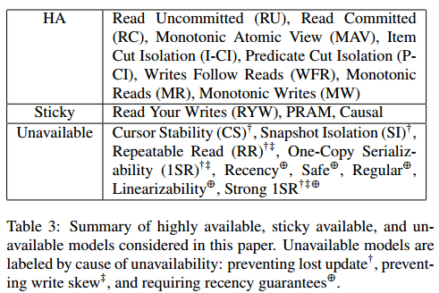

# [Highly Available Transactions - Virtues and Limitations](https://dl.acm.org/citation.cfm?id=2732237) 论文阅读笔记

> 文字性的描述太多了，，看得难受，最好是能用一些图论语言来描述。   
> 说了这么多，其实用 dependency graph 和 *hanppens-before relation* 就能解释清楚。

主要探讨了两方面：**数据库隔离级别**、***happens-before relation***（包括 *release-acquire* 语义等）

定义 sticky：client 与固定的 server(s) 交互

> 第7页左下说 SI unavailable，因为要防止 Lost Update？？？

## Reference

- [一致性模型 - PingCAP](https://segmentfault.com/a/1190000016785044)
- [Highly Available Transactions: Virtues and Limitations - the morning paper](https://blog.acolyer.org/2014/11/07/highly-available-transactions-virtues-and-limitations/)