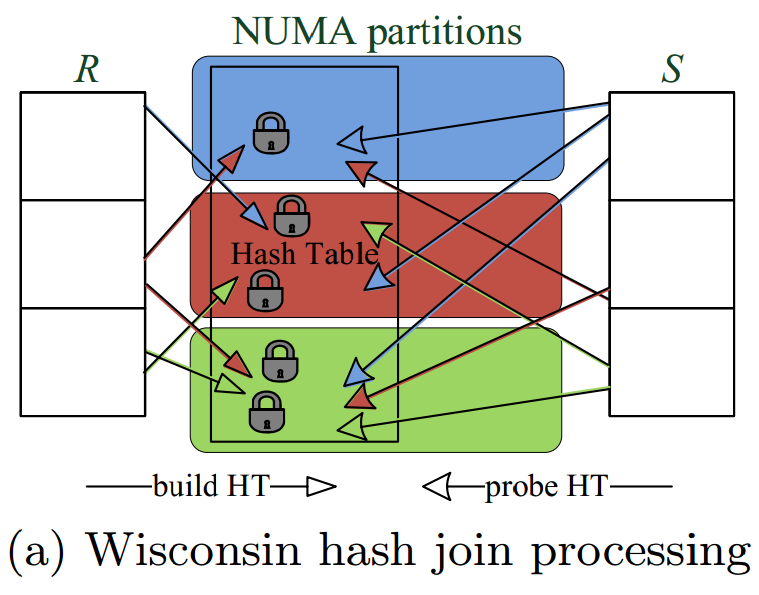
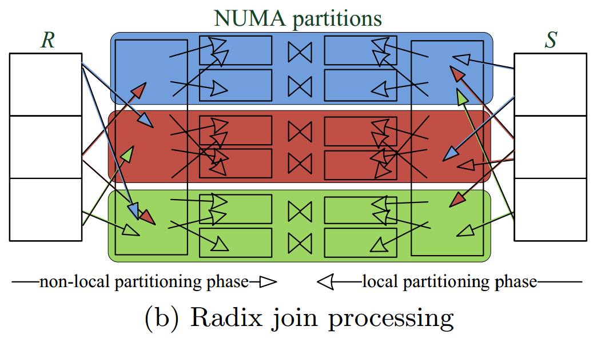
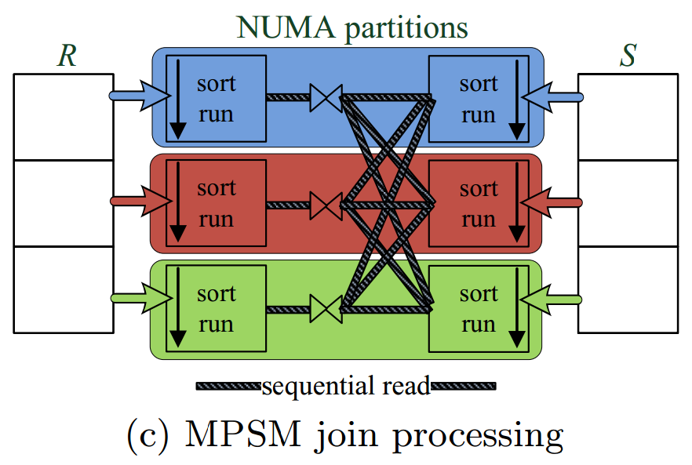
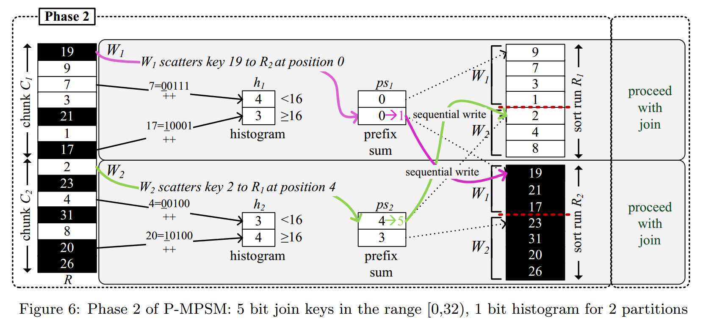
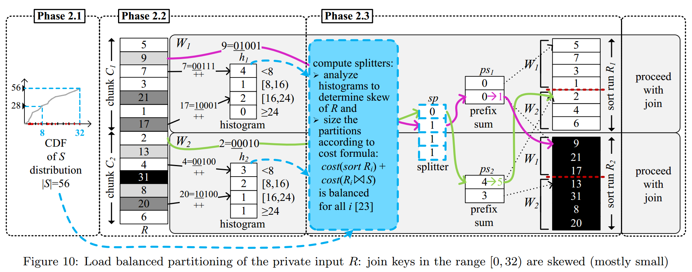

# [Massively Parallel Sort-Merge Joins in Main Memory Multi-Core Database Systems](https://15721.courses.cs.cmu.edu/spring2018/papers/20-sortmergejoins/p1064-albutiu.pdf) 论文阅读笔记

对于 NUMA 的访问模式：

- **不要 random write remote**
- **要 sequentially read remote**

- shared hash table，sync 开销，remote write 开销

- radix clustering 分散到不同 node 上，local 做 join

- locally sort，顺序 merge join 所有 local + remote

- parallel partition 时先计算 hitsogram，确定位置，保证 **顺序写入** NUMA node

- skew resilient：动态计算 range 分割阈值，中间加 splitter 表示属于哪个 range

## Reference

- [ppt](http://hyper-db.com/albutiu_mpsm.pptx)