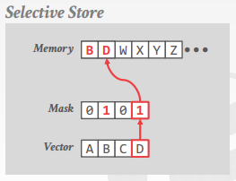
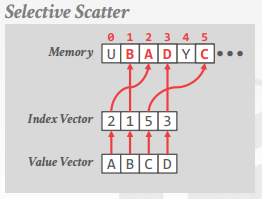
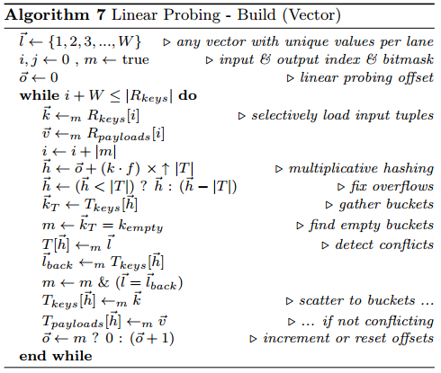

# [Rethinking SIMD Vectorization for In-Memory Databases](https://dl.acm.org/citation.cfm?id=2747645) 论文阅读笔记

## 基本操作

### selective store

将 vector lane 的一部分（根据 mask）写入连续内存

### selective load

从连续内存读入到 vector lane 的一部分（根据 mask）

### selective gather

从非连续内存（根据 index vector）读入到 vector lane

### selective scatter

将 vector lane 写入到非连续内存（根据 index vector）

注意 gather 和 scatter 并不能1个时钟周期内完成

## Selection Scan

- **W**：SIMD vector 长度
- **j**：输出数量
- **l**：buffer **B[]** 的最后一个元素的后继位置
- **B[]**：buffer，缓存被 selected 行的标号（没有明说，不过我认为 **|B|** 是 **W** 的整数倍）
- **r[]**：序号的 vector，长度为 **W**，用于 selective store，mask **m**
- **m**：predicate 结果，是一个 mask vector

意思就是每次处理一批，然后差不多满了就 output。

## Hash Table

### Linear Probing

#### Probe

参考 [Vectorization vs. Compilation in Query Execution 论文阅读笔记](https://github.com/rsy56640/paper-reading/tree/master/%E6%95%B0%E6%8D%AE%E5%BA%93/Vectorization%20vs.%20Compilation%20in%20Query%20Execution)

和上一篇笔记中的算法有一些区别，没有 **match[]**，而是每轮循环有被排除掉的就去拿新的 input。Algorithm5 最后一行的 **m** 表示排除掉的（包括 **已经匹配成功的** 和 **匹配完所有都失败的**）就拿新的 input；还在匹配的就 offset+1，继续尝试在 bucket 中匹配。（所以 output 顺序和 probe input 顺序可能不一致。上一篇笔记里的算法是把每轮 input check 完才继续下一轮）

#### Build

> 居然没有做 **Rank and Permute** 来 group by key？？？参考 [A Vectorized Hash-Join 论文阅读笔记](https://github.com/rsy56640/paper-reading/tree/master/%E6%95%B0%E6%8D%AE%E5%BA%93/A%20Vectorized%20Hash-Join)   
> 可以使用 Rank and Permute，然后查询 **next[]** 来加速 probe！！！

#### 我改进的 probe 流程，针对 build 时使用 rank and permute 来 group by keys

## Reference

- [CMU 15-721 21 Vectorized Query Execution Part I (Spring 2018)](https://www.youtube.com/watch?v=e92_3SNG5jQ&list=PLSE8ODhjZXjYplQRUlrgQKwIAV3es0U6t&index=22)
- [DataBase Partitioning Techniques](https://intellipaat.com/blog/database-partitioning-techniques/)