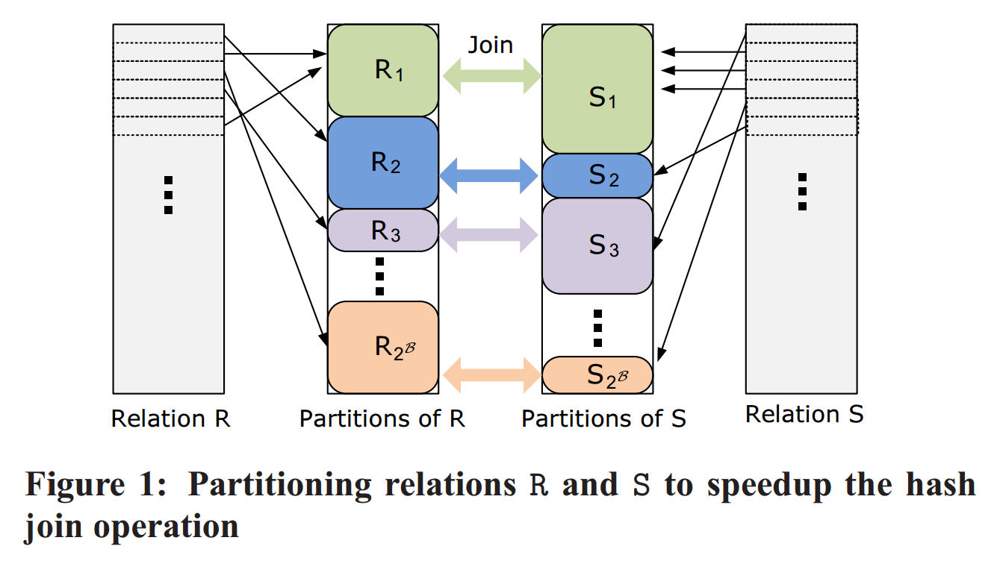
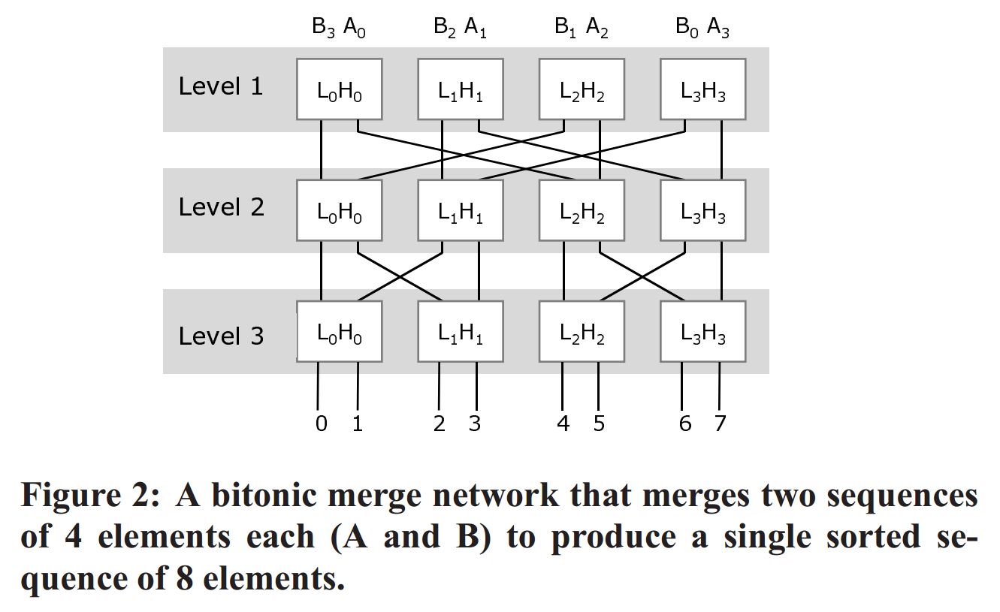

# [Sort vs. Hash Revisited - Fast Join Implementation on Modern Multi-Core CPUs](https://15721.courses.cs.cmu.edu/spring2018/papers/20-sortmergejoins/kim-vldb2009.pdf) 论文阅读笔记

## hash join

- 左边 partition 就是 rank & permute
- 右边
  - partition
      - 如图，这与 pipeline 矛盾
      - loop
      - hash：与 partition 选择不同的 key mapping function
      - sort-merge
  - pipeline
      - [Vectorization vs. Compilation in Query Execution](https://github.com/rsy56640/paper-reading/tree/master/%E6%95%B0%E6%8D%AE%E5%BA%93/content/Vectorization%20vs.%20Compilation%20in%20Query%20Execution)
      - [Rethinking SIMD Vectorization for In-Memory Databases](https://github.com/rsy56640/paper-reading/tree/master/%E6%95%B0%E6%8D%AE%E5%BA%93/content/Rethinking%20SIMD%20Vectorization%20for%20In-Memory%20Databases)

## sort-merge join

利用一些硬件科技

## Reference

- [ppt](https://www.slideserve.com/barbara/sort-vs-hash-revisited-fast-join-implementation-on-modern-multi-core-cpus)