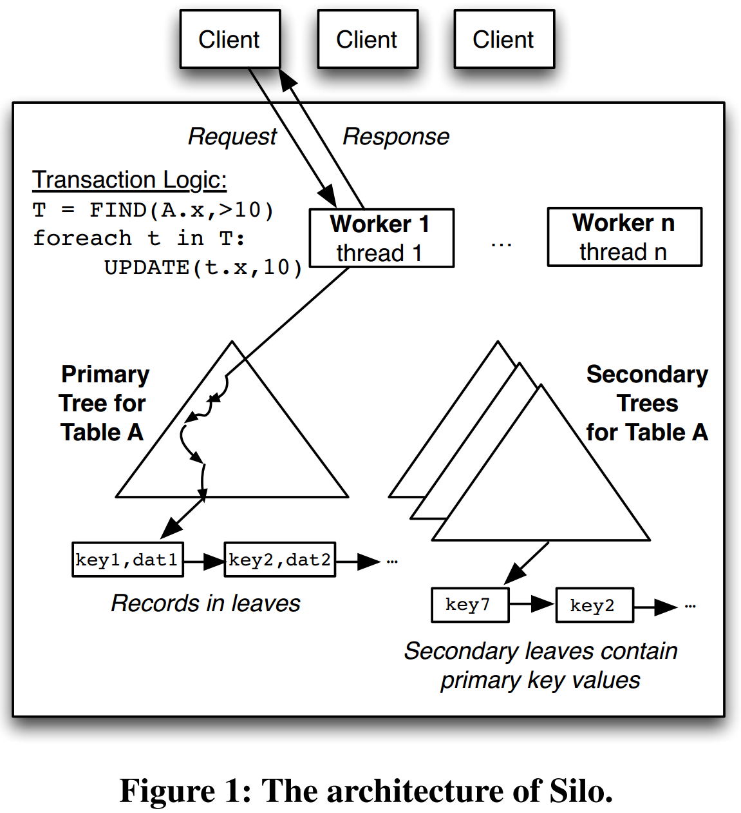
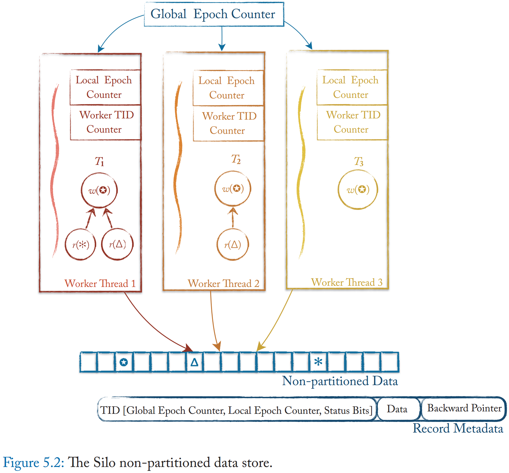
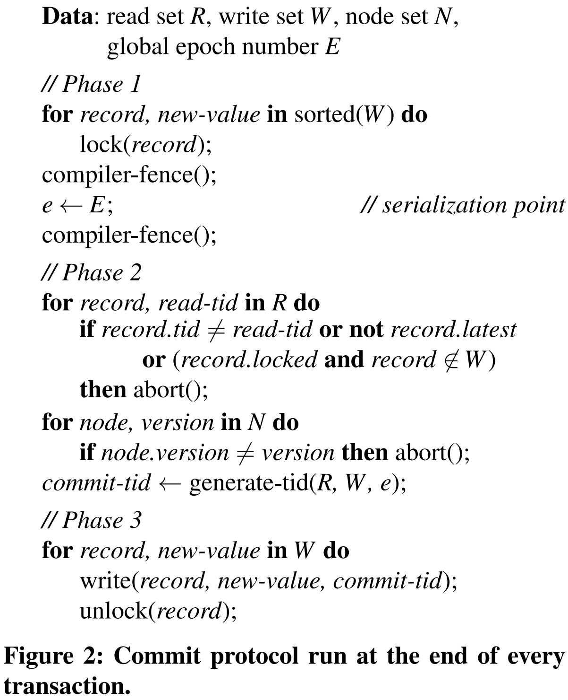
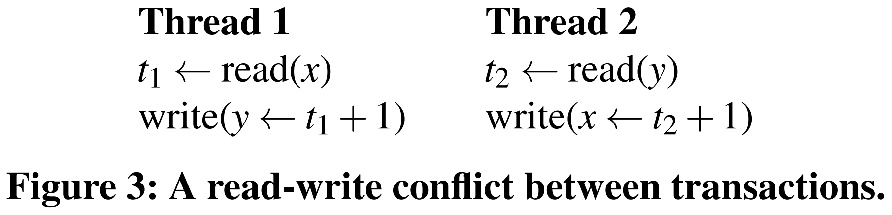
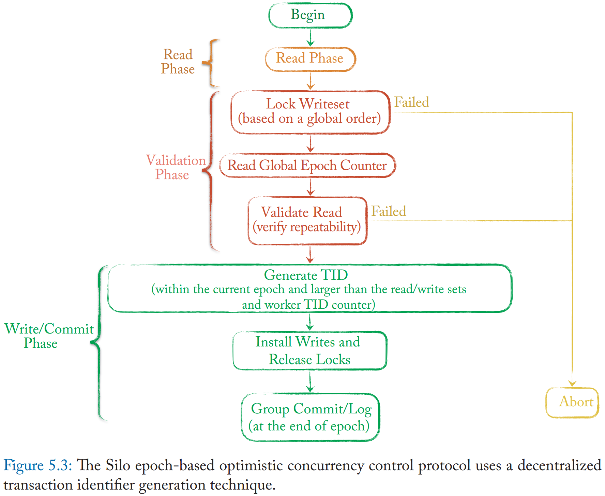
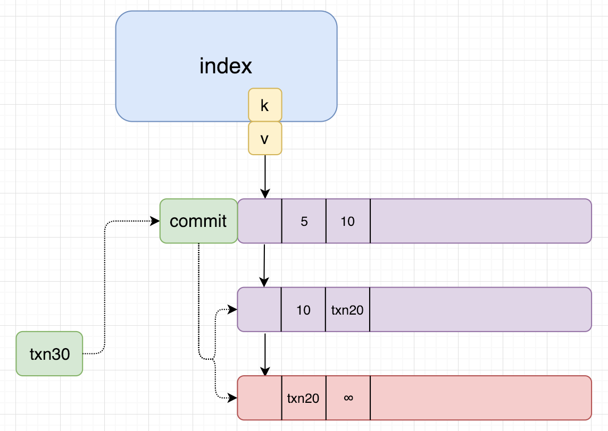
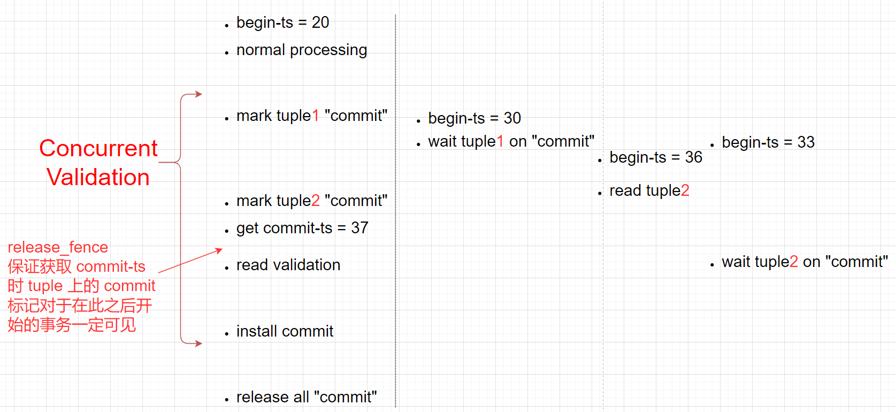

# [Speedy Transactions in Multicore In-Memory Databases](https://dl.acm.org/doi/pdf/10.1145/2517349.2522713) 论文阅读笔记

为了降低获取 sequential commit-ts 的开销，改用 periodically updated epoch

## Design

<p/>

<p/>

- TID
  - epoch
  - sequence
  - status
      - lock
      - delete
      - absent（忽略）
- previous version pointer
- record data

代码中的 TID: (epoch, num_id, core_id)。num_id 就是 read sets 里见过的最大的+1；如果 epoch 是新一轮的话 num_id 从 0 开始。

```c++
  // NB(stephentu): ABA problem happens after some multiple of
  // 2^(NBits(version_t)-6) concurrent modifications- somewhat low probability
  // event, so we let it happen
  //
  // <-- low bits
  // [ locked | deleting | write_intent | modifying | latest | version ]
  // [  0..1  |   1..2   |    2..3      |   3..4    |  4..5  |  5..32  ]
  volatile version_t hdr;
```

### Concurrent Validation Phase

<p/>

<p/>

<p/>

- write sets 全部拿锁（lock bit）
  - 避免 deadlock，按地址排序
  - `handle_last_tuple_in_group(dbtuple_write_info&)`
      - `tuple->lock(true); // lock for write`：标记 lock-bit
      - `last.mark_locked();`：把 lock-flag 藏到 ptr 后3位
- 生成 TID
  - `gen_commit_tid(write_dbtuples)`
- read validation
- install write commit & unlock

<p/>

<p/>

把[之前那个方案](https://github.com/rsy56640/paper-reading/tree/master/%E6%95%B0%E6%8D%AE%E5%BA%93/content/High-Performance%20Concurrency%20Control%20Mechanisms%20for%20Main-Memory%20Databases)改进一下，可以做 concurrent validation

### insert & delete

- delete：标记 absent，等待 GC
- insert
  - 如果存在，abort
  - 若不存在，在 validation 开始之前先插入 index（index 并发问题）

### range query

- version number
  - 要区分结构变更和修改，比如 validation 前 insert 会更新 version

## GC

- epoch-based

## Snapshot

> 这个 snapshot transaction 看上去并不遵循 causuality，因为只读事务只给 se_w。   

## Log

- group commit：同一个 epoch 当成 commit unit，一起 log
- 一个 epoch 内部的 serial order 被放弃了

## Reference

- [Speedy transactions in multicore in-memory databases](https://www.youtube.com/watch?v=5g66rBmUKOw)
- [ppt](https://slideplayer.com/slide/7291557/), [ppt](https://studylib.net/doc/5612767/silo--speedy-transactions-in-multicore-in-memory)
- [Speedy Transactions in Multicore In-Memory Databases](https://nan01ab.github.io/2017/12/Silo.html)
- [论文笔记 [SOSP '13] Speedy Transactions in Multicore In-Memory Databases](https://www.jishuwen.com/d/2q98)