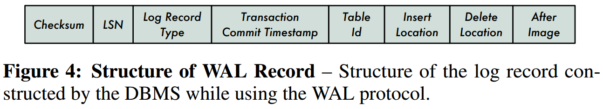
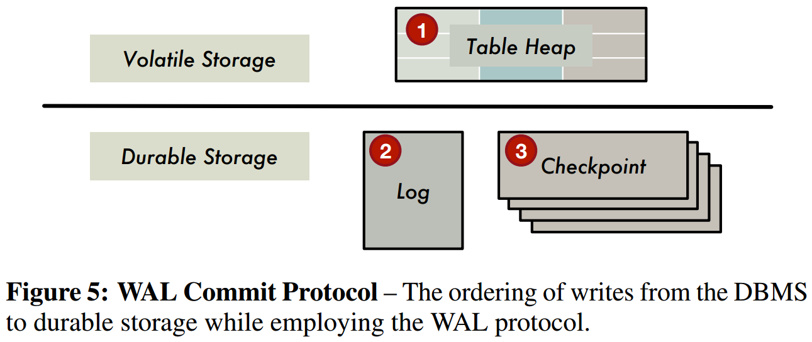

# [Write-Behind Logging](http://www.vldb.org/pvldb/vol10/p337-arulraj.pdf) 论文阅读笔记

> 这篇论文写的什么玩意，流程描述含混不清，没什么意思。   
> 重新缕了一下，放在后面了。   
> 其实就是 group commit 和 不需要 after-image 而已。   

## WAL

## WBL + MVCC

- （转自最下方 CSDN 博客）
- NVM设备的写入带宽相比SSD/HDD来说高出了数量级的差距
- 相比SDD/HDD来说，NVM设备的随机访问能力和顺序访问能力间的差距很
- NVM设备提供了按字节存储的特性，这使得CPU可以直接访问NVM设备中的字节，从而不需要将数据组织成page或通过IO系统访问

- DTT (dirty tuple table) 记录 (txn-id, type, data-ptr)
  - 不记录 after-image
  - commit 时会将 DTT 相关记录清空，**DTT 在内存，不会写入到 NVM**

缕了一下运行时大致流程，应该是这样的：

- 开启一轮 group commit，计算 commit-ts 区间 [C_p, C_d)
- 写 log `GROUP-BEGIN { { Cl }, [C_p, C_d) }` 到 NVM
- 执行 TP，同时维护 DTT（为了执行 runtime undo）
- 根据 DTT，sync dirty tuple 到 NVM
- 写 log `GROUP-END { { Cl' }, [C_p, C_d) }` 到 NVM
- 通知 commit

可以理解为 `GROUP-BEGIN` 是这一轮开启时未提交的，`GROUP-END` 是这一轮结束时已经提交的。`GROUP-BEGIN` - `GROUP-END` 就是还未提交的。

recovery 流程：

- 找到最后一个 `GROUP-BEGIN`
- 找到其对应的 `GROUP-END`，如果没有就默认为 NULL
- `GROUP-BEGIN` - `GROUP-END` 就是 abort txn
- 如何忽略这些 tuple
  - MVCC，难道访问前还检查一下 commit-ts 是否有效？
- background GC

## Replication

- WAL record

## NVM-aware Allocator

- non-volatile pointer：重启后可以固定寻址
- cache flushing primitive：CLWB + SFENCE

## Evaluation

- WBL 在 SSD/HDD 上表现不如 WAL，因为 random write

- WBL recovery time 和 txn 数量无关

- NVM latency 对写操作影响更明显，原因是 cacheline contention

- CLWB 有利于 WBL，原因是？？？

## Group Commit Latency

## Reference

- [WBL - peloton](https://github.com/cmu-db/peloton/wiki/Write-Ahead-Logging)
- [Write-Behind Logging.ppt](https://www.idi.ntnu.no/emner/tdt02/TDT02-WriteBehindLogging.pdf)
- [Write-Behind Logging.ppt](https://www.slideshare.net/PouyanRezazadeh/write-behind-logging)
- [Write-Behind Logging 论文介绍](https://zhuanlan.zhihu.com/p/47369609)
- [Write-Behind-Logging](https://blog.csdn.net/duxingxia356/article/details/102908855)
- [“Write-Behind Logs”. Because…NVM?](https://medium.com/@dieswaytoofast/write-behind-logs-because-nvm-15fe6e4552c9)
- [Write-Behind Logging](https://paulcavallaro.com/blog/write-behind-logging/)
- [Write-Behind Logging 中文翻译](https://nan01ab.github.io/2017/11/Write-Behind-Logging.html)