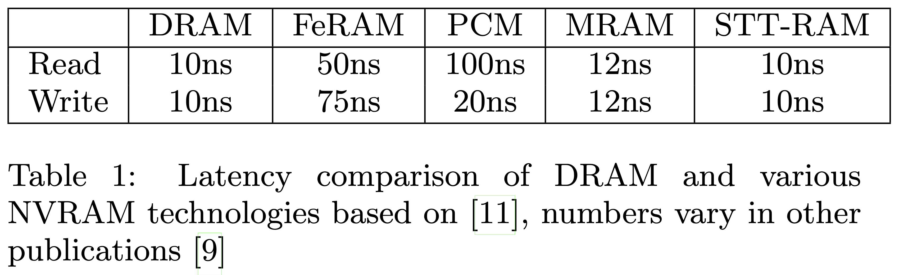
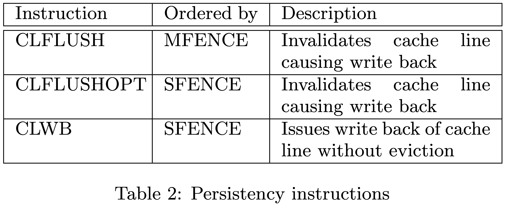
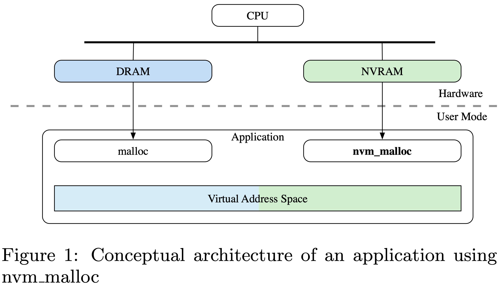
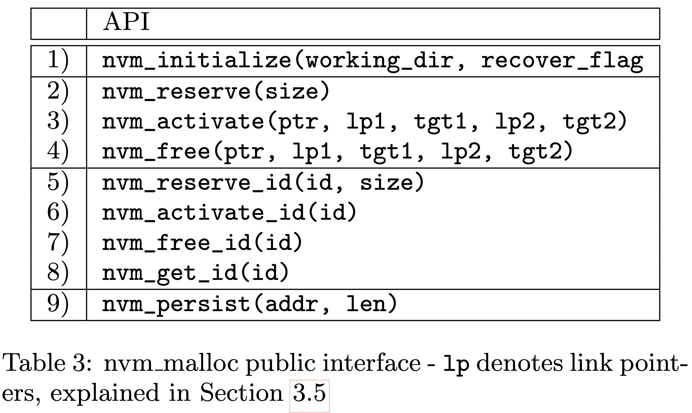
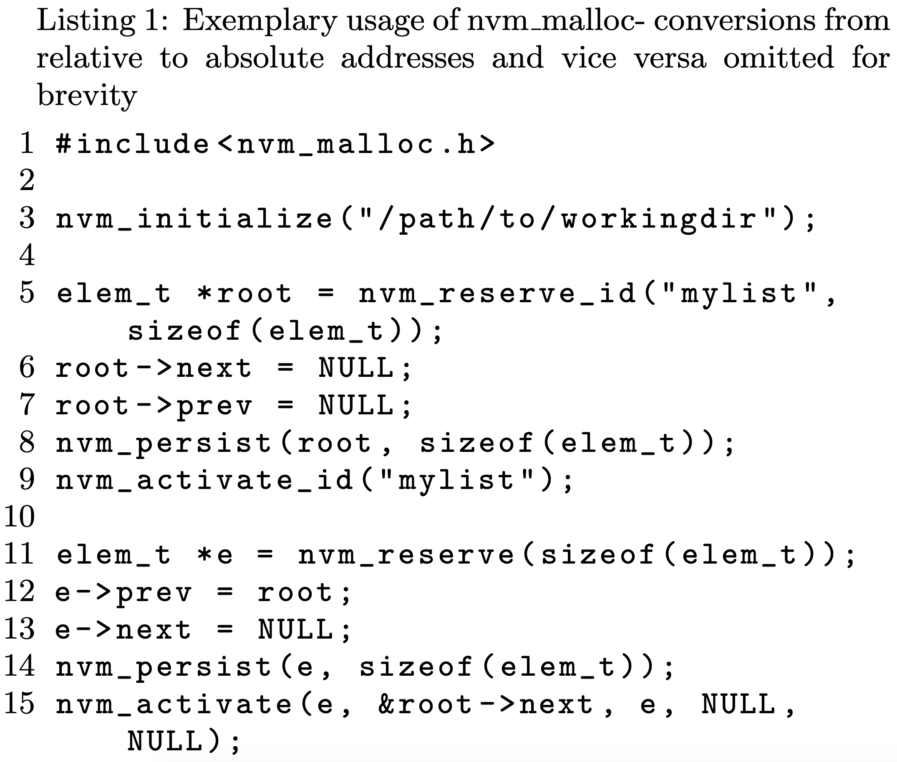
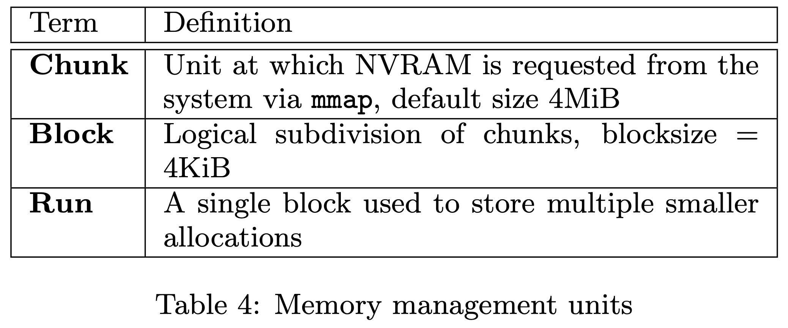
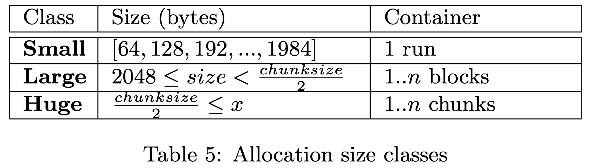
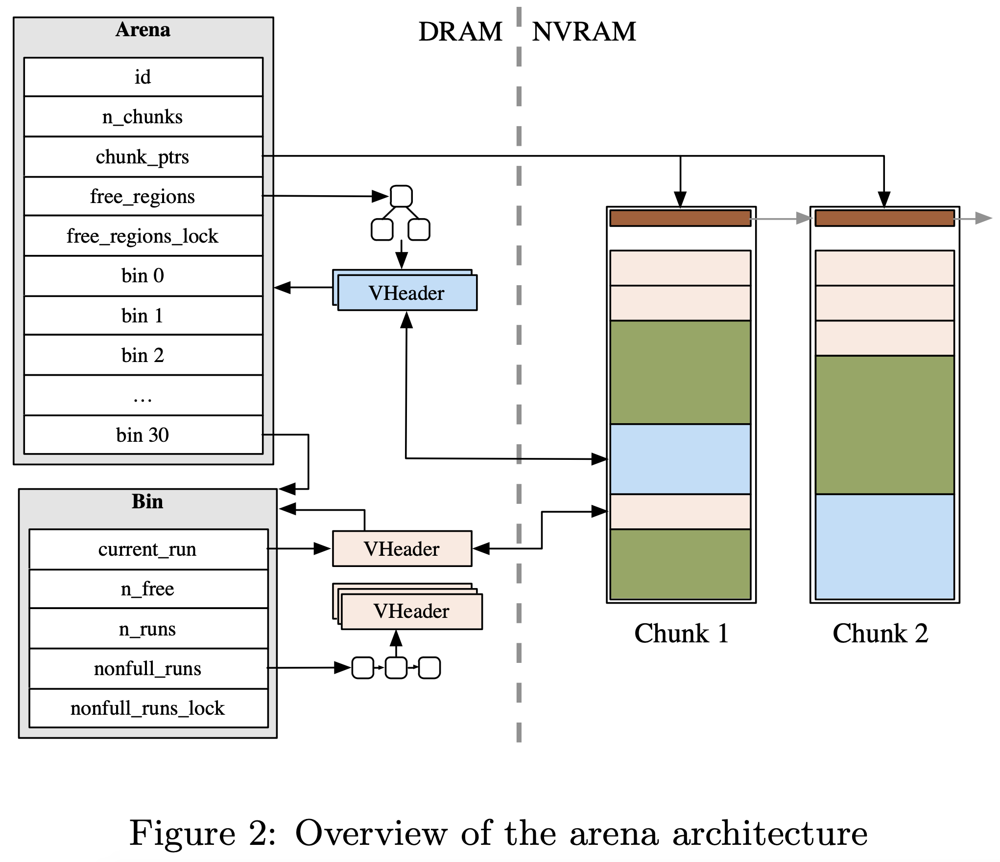
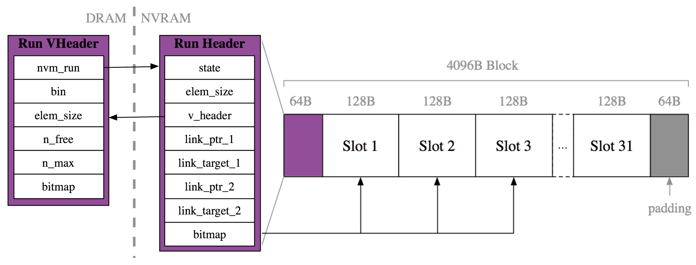
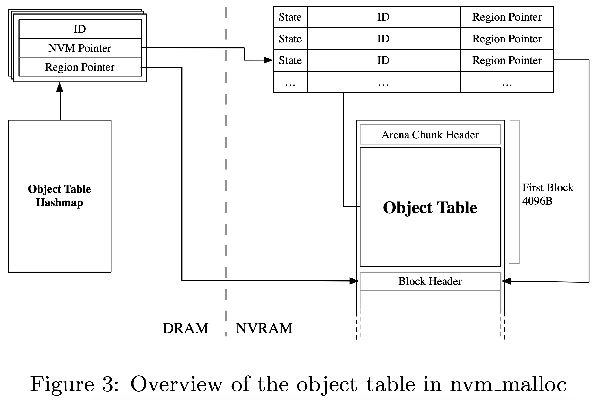

# [nvm_malloc: Memory Allocation for NVRAM](http://www.adms-conf.org/2015/adms15_schwalb.pdf) 论文阅读笔记

> 没太看懂，元数据到底分布在哪里。。。   

## NVM Malloc

- 重启时通过 id 来找到 root，然后找到整个数据结构

### Arena

- reserve
- activate
  - bit index

### Allocation by ID

- root obj 用 id 来 alloc，方便之后寻址
- 用 volatile hashmap 加速查找

### Recovery

## Reference

- [ppt](http://www.adms-conf.org/2015/nvm_malloc.pdf)
- [nvm_malloc: Memory Allocation for NVRAM [Paper Review] - GHC 6023](https://wangziqi2013.github.io/paper/2019/11/09/nvm-malloc.html)